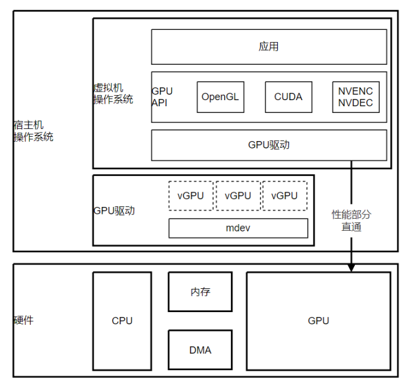

## GPU  虚拟化

GPU 虚拟化是一种将物理 GPU 的计算和显存资源在多个虚拟环境中共享的技术，它的主要优势如下：

- 资源共享：GPU 虚拟化允许在多个虚拟环境中共享物理 GPU 的计算和显存资源，提高 GPU 的使用效率。

- 弹性扩展：通过 GPU 虚拟化，可以根据应用程序的需求动态调整虚拟 GPU 的计算和显存资源，实现资源的弹性扩展。

- 成本效益：GPU 虚拟化可以降低硬件投资和维护成本，因为它允许在多个虚拟环境中共享物理 GPU，从而减少了购买和维护多个独立 GPU 的需要。

- 隔离性：GPU 虚拟化提供了良好的隔离性，确保了虚拟环境之间的安全和独立性。这在多租户云计算环境中尤为重要，因为它可以确保不同租户之间的数据和计算隔离。

- 灵活部署：GPU 虚拟化使得虚拟环境可以灵活地部署在不同的物理硬件上，以满足不同的性能需求。这意味着用户可以根据自己的需求选择合适的 GPU 硬件，而无需考虑与现有虚拟环境的兼容性问题

## GPU  虚拟化技术方案

### PCIe 直通

PCIe 直通是一种虚拟化技术，允许虚拟机 (Virtual Machine，VM) 直接访问物理主机上的 PCIe 设备，而无需通过虚拟化软件进行模拟。通过 PCIe 直通就可以将 GPU 设备直接分配给虚拟机，见下图：


vmvare 单独设置：<https://www.techtarget.com/searchitoperations/tutorial/Map-physical-GPUs-to-VMs-with-this-GPU-passthrough-guide>

```
 hypervisor.cpuid.v0=FALSE
```

只能安装 open 版本，或者 `./NVIDIA-Linux-x86_64-525.116.04.run -m=kernel-open`

### PCIe SR-IOV

PCIe SR-IOV (Single Root Input/Output Virtualization) 是一种更高级的虚拟化技术，允许一个 PCIe 设备在多个虚拟机之间共享，同时保持较高的性能。它是通过在物理设备 (Physical Functions，PF) 上创建多个虚拟功能 (Virtual Functions，VF) 来实现的，每个虚拟功能可以被分配给一个虚拟机，让虚拟机直接访问和控制这些虚拟功能，从而实现高效的 I/O 虚拟化。基于 PCIe SR-IOV 的 GPU 虚拟化方案，本质是把一个物理 GPU 显卡设备 (PF) 拆分成多份虚拟 (VF) 的显卡设备，而且 VF 依然是符合 PCIe 规范的设备。核心架构如下图：


### API 转发

基于 API 转发的 GPU 虚拟化方案。API 转发分为被调方和调用方，两方对外提供同样的接口 (API)，被调方 API 实现是真实的渲染、计算处理逻辑，而调用方 API 实现仅仅是转发，转发给被调方。其核心架构示意如下图：


### 受控直通

受控直通方案是由 Nvidia 提出，并联合 Intel 一起将相关的 mdev 提交到了 Linux 内核 4.0 中。受控直通把会影响性能的访问直接透传给 GPU (如显存)，把性能无关功能部分 (如 CSR 和部分 MMIO 寄存器) 做拦截，并在 mdev 模块中做模拟，使得系统层面能看到多个 “看似” 完整的多个 GPU PCIe 设备，即 vGPU，它也可以支持原生 GPU 驱动

