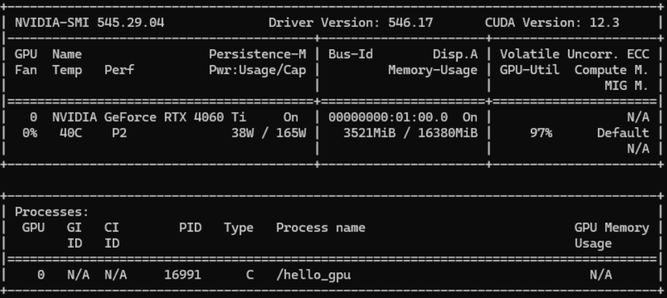
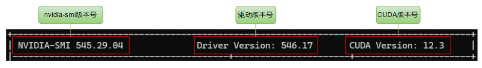

## nvidia-smi

`nvidia-smi` 全称 NVIDIA System Management Interface，是 NVIDIA 提供的用于监控和管理 NVIDIA GPU 显卡的命令行工具。直接输 `nvidia-smi` 命令可以得到如下信息：



## nvidia-smi 输出详解



- **`NVIDIA-SMI：`** nvidia-smi 版本号，当前是 545.29.04
- **`Driver Version：`** 驱动版本号，当前是 546.17
- **`CUDA Version：`** CUDA 版本号，当前是 12.3


- **`GPU：`** GPU ID，计数从 0 开始，0 表示第一张 GPU。如果有 2 张 GPU，则第二张 GPU 的 ID 是 1
- **`Name：`** GPU 名称，当前是 NVIDIA GeForce RTX 4060 Ti
- **`Persistence-M：`** 显卡的持久模式状态，当设置为启用状态（On）时，驱动程序在系统启动时就加载，并且在最后一个进程关闭时保持运行。如果设置为关闭（Off），则在最后一个 GPU 进程结束时，驱动程序将会卸载。这个特性在一般的使用场景中不会有显著影响。
- **`Fan：`** 风扇转速百分比，0% 表示当前风扇没有转动
- **`Temp：`** 温度，当前为 40°
- **`Perf：`** GPU 的性能状态，从 P0（最大性能）-P12（最小性能）
- **`Pwr:Usage/Cap：`** 显卡功率，显示当前功率和最大功率。当前功率为 38W，最大功率为 165W


- **`Bus-Id：`** 显卡是插在 PCIe 总线槽上的，每个插在总线上的设备都有唯一 id 标识，这里就是指 GPU 在 PCIe 总线上的 id
- **`Disp.A：`** Display Active GPU 初始化状态
- **`Memory-Usage：`** 显存使用情况，显示当前显存大小和显存总大小。当前显存使用 3521MiB，显存总大小为 16380MiB


- **`Volatile Uncorr. ECC：`** 报告 GPU 错误检查和纠正（ECC）状态。N/A 表示这个 GPU 不支持 ECC 或者没有启用 ECC
- **`GPU-Util：`** 显示 GPU 的使用率，即 GPU 正在执行计算任务的比例，0% 表示GPU目前在空闲状态，和 CPU 使用率类似
- **`Compute M.：`** 表示计算模式，NVIDIA GPU 有 Default、Exclusive Process、Exclusive Thread、Prohibited 四种计算模式，一般就用默认的 Default 就可以了。在 Default 模式下，多个进程可以同时共享不同的 GPU
- **`MIG M.：`** MIG 模式，MIG 一般用在 GPU 虚拟化场景，N/A 表示该 GPU 不支持 MIG


processes 指的是当前正在使用 GPU 的进程，相关信息有：

- **`GPU：`** 进程使用的 GPU ID 号
- **`GI ID：`** GPU instance ID，GPU 实例 id
- **`CI ID：`** Compute instance ID，计算实例 id
- **`PID：`** 进程 id
- **`Type：`** 进程类型，C 表示计算进程，G 表示图形进程，C+G 表示都有
- **`Process name：`** 进程名称
- **`GPU Memory Usage：`** 进程显存使用量

## 其它参数

查看 GPU 基本信息

```bash
> nvidia-smi -L

GPU 0: NVIDIA GeForce RTX 3090 (UUID: GPU-cc569cce-fceb-b9fa-918d-6d69fc6c2a3d)
```

查询所有 GPU 详细信息

```bash
> nvidia-smi -q

==============NVSMI LOG==============

Timestamp                                 : Sun Mar 24 00:17:09 2024
Driver Version                            : 545.23.08
CUDA Version                              : 12.3

Attached GPUs                             : 1
GPU 00000000:08:00.0
    Product Name                          : NVIDIA GeForce RTX 3090
    Product Brand                         : GeForce
    Product Architecture                  : Ampere
    Display Mode                          : Disabled
    Display Active                        : Disabled
    Persistence Mode                      : Disabled
    Addressing Mode                       : None
    MIG Mode
        Current                           : N/A
        Pending                           : N/A
```

查询指定 id 的 GPU 详细信息，如下，通过 `-i` 参数指定 id 为 0 的 GPU

```bash
> nvidia-smi -q -i 0
```

查询指定 id 的 GPU 的显存信息

```bash
> nvidia-smi -q -i 0 -d MEMORY

==============NVSMI LOG==============

Timestamp                                 : Sun Mar 24 00:18:16 2024
Driver Version                            : 545.23.08
CUDA Version                              : 12.3

Attached GPUs                             : 1
GPU 00000000:08:00.0
    FB Memory Usage
        Total                             : 24576 MiB
        Reserved                          : 318 MiB
        Used                              : 2 MiB
        Free                              : 24255 MiB
    BAR1 Memory Usage
        Total                             : 256 MiB
        Used                              : 4 MiB
        Free                              : 252 MiB
    Conf Compute Protected Memory Usage
        Total                             : 0 MiB
        Used                              : 0 MiB
        Free                              : 0 MiB
```

查看 GPU 系统的拓扑连接信息

```bash
> nvidia-smi topo -m

	GPU0	CPU Affinity	NUMA Affinity	GPU NUMA ID
GPU0	 X 	0-31	0		N/A

Legend:

  X    = Self
  SYS  = Connection traversing PCIe as well as the SMP interconnect between NUMA nodes (e.g., QPI/UPI)
  NODE = Connection traversing PCIe as well as the interconnect between PCIe Host Bridges within a NUMA node
  PHB  = Connection traversing PCIe as well as a PCIe Host Bridge (typically the CPU)
  PXB  = Connection traversing multiple PCIe bridges (without traversing the PCIe Host Bridge)
  PIX  = Connection traversing at most a single PCIe bridge
  NV#  = Connection traversing a bonded set of # NVLinks
```

## NVML

nvidia-smi 可以用于查看显卡 GPU 相关信息，这些信息在显卡监控、GPU 性能监控等场景是非常有用的。其实 nvidia-smi 底层是调用 NVIDIA 封装好的 NVML（NVIDIA Management Library）动态库获取到这些数据的，代码层面也可以通过调用 NVML 库函数来获取相关数据上报到业务监控数据库中。也有一些其它语言基于 NVML 封装的 SDK，例如 go 语言的 SDK：<https://github.com/NVIDIA/go-nvml>。

```go
package main

import (
	"fmt"
	"log"

	"github.com/NVIDIA/go-nvml/pkg/nvml"
)

func main() {
	ret := nvml.Init()
	if ret != nvml.SUCCESS {
		log.Fatalf("Unable to initialize NVML: %v", nvml.ErrorString(ret))
	}
	defer func() {
		ret := nvml.Shutdown()
		if ret != nvml.SUCCESS {
			log.Fatalf("Unable to shutdown NVML: %v", nvml.ErrorString(ret))
		}
	}()

	count, ret := nvml.DeviceGetCount()
	if ret != nvml.SUCCESS {
		log.Fatalf("Unable to get device count: %v", nvml.ErrorString(ret))
	}

	for i := 0; i < count; i++ {
		device, ret := nvml.DeviceGetHandleByIndex(i)
		if ret != nvml.SUCCESS {
			log.Fatalf("Unable to get device at index %d: %v", i, nvml.ErrorString(ret))
		}

		uuid, ret := device.GetUUID()
		if ret != nvml.SUCCESS {
			log.Fatalf("Unable to get uuid of device at index %d: %v", i, nvml.ErrorString(ret))
		}

		fmt.Printf("%v\n", uuid)
	}
}
```

NVML 也可以参考官方文档获取更详细信息：<https://docs.nvidia.com/deploy/nvml-api/index.html>