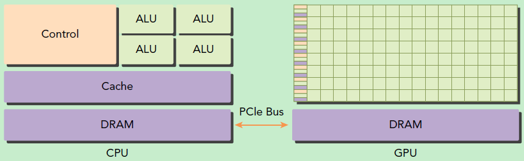
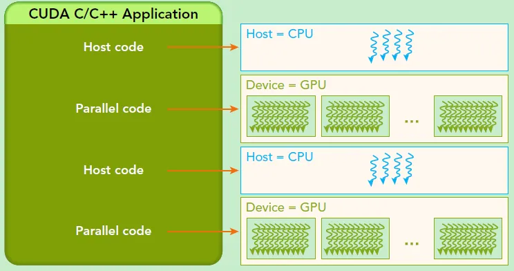

GPU 并不是一个独立运行的计算平台，而需要与 CPU 协同工作，可以看成是 CPU 的协处理器，因此在说 GPU 并行计算时，其实是指的基于 CPU+GPU 的异构计算架构

在异构计算架构中，GPU 与 CPU 通过 PCIe 总线连接在一起来协同工作，CPU 所在位置称为为主机端（host），而 GPU 所在位置称为设备端（device），如下图所示

可以看到 GPU 包括更多的运算核心，其特别适合数据并行的计算密集型任务，如大型矩阵运算，而 CPU 的运算核心较少，但是其可以实现复杂的逻辑运算，因此其适合控制密集型任务

另外，CPU 上的线程是重量级的，上下文切换开销大，但是 GPU 由于存在很多核心，其线程是轻量级的

因此，基于 CPU+GPU 的异构计算平台可以优势互补，CPU 负责处理逻辑复杂的串行程序，而 GPU 重点处理数据密集型的并行计算程序，从而发挥最大功效

