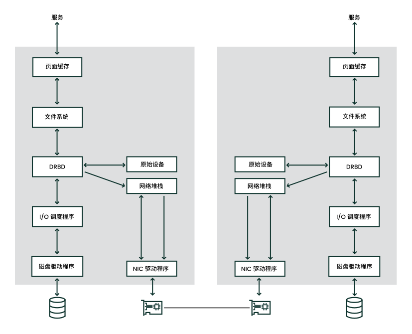
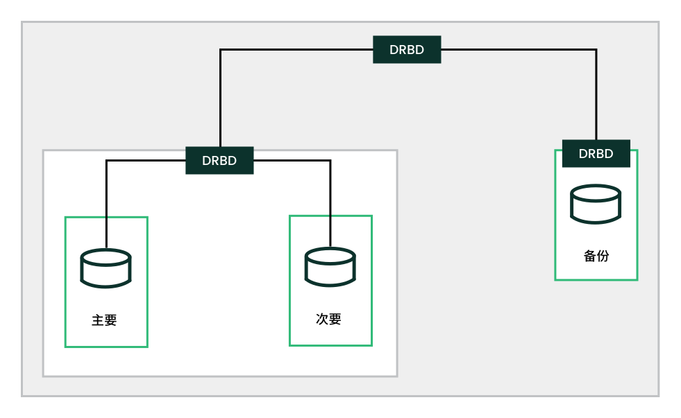

## DRBD

通过分布式复制块设备 (DRBD / Distributed Replicated Block Device )，可以为位于 IP 网络上两个不同站点的两个块设备创建镜像。和 Corosync 一起使用时，DRBD 支持分布式高可用性 Linux 群集 

DRBD 以确保数据的两个副本保持相同的方式将主设备上的数据复制到次设备上。将其视为联网的 RAID 1。它实时对数据进行镜像，以便连续复制。应用程序不需要知道实际上它们的数据存储在不同的磁盘上。   

DRBD 是 Linux 内核模块，位于下端的 I/O 调度程序与上端的文件系统之间

   DRBD 允许使用 Linux 支持的任何块设备，通常包括

- 硬盘分区或完整硬盘
- 软件 RAID 
- 逻辑卷管理器 (LVM)    

使用高级别命令 `drbdadm`；为了提供最大的灵活性，DRBD 附带了低级别工具 `drbdsetup`

在 DRBD 设备上创建文件系统之前，必须先设置 DRBD 设备。与用户数据相关的所有操作都只应通过 `/dev/drbd*N*` 设备执行，不能在原始设备上执行，因为 DRBD 会将原始设备最后的部分用于存储元数据。使用原始设备会导致数据不一致

借助 udev 集成，您还可以获取 `/dev/drbd/by-res/*RESOURCES*` 格式的符号链接，这种链接更易于使用，而且还能避免在记错设备次要编号时出现问题

## 堆叠式 DRBD 设备

堆叠式 DRBD 设备包含两个其他设备，其中至少有一个设备也是 DRBD 资源。也就是说，DRBD 在一个现有 DRBD 资源的基础上又添加了一个节点。此类复制设置可用于备份和灾难恢复用途

三向复制运用了异步（DRBD 协议 A）和同步复制（DRBD 协议 C）。异步部分用于堆叠的资源，同步部分用于备用资源