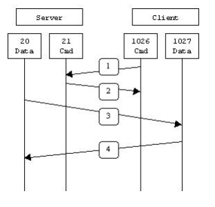
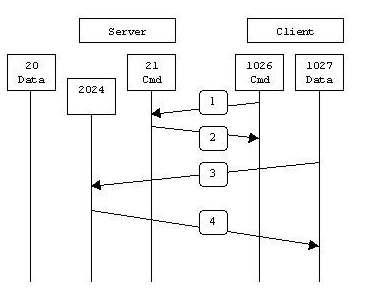

## 认证模式

FTP 支持以下三种认证模式：

- 匿名用户模式：任何人无需密码验证就可以直接登录 FTP 服务器。该模式不安全，一般只用来传输不重要的公开文件，不推荐在生产环境中使用。
- 本地用户模式：通过 Linux 系统本地用户验证登录权限，相较于匿名用户模式更安全。
- 虚拟用户模式：通过虚拟用户验证登录权限，虚拟用户只能访问 Linux 系统为其提供的 FTP 服务，而不能访问 Linux 系统的其他资源。该模式相较于其他两种模式更加安全，如果您对服务器的数据有较高的安全性要求，建议在相关专业人员的指导下，自行配置该模式

## 主动模式和被动模式

- PORT（主动模式）
- PASV（被动模式）

主动模式和被动模式的不同简单概述为： 主动模式传送数据时是 “服务器” 连接到 “客户端” 的端口（客户端开启数据端口）；被动模式传送数据是 “客户端” 连接到 “服务器” 的端口（服务端开启数据端口）。

主动模式需要客户端必须开放端口给 FTP 服务端，很多客户端都是在防火墙内，开放端口给 FTP 服务器访问比较困难。

被动模式只需要服务器端开放端口给客户端连接就行了，如果服务端在防火墙内，也需要做端口映射才行。

### PORT 主动模式

在主动模式下，FTP 客户端随机开启一个大于 1024 的端口 N 向服务器的 21 号端口发起连接，发送 FTP 用户名和密码，然后开放 N+1 号端口进行监听，并向服务器发出 PORT N+1 命令，告诉服务端客户端采用主动模式并开放了端口。FTP 服务器接收到 PORT 命令后，会用其本地的 FTP 数据端口（通常是 20）来连接客户端指定的端口 N+1，进行数据传输。

```
FTP服务器命令（21）端口接受客户端任意端口（客户端初始连接）
FTP服务器命令（21）端口到客户端端口（>1023）（服务器响应客户端命令）
FTP服务器数据（20）端口到客户端端口（>1023）（服务器初始化数据连接到客户端数据端口）
FTP服务器数据（20）端口接受客户端端口（>1023）（客户端发送ACK包到服务器的数据端口）
```




### PASV 被动模式

 在被动模式下，FTP 客户端随机开启一个大于 1024 的端口 N 向服务器的 21 号端口发起连接，发送用户名和密码进行登陆，同时会开启 N+1 端口。然后向服务器发送 PASV 命令，通知服务器自己处于被动模式。服务器收到命令后，会开放一个大于 1024 的端口 P（端口 P 的范围是可以设置的，后面会说到这个是很重要的）进行监听，然后用 PORT P 命令通知客户端，自己的数据端口是 P。客户端收到命令后，会通过 N+1 号端口连接服务器的端口 P，然后在两个端口之间进行数据传输

```
FTP服务器命令（21）端口接受客户端任意端口（客户端初始连接）
FTP服务器命令（21）端口到客户端端口（>1023）（服务器响应客户端命令）
FTP服务器数据端口（>1023）接受客户端端口（>1023）（客户端初始化数据连接到服务器指定的任意端口）
FTP服务器数据端口（>1023）到客户端端口（>1023）（服务器发送ACK响应和数据到客户端的数据端口）
```

