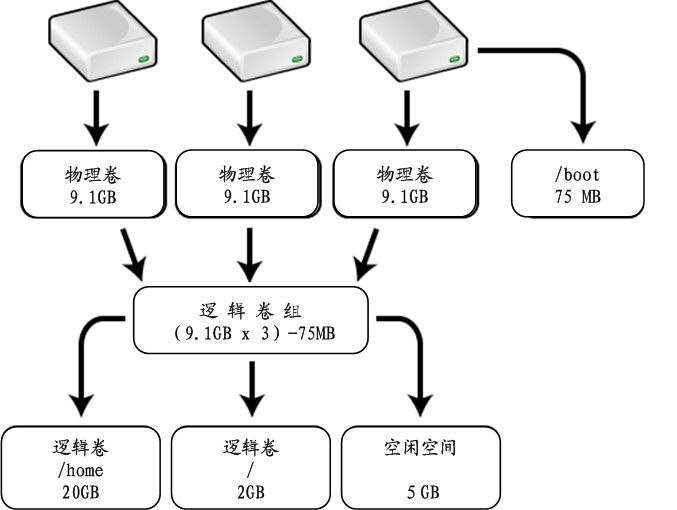

## LVM 简介

VM 是 Logical Volume Manager（逻辑卷管理）的简写，它是 Linux 环境下对磁盘分区进行管理的一种机制

LVM 将一个或多个磁盘分区（PV）虚拟为一个卷组（VG），相当于一个大的硬盘，可以在上面划分一些逻辑卷（LV）

当卷组的空间不够使用时，可以将新的磁盘分区加入进来；还可以从卷组剩余空间上划分一些空间给空间不够用的逻辑卷使用

## 基础概念

- PV (physical volume)

物理卷在逻辑卷管理系统最底层，可为整个物理硬盘或实际物理硬盘上的分区。它只是在物理分区中划出了一个特殊的区域，用于记录与 LVM 相关的管理参数。

- VG (volume group)

卷组建立在物理卷上，一卷组中至少要包括一物理卷，卷组建立后可动态的添加卷到卷组中，一个逻辑卷管理系统工程中可有多个卷组。

- LV (logical volume)

逻辑卷建立在卷组基础上，卷组中未分配空间可用于建立新的逻辑卷，逻辑卷建立后可以动态扩展和缩小空间。

- PE (physical extent)

物理区域是物理卷中可用于分配的最小存储单元，物理区域大小在建立卷组时指定，一旦确定不能更改，同一卷组所有物理卷的物理区域大小需一致，新的 PV 加入到 VG 后，PE 的大小自动更改为 VG 中定义的 PE 大小。

- LE (logical extent)

逻辑区域是逻辑卷中可用于分配的最小存储单元，逻辑区域的大小取决于逻辑卷所在卷组中的物理区域的大小。

由于受内核限制的原因，一个逻辑卷（Logic Volume）最多只能包含 65536 个 PE（Physical Extent），所以一个 PE 的大小就决定了逻辑卷的最大容量，4 MB (默认) 的 PE 决定了单个逻辑卷最大容量为 256 GB，若希望使用大于 256G 的逻辑卷，则创建卷组时需要指定更大的 PE。在 Red Hat Enterprise Linux AS 4 中 PE 大小范围为 8 KB 到 16GB，并且必须总是 2 的倍数。
