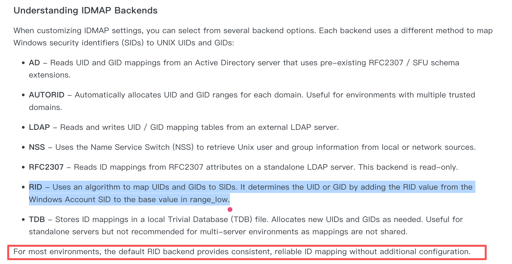

## 接入 AD 域

IDMaps

参考文档：<https://www.truenas.com/docs/scale/credentials/directoryservices/configad/#understanding-idmap-backends>



### 挂载

CIFS 挂载

直接 Mount

```
# 注意不是使用挂载参数 domain，这个是指定 Client Domain
# 而 srliao@alpha-quant.tech 是指定 Became Domain
mount -t cifs -o rw,vers=3.0,username=srliao@alpha-quant.tech //192.168.3.82/srliao /mnt/test
```

使用 fstab

如果使用 fstab 进行挂载，一定要声明 _netdev

```
//192.168.3.82/srliao /mnt/test cifs rw,vers=3.0,credentials=/etc/smb.creds,_netdev	0 0
```

smb.creds 内容

```
username=srliao@ALPHA-QUANT.TECH
password=xxx
```