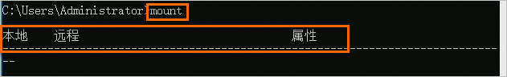

## NFS 简介

NFS 是 Network File System 的缩写，即网络文件系统

NFS 服务会经常用到，它用于在网络上共享存储。举例来说，假如有 3 台机器 A、B 和 C，它们需要访问同一个目录，且目录中都是图片。传统的做法是把这些图片分别放到 A、B、C 中，但若使用 NFS，只需要把图片放到 A 上，然后 A 共享给 B 和 C 即可。访问 B 和 C 时，是通过网络的方式去访问 A 上的那个目录的


## NFS 部署和管理

### 服务端安装

在节点 `10.244.244.3` 上来安装 NFS 服务，数据目录：`/data/raid10` 和 `/data/sata`

关闭防火墙

```bash
systemctl disable --now firewalld.service
```

安装配置 nfs

```bash
dnf -y install nfs-utils rpcbind
```

共享目录设置权限：

```bash
mkdir -p <NFS目录>

# chown -R nobody:nobody <NFS目录>
chmod -R 755 <NFS目录>
```

配置 NFS（NFS 的默认配置文件在 `/etc/exports` 文件下），在该文件中添加下面的配置信息：

```bash
> vim /etc/exports

/data/raid10 *(rw,sync,no_root_squash)
/data/sata *(rw,sync,no_root_squash)
# 此文件的配置格式为：
# <输出目录> [客户端1 选项（访问权限,用户映射,其他）] [客户端2 选项（访问权限,用户映射,其他）]
```

配置说明：

- `/data/raid10`：是共享的数据目录
- `*`：表示任何人都有权限连接，也可以是一个网段、一个 IP、域名

第三部分：

- 访问权限

  - `rw`：表示读/写

  - `ro`：表示只读

- 数据写入模式

  - `sync`：同步模式，表示内存中的数据实时写入磁盘

  - `async`：非同步模式，表示把内存中的数据定期写入磁盘

- 用户映射

  - `no_root_squash`：加上这个选项后，root 用户就会对共享的目录拥有至高的权限控制，就像是对本机的目录操作一样。但这样安全性降低。当登录 NFS 主机使用共享目录的使用者是 root 时，其权限将被转换成为匿名使用者，通常它的 UID 与 GID，都会变成 nobody 身份

  - `root_squash`：与 `no_root_squash` 选项对应，表示 root 用户对共享目录的权限不高，只有普通用户的权限，即限制了 root

  - `all_squash`：表示不管使用 NFS 的用户是谁，其身份都会被限定为一个指定的普通用户身份

  - `anonuid /anongid`：要和 `root_squash` 以及 `all_squash` 选项一同使用，用于指定使用 NFS 的用户被限定后的 uid 和 gid，但前提是本机的 `/etc/passwd` 中存在相应的 uid 和 gid

启动服务 nfs 需要向 rpc 注册，rpc 一旦重启了，注册的文件都会丢失，向他注册的服务都需要重启

注意启动顺序，先启动 rpcbind

```bash
systemctl enable --now rpcbind
systemctl status rpcbind
```

然后启动 NFS 服务：

```bash
systemctl enable --now nfs-server.service
systemctl status nfs-server.service
```

同样看到 Started 则证明 NFS Server 启动成功

还可以通过下面的命令确认下：

```bash
> rpcinfo -p|grep nfs
    100003    3   tcp   2049  nfs
    100003    4   tcp   2049  nfs
    100227    3   tcp   2049  nfs_acl
```

查看具体目录挂载权限：

```bash
> cat /var/lib/nfs/etab

/data/sata	*(rw,sync,wdelay,hide,nocrossmnt,secure,no_root_squash,no_all_squash,no_subtree_check,secure_locks,acl,no_pnfs,anonuid=65534,anongid=65534,sec=sys,rw,secure,no_root_squash,no_all_squash)
/data/raid10	*(rw,sync,wdelay,hide,nocrossmnt,secure,no_root_squash,no_all_squash,no_subtree_check,secure_locks,acl,no_pnfs,anonuid=65534,anongid=65534,sec=sys,rw,secure,no_root_squash,no_all_squash)
```

到这里 NFS server 给安装完成

### 客户端安装

前往节点安装 NFS 的客户端来验证，安装 NFS 前也需要先关闭防火墙：

```bash
systemctl disable --now firewalld.service
```

然后安装 NFS

```bash
dnf -y install nfs-utils rpcbind
```

安装完成后，和上面的方法一样，先启动 RPC、然后启动 NFS：

```bash
systemctl enable --now rpcbind.service
systemctl enable --now nfs-server.service
```

挂载数据目录客户端启动完成后，在客户端来挂载下 NFS 测试

首先检查下 nfs 是否有共享目录：

```bash
> showmount -e 10.244.244.3

Export list for 10.244.244.3:
/data/sata   *
/data/raid10 *
```

然后我们在客户端上新建目录：

```bash
mkdir -p /mnt/nfs/raid10
```

将 nfs 共享目录挂载到上面的目录：

```bash
mount -t nfs 10.244.244.3:/data/raid10 /mnt/nfs/raid10
```

挂载成功后，在客户端上面的目录中新建一个文件，观察下 NFS 服务端的共享目录下面是否也会出现该文件：

```bash
touch /mnt/nfs/raid10/test.txt
```

然后在 NFS 服务端查看：

```bash
> ls -al /data/raid10/test.txt

-rw-r--r-- 1 root root 0 Jan 18 05:21 /data/raid10/test.txt
```

如果上面出现了 `test.txt` 的文件，那么证明 NFS 挂载成功

如果需要开机自动挂载，写入 fstab，注意 `_netdev` 必须加上，防止 NFS 服务器未启动导致服务器无法启动

```bash
10.244.244.3:/data/raid10 /mnt/nfs/raid10 nfs defaults,nolock,retrans=2,_netdev 0 0
```

### Exportfs

Exportfs 命令的常用选项为 -a、-r、-u 和 -v，各选项的含义如下

- **-a**：表示全部挂载或者卸载。
- **-r**：表示重新挂载。
- **-u**：表示卸载某一个目录。
- **-v**：表示显示共享的目录。

当改变 `/etc/exports` 配置文件后，使用 exportfs 命令挂载不需要重启 NFS 服务

首先修改服务端的配置文件，如下所示：

```bash
> vim /etc/exports # 增加一行:
/tmp/ 192.168.72.0/24(rw,sync,no_root_squash)
```

然后在服务端上执行如下命令：

```bash
> exportfs -arv
exporting 192.168.72.0/24:/tmp
exporting 192.168.72.0/24:/home/nfstestdir
```

## NFS 版本

使用以下命令检查 `nfsd` 模块支持的 NFS 版本：

```bash
cat /proc/fs/nfsd/versions
```

该命令输出支持的 NFS 版本列表，例如：

```bash
-2 +3 +4 +4.1
```

其中，前面的符号表示是否启用了对应的版本，`+` 表示启用，`-` 表示禁用。

在某些系统上，NFS 版本配置可能在 `/etc/nfs.conf` 文件中。您可以检查这个文件，确保配置正确：

```bash
[nfsd]
vers3=y
vers4=y
vers4.1=y
```


win 修改

```bash
HKEY_LOCAL_MACHINE\SOFTWARE\Microsoft\ClientForNFS\CurrentVersion\Default
```

- 找到或创建一个名为 `NfsMountProtocol` 的 `DWORD (32-bit) Value`。
- 将其值设置为对应的 NFS 版本：
  - `1` 表示 NFSv2
  - `2` 表示 NFSv3
  - `3` 表示 NFSv4

## 挂载参数

<https://help.aliyun.com/document_detail/90529.html#section-jyi-hyd-hbr>

| 参数                       | 说明                                                         |
| :------------------------- | :----------------------------------------------------------- |
| `_netdev`                  | 防止客户端在网络就绪之前开始挂载文件系统。                   |
| 0（`noresvport` 后第一项） | 非零值表示文件系统应由 dump 备份。对于 NAS 文件系统而言，此值默认为 0。 |
| 0（`noresvport` 后第二项） | 该值表示 fsck 在启动时检查文件系统的顺序。对于 NAS 文件系统而言，此值默认为 0，表示 fsck 不应在启动时运行。 |

挂载文件系统时，可选择多种挂载选项，挂载选项使用半角逗号（,）分隔，说明如下：

- rsize：定义数据块的大小，用于客户端与文件系统之间读取数据。建议值：1048576。
- wsize：定义数据块的大小，用于客户端与文件系统之间写入数据。建议值：1048576。
- hard：在文件存储 NAS 暂时不可用的情况下，使用文件系统上某个文件的本地应用程序时会停止并等待至该文件系统恢复在线状态。建议启用该参数。
- timeo：指定时长，单位为 0.1 秒，即NFS客户端在重试向文件系统发送请求之前等待响应的时间。建议值：600（60秒）。
- retrans：NFS 客户端重试请求的次数。建议值：2。
- noresvport：在网络重连时使用新的 TCP 端口，保障在网络发生故障恢复时不会中断连接。建议启用该参数。

推荐通过 NFS v3 协议挂载文件系统，以获得最佳访问性能

```bash
mount -t nfs \
 -o vers=3,nolock,proto=tcp,rsize=1048576,wsize=1048576,hard,timeo=600,retrans=2,noresvport \
  10.244.244.201:/ /mnt
```

使用 NFS v4 协议挂载文件系统：

```bash
mount -t nfs \
 -o vers=4,minorversion=0,rsize=1048576,wsize=1048576,hard,timeo=600,retrans=2,noresvport \
  10.244.244.201:/ /mnt
```

```bash
mount -t nfs \
 -o vers=3,nolock,noacl,proto=tcp,rsize=1048576,wsize=1048576,hard,timeo=600,retrans=2,noresvport \
  10.244.244.201:/ /mnt
```

参考文档

- <https://help.aliyun.com/zh/nas/user-guide/mount-an-nfs-file-system-on-a-linux-ecs-instance>

### Windows 挂载 NFS

1. 打开服务器管理器。
2. 选择管理 > 添加角色和功能。
3. 根据添加角色和功能向导提示安装NFS客户端：在功能页签，选择 NFS 客户端。
4. 启动命令提示符，执行 mount 命令。如果返回以下信息，说明 NFS 客户端安装成功。



为保证 NFS 挂载后能正常进行读写，需要先添加两个注册表项：进入 `HKEY_LOCAL_MACHINE > SOFTWARE > Microsoft > ClientForNFS > CurrentVersion> Default`，在空白处右键新建 > DWORD(32位)值，创建以下两个注册表项

- AnonymousGID，值为 0

- AnonymousUID，值为 0

若不进行该项修改，NFS 可以挂载，但无法进行读写，输入 mount 命令或查看属性中的 NFS 装载选项，显示 Uid 和 Gid = -2；NFS 服务只允许 root 用户挂载，Windows Server 默认挂载用户为 Anonymous，Uid 为 -2，因此没有权限。解决办法就是让 Windows Server 在挂载 NFS 时将 Uid 和 Gid 改成 0。

完成后重启服务器。


在 Windows 客户端，执行以下命令挂载 NFS 协议的文件系统

```bash
mount -o nolock -o mtype=hard -o timeout=60 \\nas.server.ip_or_domain\somdir S:
```

可以通过配置 Windows 的`c:\ProgramData\Microsoft\Windows\Start Menu\Programs\StartUp\auto_mount.bat`文件，实现重启时自动挂载 NFS 协议文件系统

1. 打开控制面板，单击系统和安全，在管理工具区域，单击计划任务。
2. 在任务计划程序页面，选择操作 > 创建任务。
3. 单击常规页签，输入计划任务的名称，选中不管用户是否登录都要运行和使用最高权限运行。（如果使用的系统是Windows Server 2016，则必须选中只在用户登录时运行，否则自动挂载 NFS 协议的文件系统配置不生效。）
4. 单击触发器页签，单击新建。在开始任务列表中选择登录时，在高级设置中选择已启用。单击确定。
5. 单击操作页签，单击新建。在操作列表中选择启动程序，在程序或脚本中选择步骤 1 创建好的 nas_auto.bat 文件。单击确定。
6. 单击条件页签，在网络区域，选中只有在以下网络连接可用时才启动。并在下拉框中选择任何连接。
7. 单击设置页签，选中如果请求后任务还在运行，强行将其停止。在如果此任务已经运行，以下规则适用下拉框中选择请勿启动新实例。
8. 单击确定。重启服务器，验证创建结果。

若需要卸载共享目录，请使用如下命令：

```bash
umount S:
```
