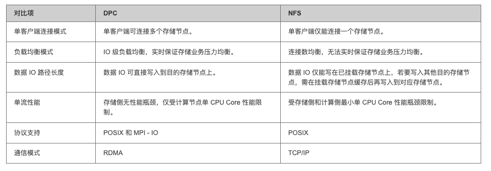
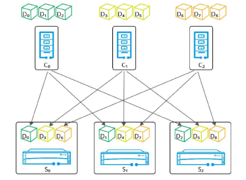
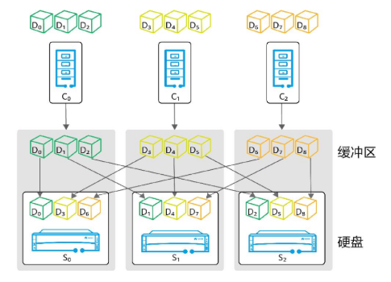

## DPC 简介

DPC（Distributed Parallel Client）分布式并行客户端，它作为存储客户端运行在计算节点上，可同时连接多个存储节点，对上层应用提供标准 POSIX 和 MPI - IO 接口，以获得更好的兼容性和更优的性能。

- <https://github.com/Huawei/eSDK_K8S_Plugin>
- <https://huawei.github.io/css-docs/docs/basic-services/storage-backend-management/configuring-the-storage-backend/mass-storage-oceanstor-pacific-series-57/file-system-58/dpc/>
- OceanStor Pacific 系列兼容性查询：<https://info.support.huawei.com/storage/comp/#/oceanstor-pacific?lang=zh&type=DPC%20%E5%9F%BA%E6%9C%AC%E8%BF%9E%E9%80%9A%E6%80%A7>
- DPC 安装文档：<https://support.huawei.com/enterprise/zh/doc/EDOC1100376566/6270762>、<https://support.huawei.com/enterprise/zh/doc/EDOC1100376305/af35eb8e>



DPC 数据路径



NFS 数据路径



## 安装 DPC 客户端

安装 `OceanStor-Pacific_8.2.0.SPH068_DPC.tar.gz`（当前版本）

```bash
cd OceanStor-Pacific_8.2.0.SPH068_DPC/action/
```

获取节点资源包：<https://support.huawei.com/enterprise/zh/doc/EDOC1100376305/cb8c9e0b>

安装

```bash
bash install.sh preinstall_params.cfg
```

## 性能调优

- <https://support.huawei.com/enterprise/zh/doc/EDOC1100376566/1e8f0259>