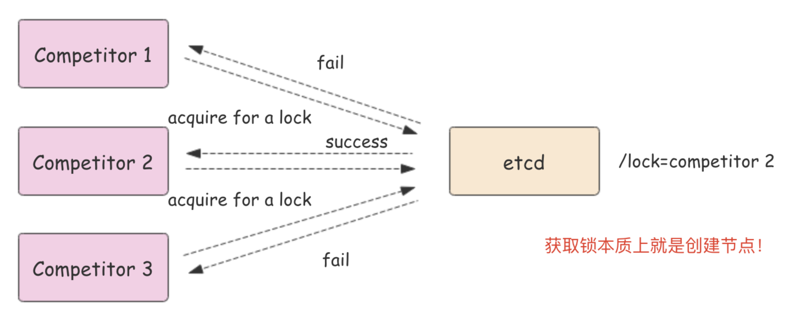

## Etcd 简介

官方：

- GitHub 仓库：<https://github.com/etcd-io/etcd>
- 文档：<https://etcd.io/docs/v3.5/>
- Benchmark tester：<https://github.com/etcd-io/dbtester>
- Helm 部署：<https://github.com/etcd-io/discovery.etcd.io>

etcd 是使用 Go 语言开发的一个开源的、高可用的分布式 key-value 存储系统。用于分布式系统或计算机集群的共享配置、服务发现和调度协调。

etcd 是许多其他项目的核心组件。最值得注意的是，它是 Kubernetes 的首要数据存储，也是容器编排的实际标准系统。使用 etcd， 云原生应用可以保持更为一致的运行时间，而且在个别服务器发生故障时也能正常工作。应用从 etcd 读取数据并写入到其中；通过分散配置数据，为节点配置提供冗余和弹性。

可以用于配置共享和服务的注册和发现，类似项目有 zookeeper 和 consul。

Etcd 具有以下特点：

- 完全复制：集群中的每个节点都可以使用完整的存档
- 高可用性：Etcd 可用于避免硬件的单点故障或网络问题
- 一致性：每次读取都会返回跨多主机的最新写入
- 简单：包括一个定义良好、面向用户的API（gRPC）
- 安全：实现了带有可选的客户端证书身份验证的自动化 TLS
- 快速：每秒 10000 次写入的基准速度
- 可靠：使用 Raft 算法实现了强一致、高可用的服务存储目录

## Etcd 应用场景

###  服务发现

服务发现要解决的也是分布式系统中最常见的问题之一，即在同一个分布式集群中的进程或服务，要如何才能找到对方并建立连接。

本质上来说，服务发现就是想要了解集群中是否有进程在监听 udp 或 tcp 端口，并且通过名字就可以查找和连接。


###  配置中心

将一些配置信息放到 etcd 上进行集中管理。

这类场景的使用方式通常是这样：应用在启动的时候主动从 etcd 获取一次配置信息，同时，在 etcd 节点上注册一个 Watcher 并等待，以后每次配置有更新的时候，etcd 都会实时通知订阅者，以此达到获取最新配置信息的目的。

###  分布式锁

因为 etcd 使用 Raft 算法保持了数据的强一致性，某次操作存储到集群中的值必然是全局一致的，所以很容易实现分布式锁。锁服务有两种使用方式，一是保持独占，二是控制时序。

- 保持独占即所有获取锁的用户最终只有一个可以得到。etcd 为此提供了一套实现分布式锁原子操作 CAS（CompareAndSwap）的 API。通过设置 prevExist 值，可以保证在多个节点同时去创建某个目录时，只有一个成功。而创建成功的用户就可以认为是获得了锁。
- 控制时序，即所有想要获得锁的用户都会被安排执行，但是获得锁的顺序也是全局唯一的，同时决定了执行顺序。etcd 为此也提供了一套 API（自动创建有序键），对一个目录建值时指定为 POST 动作，这样 etcd 会自动在目录下生成一个当前最大的值为键，存储这个新的值（客户端编号）。同时还可以使用 API 按顺序列出所有当前目录下的键值。此时这些键的值就是客户端的时序，而这些键中存储的值可以是代表客户端的编号。



## 对比 ZK

etcd 实现的这些功能，ZooKeeper 都能实现。那么为什么要用 etcd 而非直接使用ZooKeeper呢？

为什么不选择 ZooKeeper？

- 部署维护复杂，其使用的 Paxos 强一致性算法复杂难懂
- 官方只提供了 Java 和 C 两种语言的接口
- 使用 Java 编写引入大量的依赖。运维人员维护起来比较麻烦
- 最近几年发展缓慢，不如 etcd 和 consul 等后起之秀

为什么选择 Etcd？

- 简单：使用 Go 语言编写部署简单；支持 HTTP/JSON API，使用简单；使用 Raft 算法保证强一致性让用户易于理解
- etcd 默认数据一更新就进行持久化
- etcd 支持 SSL 客户端安全认证

最后，etcd 作为一个年轻的项目，正在高速迭代和开发中，这既是一个优点，也是一个缺点。优点是它的未来具有无限的可能性，缺点是无法得到大项目长时间使用的检验。然而，目前 CoreOS、Kubernetes 和 CloudFoundry 等知名项目均在生产环境中使用了etcd，所以总的来说，etcd 值得去尝试。

## Etcd 集群部署

etcd 作为一个高可用键值存储系统，天生就是为集群化而设计的。由于 Raft 算法在做决策时需要多数节点的投票，所以 etcd 一般部署集群推荐奇数个节点，推荐的数量为 3、5 或者 7 个节点构成一个集群。

### 二进制部署

在每个 etcd 节点指定集群成员，为了区分不同的集群最好同时配置一个独一无二的 token。

下面是提前定义好的集群信息，其中 n1、n2 和 n3 表示 3 个不同的 etcd 节点。

```bash
TOKEN=token-01
CLUSTER_STATE=new
CLUSTER=n1=http://10.244.244.201:2380,n2=http://10.244.244.211:2380,n3=http://10.244.244.212:2380
```

在 n1 这台机器上执行以下命令来启动 etcd：

```bash
etcd --data-dir=data.etcd --name n1 \
  --initial-advertise-peer-urls http://10.244.244.201:2380 --listen-peer-urls http://10.244.244.201:2380 \
  --advertise-client-urls http://10.244.244.201:2379 --listen-client-urls http://10.244.244.201:2379 \
  --initial-cluster ${CLUSTER} \
  --initial-cluster-state ${CLUSTER_STATE} --initial-cluster-token ${TOKEN}
```

在 n2 这台机器上执行以下命令启动 etcd：

```bash
etcd --data-dir=data.etcd --name n2 \
  --initial-advertise-peer-urls http://10.244.244.211:2380 --listen-peer-urls http://10.244.244.211:2380 \
  --advertise-client-urls http://10.244.244.211:2379 --listen-client-urls http://10.244.244.211:2379 \
  --initial-cluster ${CLUSTER} \
  --initial-cluster-state ${CLUSTER_STATE} --initial-cluster-token ${TOKEN}
```

在 n3 这台机器上执行以下命令启动 etcd：

```bash
etcd --data-dir=data.etcd --name n3 \
  --initial-advertise-peer-urls http://10.244.244.212:2380 --listen-peer-urls http://10.244.244.212:2380 \
  --advertise-client-urls http://10.244.244.212:2379 --listen-client-urls http://10.244.244.212:2379 \
  --initial-cluster ${CLUSTER} \
  --initial-cluster-state ${CLUSTER_STATE} --initial-cluster-token ${TOKEN}
```

到此 etcd 集群就搭建起来了，可以使用 etcdctl 来连接 etcd。

```bash
export ETCDCTL_API=3
export HOST_1=10.244.244.201
export HOST_2=10.244.244.211
export HOST_3=10.244.244.212
export ENDPOINTS=$HOST_1:2379,$HOST_2:2379,$HOST_3:2379

etcdctl --endpoints=$ENDPOINTS member list
```

### Helm 部署

官方暂未提供 Helm chart 部署，这里使用 bitnami 的 chart 进行部署

添加 helm 仓库

```bash
helm repo add bitnami https://charts.bitnami.com/bitnami
```

选择合适的版本

```bash
> helm search repo bitnami/etcd 

NAME            CHART VERSION   APP VERSION     DESCRIPTION                                       
bitnami/etcd    8.7.3           3.5.7           etcd is a distributed key-value store designed ...
```

下载 chart

```bash
helm pull bitnami/etcd --version 8.7.3

# 下载并解压
helm pull bitnami/etcd --version 8.7.3 --untar
```

使用如下的 values.yaml 进行安装

```yaml
auth:
  rbac:
    allowNoneAuthentication: false
    rootPassword: "abcd1234"
  token:
    ttl: 10080m
replicaCount: 3

tolerations: 
  - operator: "Exists"

service:
  type: LoadBalancer

podSecurityContext:
  enabled: true
  fsGroup: 0
containerSecurityContext:
  enabled: true
  runAsUser: 1001
  runAsNonRoot: false

persistence:
  enabled: true
  storageClass: "csi-local-data-path"

# 如果需要备份恢复
disasterRecovery:
  enabled: false

```

安装

```bash
helm upgrade --install \
  -n etcd --create-namespace \
  --version 8.7.3 \
  -f ./values.yaml \
  etcd bitnami/etcd
```

连接 etcd

```bash
# 运行一个容器作为客户端
kubectl run etcd-client \
  --restart='Never' \
  --image docker.io/bitnami/etcd:3.5.7-debian-11-r0 \
  --env ROOT_PASSWORD=$(kubectl get secret --namespace etcd etcd -o jsonpath="{.data.etcd-root-password}" | base64 -d) \
  --env ETCDCTL_ENDPOINTS="etcd.etcd.svc.cluster.local:2379" \
  --namespace etcd --command -- sleep infinity

# 在容器中连接
kubectl exec --namespace etcd -it etcd-client -- bash
> etcdctl --user root:$ROOT_PASSWORD put /message Hello
> etcdctl --user root:$ROOT_PASSWORD get /message

# 或者从 LoadBalancer 的地址
kubectl run etcd-client1 \
  --restart='Never' \
  --image docker.io/bitnami/etcd:3.5.7-debian-11-r0 \
  --env ROOT_PASSWORD=$(kubectl get secret --namespace etcd etcd -o jsonpath="{.data.etcd-root-password}" | base64 -d) \
  --env ETCDCTL_ENDPOINTS="10.244.244.101:2379" \
  --namespace etcd --command -- sleep infinity
# 在容器中连接
kubectl exec --namespace etcd -it etcd-client1 -- bash
> etcdctl --user root:$ROOT_PASSWORD get /message
```

