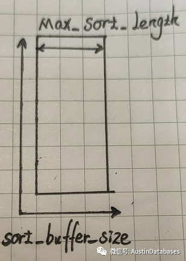

## 理论

### sort_buffer_size

sort_buffer_size 是一个 connection 级参数，在每个 connection 需要 buffer 的时候，一次性分配的内存
sort_buffer_size 并不是越大越好，过大的设置 + 高并发可能会耗尽系统内存资源

### 和 max_sort_length 之间的关系

sort buffer size 和 max_sort_length 之间的关系：



- MAX_SORT_LENGTH 仅仅锁定排序中最大支持的一行的字节数

- SORT_BUFFER_SIZE 设定的是整体我们给排序中多少容量的字节来支持整体的排序

SORT_BUFFER_SIZE 是固定，MAX_SORT_LENGTH 越大，则支持的容纳的行数就越少

对于 MAX_SORT_LENGTH，调整的后的对 于ORDER BY 的执行的时间的变化，这里的 sort_buffer_size 的配置是 20MB


如果需要排序的数据，前面字头的数据就很容易能进行排序，则越小的 MAX_SORT_LENGTH 越好

反过来，如果你的数据排序的字段，前面大致相同，需要后面的数据来进行排序的区分，那 MAX_SORT_LENGHT 大一些，同时将 SORT_BUFFER_SIZE 也需要提高

## 配置

查看 sort_buffer_size 默认值，默认值为 256K

```mysql
mysql> show variables like 'sort_buffer_size';

+------------------+--------+
| Variable_name    | Value  |
+------------------+--------+
| sort_buffer_size | 262144 |
+------------------+--------+
1 row in set (0.00 sec)
```

设置 global 级别的 sort_buffer_size 值，设置 `sort_buffer_size=1M`

```mysql
mysql> SET GLOBAL sort_buffer_size = 1024*1024;
Query OK, 0 rows affected (0.00 sec)
```

设置 session 级别的 sort_buffer_size 值

```mysql
mysql> SET session sort_buffer_size = 2*1024*1024;
Query OK, 0 rows affected (0.00 sec)
 
mysql> show variables like 'sort_buffer_size';
+------------------+---------+
| Variable_name    | Value   |
+------------------+---------+
| sort_buffer_size | 2097152 |
+------------------+---------+
1 row in set (0.00 sec)
```

设置永久生效，需要修改 `/etc/my.cnf` 文件

```bash
> cat /etc/my.cnf | grep -i sort-buffer-size

sort-buffer-size = 2M

```

