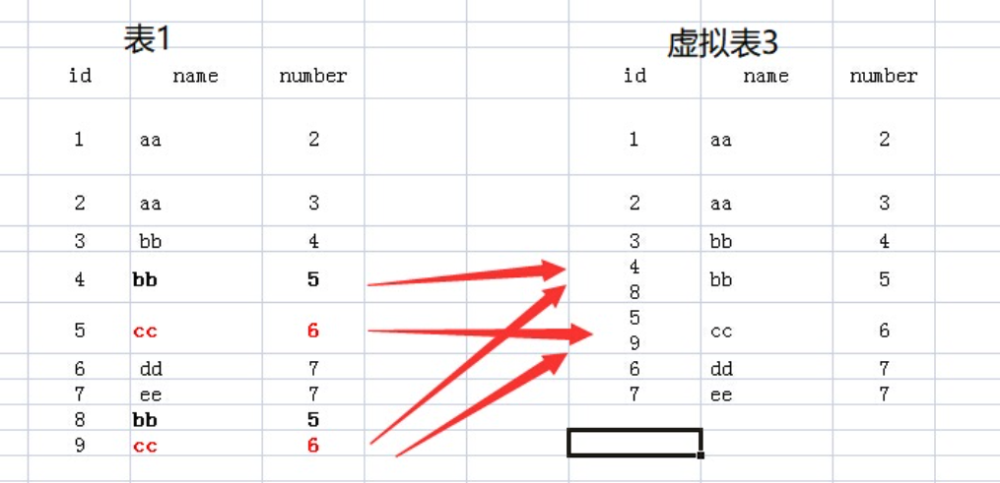

为什么不能够 `select *from Table group by id`，为什么一定不能是 `*`，而只能是某一个列或者某个列的聚合函数

先来看下表 1，表名为 test：

| id   | name | number |
| :--- | :--- | :----- |
| 1    | aa   | 2      |
| 2    | aa   | 3      |
| 3    | bb   | 4      |
| 4    | bb   | 5      |
| 5    | cc   | 6      |
| 6    | dd   | 7      |
| 7    | ee   | 7      |
| 8    | bb   | 5      |
| 9    | cc   | 6      |

执行如下 sql 语句：

```sql
select name from test group by name
```

很容易知道运行的结果：

| name |
| :--: |
|  aa  |
|  bb  |
|  cc  |
|  dd  |
|  ee  |

为了能够更好的理解 `group by` ”多个列“ 和 ”聚合函数“ 的应用，建议在思考的过程中，由表 1 到表 2 的过程中，增加一个虚构的中间表：虚拟表 3

（1）`from test`：该句执行后，应该结果和表 1 一样，就是原来的表。

（2）`from test group by name`：该句执行后，我们想象生成了虚拟表 3，如下所图所示，生成过程是这样的：group by name，那么找 name 那一列，具有相同 name 值的行，合并成一行，如对于 name 值为 aa 的，那么 `<1 aa 2>` 与 `<2 aa 3>` 两行合并成 1 行，所有的 id 值和 number 值写到一个单元格里面。


（3）接下来就要针对虚拟表 3 执行 select 语句了：

- 如果执行 `select *` 的话，那么返回的结果应该是虚拟表 3，可是 id 和 number 中有的单元格里面的内容是多个值的，而关系数据库就是基于关系的，单元格中是不允许有多个值的，所以你看，执行 `select *` 语句就报错了。
- 再看 name 列，每个单元格只有一个数据，所以我们 `select name` 的话，就没有问题了。为什么 name 列每个单元格只有一个值呢，因为我们就是用 name 列来 `group by` 的
- 那么对于 id 和 number 里面的单元格有多个数据的情况怎么办呢？答案就是用聚合函数，聚合函数就用来输入多个数据，输出一个数据的。如 `count(id)`，`sum(number)`，而每个聚合函数的输入就是每一个多数据的单元格。

执行 `select name,sum(number) from test group by name`，那么 sum 就对虚拟表 3 的 number 列的每个单元格进行 sum 操作，例如对 name 为 aa 的那一行的 number 列执行 sum 操作，即 2 + 3，返回 5，最后执行结果如下：

| name | (无列名) |
| :--- | :------- |
| aa   | 5        |
| bb   | 14       |
| cc   | 12       |
| dd   | 7        |
| ee   | 7        |

group by 多个字段该怎么理解呢：如 `group by name,number`，我们可以把 name 和 number 看成一个整体字段，以他们整体来进行分组的



接下来就可以配合 select 和聚合函数进行操作了。如执行 `select name,sum(id) from test group by name,number`，结果如下：

| name | (无列名)  |
| :--- | :------- |
| aa   | 1        |
| aa   | 2        |
| bb   | 3        |
| bb   | 12       |
| cc   | 14       |
| dd   | 6        |
| ee   | 7        |
