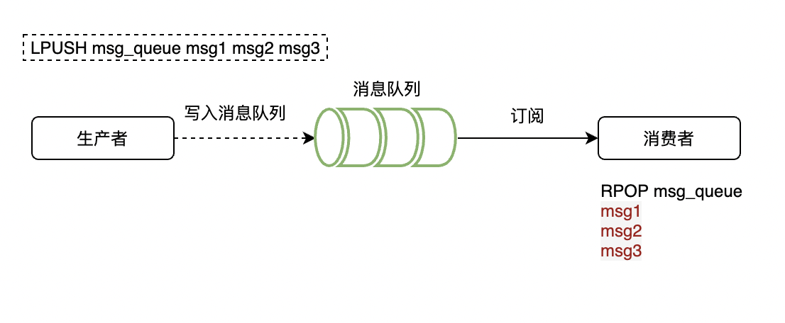

## 实现方式

| 实现方式   | 实现方法                   | 优点                             | 缺点                                  |
| ---------- | -------------------------- | -------------------------------- | ------------------------------------- |
| List       | lpush 、brpop              | 简单                             | 性能低(不断 Loop)、不能友好的重复消费 |
| Sorted-Set | zRangeByScore、zrem        | 延时队列，其他类似 List          | 类似 List                             |
| PubSub     | publish、 subscribe        | 持续订阅，性能好                 | 不能持久化消息、订阅者不在线会漏消息  |
| Stream     | xadd、 xread 或 xgroupread | 消息的持久化、主备复制、重复消费 | 无                                    |

下述涉及代码均不填写公共部分

```python
"""
redis
"""

import time

import redis

rds = redis.StrictRedis(
    host="localhost",
    port=6379,
    password="changeme",
    db=0,
    decode_responses=True,
)
```

## 异步消息队列

Redis 通过 `list` 数据结构来实现消息队列

- `lpush` 和 `rpush` 入队列
- `lpop` 和 `rpop` 出队列
- `blpop` 和 `brpop` 阻塞式出队列



如果队列长时间是空的，那 pop 就不会不断的循环，这样会导致 redis 的 QPS 升高，影响性能。所以使用 sleep 来解决，当没有消息的时候阻塞一段时间。但其实这样还会带来另一个问题，就是 sleep 会导致消息的处理延迟增加。这个问题可以通过 blpop/brpop 来阻塞读取队列。blpop/brpop 在队列没有数据的时候，会立即进入休眠状态，一旦数据到来，则立刻醒过来。消息的延迟几乎为零。用 blpop/brpop 替代前面的 lpop/rpop

还有一个需要注意的点：需要是用 try/catch 来进行异常捕获，如果一直阻塞在那里，Redis 服务器一般会主动断开掉空链接，来减少闲置资源的占用

### lpush 和 brpop 实现

实现生产者

```python
def producer():
    """
    redis producer using lpush
    """
    for i in range(10):
        rds.lpush("queue", str(i))
        print(f"生产: {i}")
        time.sleep(2)

producer()

```

实现消费者

```python
def consumer():
    """
    redis consumer using brpop
    """
    while True:
        data = rds.brpop(["queue"], timeout=1)
        if data is None:
            time.sleep(1)
            continue
        print(data)

consumer()
```

rpop 与 brpop 的区别， brpop 当队列中没有的时候会进行阻塞，直到队列中用可弹出的元素或者等待超时

## 延时队列

延时队列：需要延迟一段时间后执行

Redis 可通过 zset 来实现：可以将有序集合的 value 设置为消息任务，把 value 的 score 设置为消息的到期时间，然后轮询获取有序集合的中的到期消息进行处理

## 参考资料

- <https://zhuanlan.zhihu.com/p/662660279>
