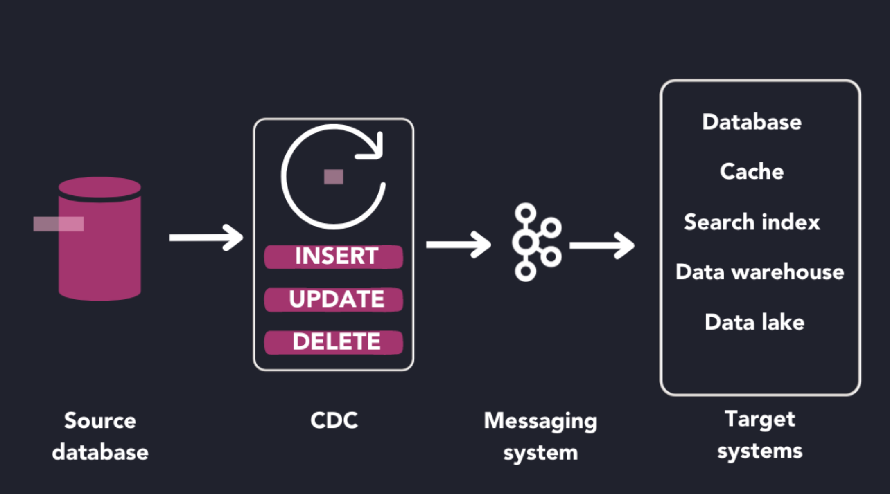
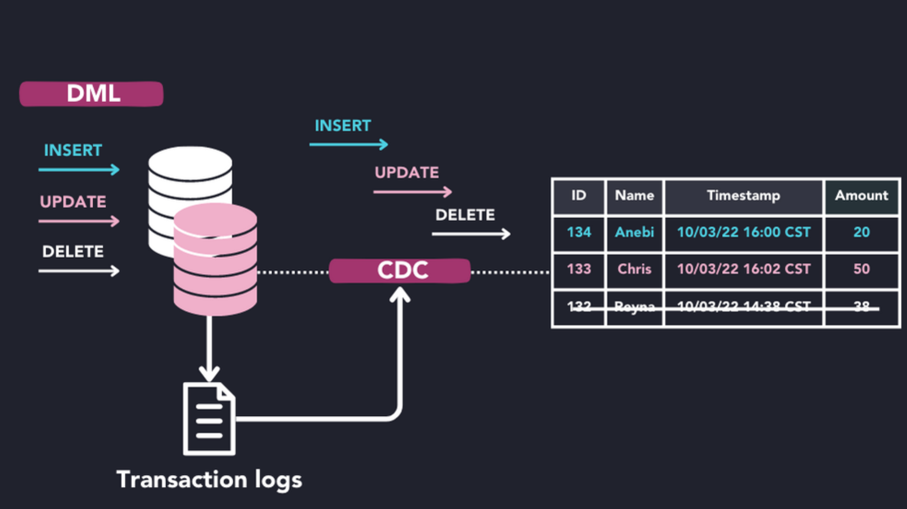

变更数据捕获 (CDC) 是一种数据集成技术，用于跟踪数据源的更改并实时将这些更改传递到目标系统。

最常见的是，变更数据捕获用于监视源数据库的更改并将这些更改传播到数据库、数据仓库、数据湖或事件流平台。

CDC 在跨各种系统的数据一致性很重要的情况下很有用。例如，变更数据捕获系统大量用于数据复制、数据迁移和数据处理管道。由于 CDC 系统实时跟踪更改，因此它比使用批处理的解决方案更好地保持了跨系统的数据完整性。

