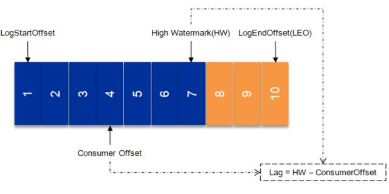
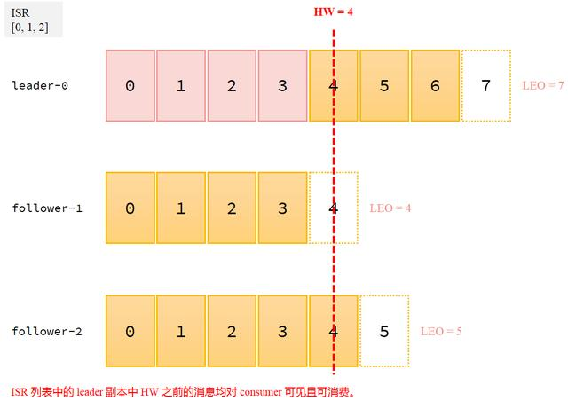

## 产生原因

由于消息消费速度处理慢或是消费端故障会导致数据产生积压。

消费积压情况分析

- LogEndOffset ：下一条将要被加入到日志的消息的位移

- CurrentOffset ：当前消费的位移

- LAG ：消息堆积量，消息中间件服务端中所留存的消息与消费掉的消息之间的差值，也称之为消费滞后量



LogEndOffset：代表 Partition 的最高日志位移。简称 LEO



消息发送到 LeaderA 之后会更新 LEO 的值，Follower1 和 Fllower2 也会实时拉取 LeaderA 中的消息来更新自己，HW 就表示 A、B、C 三者同时达到的日志位移。也就是 A、B、C 三者中 LEO 最小的那个值。由于 B、C 拉取 A 消息之间延时问题，所有 HW 必然不会与 Leader 的 LEO 相等，即 LEO>=HW

## Consumer-Groups 管理

查询消费者组

```bash
rpk group list
# bin/kafka-consumer-groups.sh --list
```

查询消费者组详情

```bash
rpk group describe groupname
# bin/kafka-consumer-groups.sh --describe --group groupname
```

## 重设消费者组位移

最早处

```bash
# bin/kafka-consumer-groups.sh --group groupname --reset-offsets --all-topics --to-earliest --execute
```

最新处

```bash
# bin/kafka-consumer-groups.sh --group groupname --reset-offsets --all-topics --to-latest --execute
```

某个位置

```bash
# bin/kafka-consumer-groups.sh --group groupname --reset-offsets --all-topics --to-offset 2000 --execute
```

调整到某个时间之后得最早位移

```bash
# bin/kafka-consumer-groups.sh --group groupname --reset-of
```