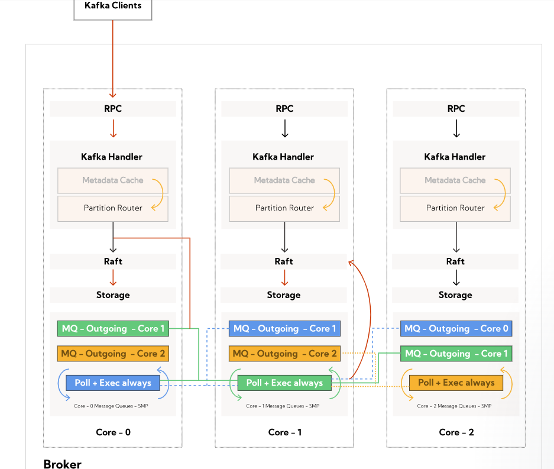
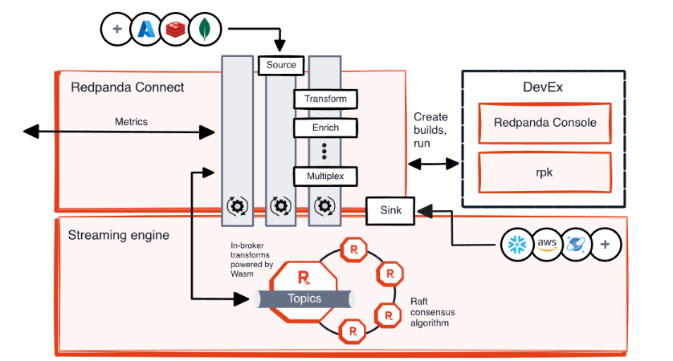

## Redpanda

Redpanda 使用 C++ 编写，是一个与 Kafka 兼容的流数据平台，事实证明它的速度提高了10 倍。

- 官方：<https://redpanda.com>

它还不含 JVM、不含 ZooKeeper、经过 Jepsen 测试且源代码可用；因为是 C++ 编写，所以无需使用 JVM，分布式协调使用 raft 协议，所以也无需使用 zookeeper。只有一个可执行二进制文件，部署非常方便

支持多种消息编码格式，包括但不限于：

- JSON
- Avro
- Protobuf

## Redpanda Console

Redpanda Console 是一个 可视化 Kafka/Redpanda 集群管理工具

通过Redpanda Console，用户可以轻松执行消息的实时查询、消费者组状态的监控以及主题配置的审查，从而确保数据流的高效和稳定

### Schema Registry

Schema Registry 功能允许用户管理和查看存储在 Schema Registry 中的所有模式，包括 Avro、Protobuf 和 JSON 格式。用户可以轻松地列出、搜索和查看这些模式的详细信息，确保数据的一致性和兼容性

## RPK

<https://docs.redpanda.com/current/reference/rpk/>

## 参考资料

- <https://blog.ktpro.ink/2024/07/06/ru-he-tong-guo-san-chong-fang-shi-bu-shu-redpanda/>

- <https://docs.automq.com/zh/automq/integrations/kafka-ui/redpanda-console>
