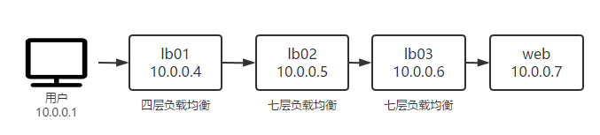

## 案例环境

## 多七层负载均衡透传真实 IP

首先去掉四层负载均衡，进行多七层负载均衡透传真实 IP 的案例

## 参考文档

- <https://www.cpweb.top/623>

- <https://djangocas.dev/blog/nginx/nginx-access-log-with-real-x-forwarded-for-ip-instead-of-proxy-ip/>