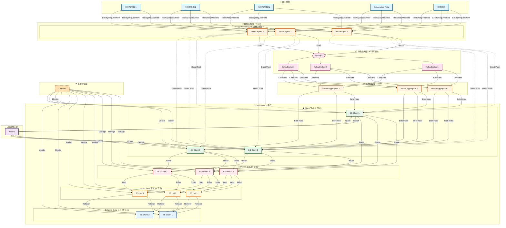

| 层级       | 组件              | 节点数 | 作用                 |
| :--------- | :---------------- | :----- | :------------------- |
| 日志源层   | 应用 / 系统       | N      | 产生日志数据         |
| 采集层     | Vector Agent      | N      | 边缘采集、初步处理   |
| 消息队列层 | Kafka Broker      | 3      | 削峰填谷、缓冲       |
| 聚合层     | Vector Aggregator | 3      | 消费 Kafka、批量写入 |
| 存储层     | ES Master         | 3      | 集群元数据管理       |
| 存储层     | ES Hot            | 3      | 热数据读写           |
| 存储层     | ES Warm           | 2      | 冷数据归档           |
| 存储层     | ES Client         | 3      | 查询路由、协调       |
| 查询层     | Kibana            | N      | 日志检索、可视化     |
| 管理层     | Cerebro           | 1      | 集群监控、索引管理   |



两条日志写入路径

```bash
路径 1（推荐 - 削峰）：
日志源 → Vector Agent → Kafka → Vector Aggregator → ES

路径 2（直连 - 低延迟）：
日志源 → Vector Agent → ES Client → ES
```

Vector Agent 配置

```yaml
# vector.toml
[sinks.kafka]
  type = "kafka"
  inputs = ["processed_logs"]
  bootstrap_servers = ["kafka1:9092", "kafka2:9092", "kafka3:9092"]
  topic = "logs-topic"
  compression = "gzip"
```

 Vector Aggregator 配置（消费 Kafka 写入 ES）

```yaml
# vector-aggregator.toml
[sources.kafka]
  type = "kafka"
  bootstrap_servers = ["kafka1:9092", "kafka2:9092", "kafka3:9092"]
  topics = ["logs-topic"]

[sinks.elasticsearch]
  type = "elasticsearch"
  inputs = ["kafka"]
  endpoints = ["http://es-client1:9200", "http://es-client2:9200", "http://es-client3:9200"]
  bulk.action = "index"
  bulk.flush.bytes = 10485760
  bulk.flush.interval = 1000
```

ES 索引生命周期管理 (ILM)

```json
{
  "policy": {
    "phases": {
      "hot": {
        "actions": { "rollover": { "max_size": "50GB", "max_age": "1d" } }
      },
      "warm": {
        "min_age": "7d",
        "actions": { "shrink": { "number_of_shards": 1 }, "freeze": {} }
      },
      "delete": {
        "min_age": "30d",
        "actions": { "delete": {} }
      }
    }
  }
}
```

| 特性     | 说明                          |
| :------- | :---------------------------- |
| 削峰能力 | Kafka 缓冲应对日志洪峰        |
| 高可用   | 各组件多副本，无单点故障      |
| 冷热分离 | Hot / Warm 架构优化存储成本   |
| 灵活路由 | Vector 支持多种处理和路由策略 |
| 管理     | Cerebro + Kibana 双重监控     |