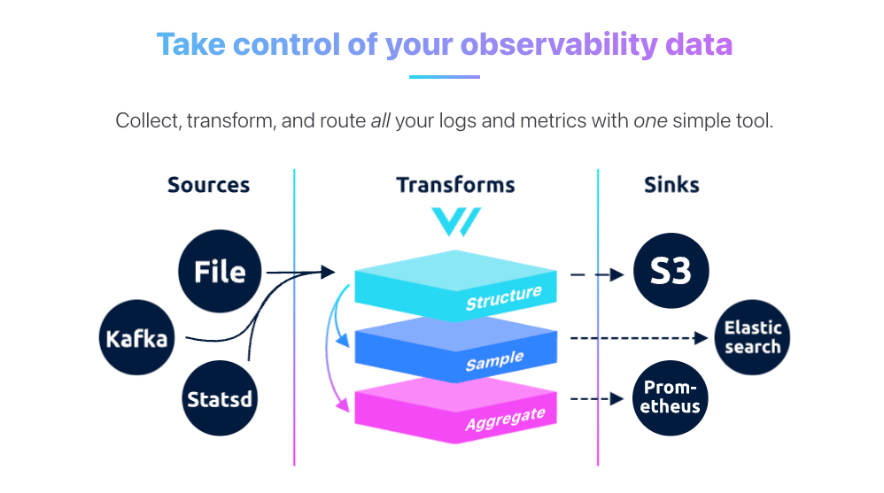
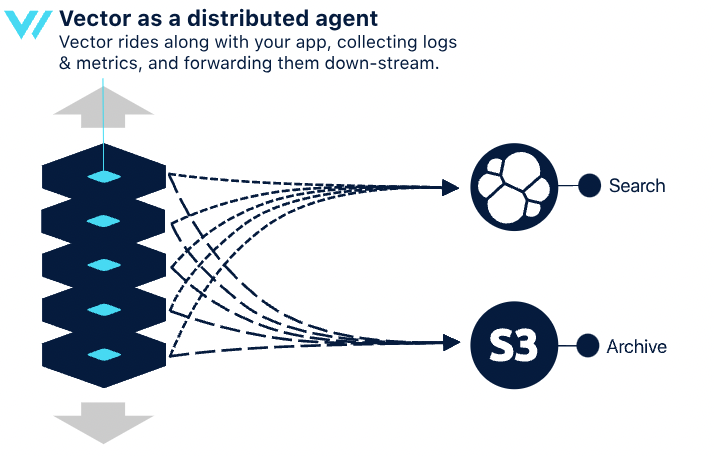
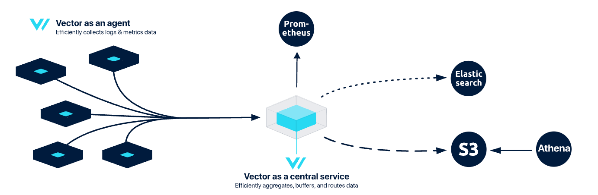
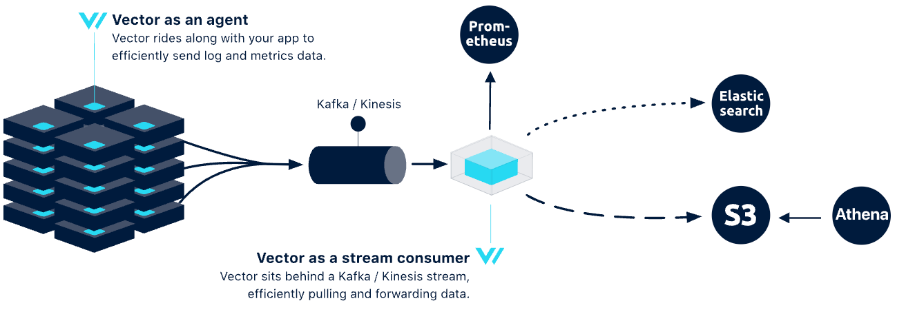

## Vector

Vector 是一种高性能的可观察性数据管道，可以收集、转换所有日志、指标和跟踪信息（ logs, metrics, and traces），并将其写到想要的存储当中；Vector 可以实现显着的成本降低、丰富的数据处理和数据安全

官方：

- 代码仓库：<https://github.com/vectordotdev/vector>

- 官网：<https://vector.dev/>
- 官方文档：<https://vector.dev/docs/>

## 基本概念

Vector 将整个流程抽象为数据源（Source）、可选的数据处理（Transform）和数据目的地（Sink）三个模块

在数据类型方面，Vector 将所有可观测数据统一抽象为 Event ，包含了指标（Metric）和日志（Log）两大类。其中 Metric 又进一步细分为 Gauge 、Counter 、Distribution、Histogram 和 Summary 等类型，这些分类与 Prometheus 中的概念十分相似

## 部署模式

Vector 可以部署为两个角色，既可以作为数据采集的 agent，也可以作为数据聚合、路由的 aggregator

### 分布式拓扑

在分布式拓扑中，可以在每个客户端节点上安装 Vector 代理。其中 Vector 直接在客户端节点与下游服务之间进行通信。在这种模式下，每个客户端节点都充当数据收集和转发的角色。Vector 代理会独立运行，处理来自本地资源（如应用程序日志、系统指标等）的数据。这种拓扑的设计理念是避免中间层，直接将数据传输到目标系统

优点：

- 简单：结构简单，易于理解和实现。
- 弹性：可以随着应用的扩展，资源随着扩展而增长。

缺点：

- 效率较低：复杂的管道可能耗费更多资源，影响其他应用的性能。
- 耐久性差：由于数据缓存在主机上，可能在不可恢复的崩溃中丢失重要数据。
- 下游压力大：下游服务可能会收到更多小请求，影响其稳定性。
- 缺乏多主机上下文：缺乏对其他主机的感知，无法跨主机执行操作。

### 集中式拓扑

集中式拓扑在简单性、稳定性和控制之间取得了良好的平衡。在这种模式下，数据首先由客户端节点的 Vector 代理收集，然后发送到一个或多个集中式的 Vector 聚合器。这种架构通过集中管理和处理数据，提高了整体的效率和可靠性。

优点：

- 更高效：集中式服务缓冲数据，提供更好的压缩和优化请求，降低客户端节点和下游服务的负担。
- 更可靠：通过平滑的缓冲和刷新策略，保护下游服务免受流量峰值的影响。
- 多主机上下文：能够跨主机执行操作，适合大规模部署。

缺点：

- 更复杂：需要同时运行 Vector 的代理和聚合器角色，增加了管理复杂性。
- 耐久性差：如果中央服务发生故障，可能会丢失缓冲数据。

### 流式拓扑

这种拓扑通常用于需要高耐久性和弹性的环境，适合大型数据流的处理。在流式拓扑中，需要部署 Vector 代理来收集数据，并将其发送到流处理系统（如 Kafka）。配置文件应指定数据源、流处理的参数以及下游系统的连接。代理将数据转发到 Kafka，Kafka 再将数据分发给消费者。

