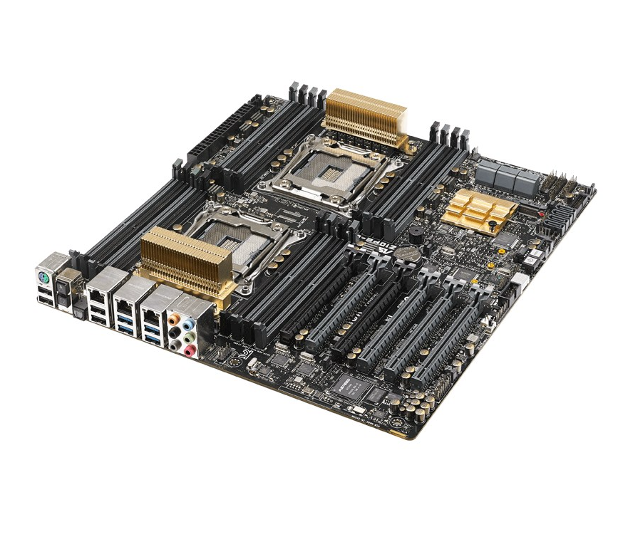

## Z10PH-D16

## Z10PE-D16

## Z10PR-D16

- <http://asus.com.cn/commercial-servers-workstations/z10prd16/specifications/>

EEB

2 x Socket R3 (LGA 2011-3)

16 x DIMM

DDR4 2133/1866/1600 MHz RDIMM, LR-DIMM Memory

## Z10PE-D16 WS

- <https://www.asus.com.cn/commercial-servers-workstations/z10ped16_ws/specifications/>

EEB

2 x Socket R3 (LGA 2011-3)

16 x DIMM

DDR4 2400/2133/1866/1600 MHz RDIMM, LR-DIMM Memory

## Z10PC-D8

## Z10PA-U8

- <https://www.asus.com.cn/commercial-servers-workstations/z10pau8/specifications/>

ATX

1 x Socket R3 (LGA 2011-3)

内存插槽数 : 8个内存插槽 (4通道/CPU, 8-DIMM插槽/CPU)

DDR4 2133 /1866/1600/1333 RDIMM；DDR4 2133 /1866/1600/1333 LRDIMM

内存规格: 32GB, 16GB, 8GB, 4GB RDIMM；64GB, 32GB LRDIMM

## Z10PA-D8

- <https://www.asus.com.cn/Commercial-Servers-Workstations/Z10PAD8/specifications/>

ATX

2 x Socket R3 (LGA 2011-3)

内存插槽数 : 8个内存插槽  (4通道/CPU, 8-DIMM插槽/CPU)

DDR4 2133 /1866/1600/1333 RDIMM；DDR4 2133 /1866/1600/1333 LRDIMM

内存规格: 32GB, 16GB, 8GB, 4GB RDIMM；64GB, 32GB LRDIMM

