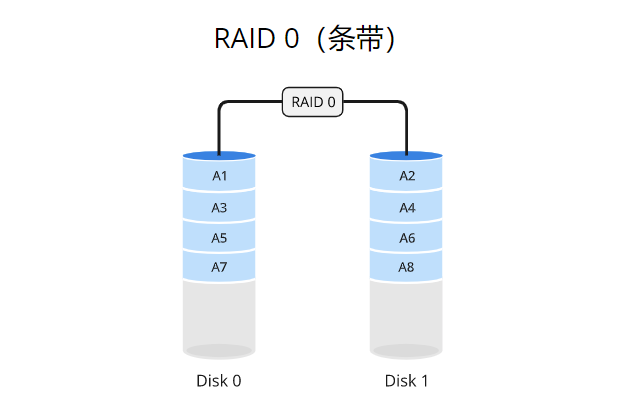
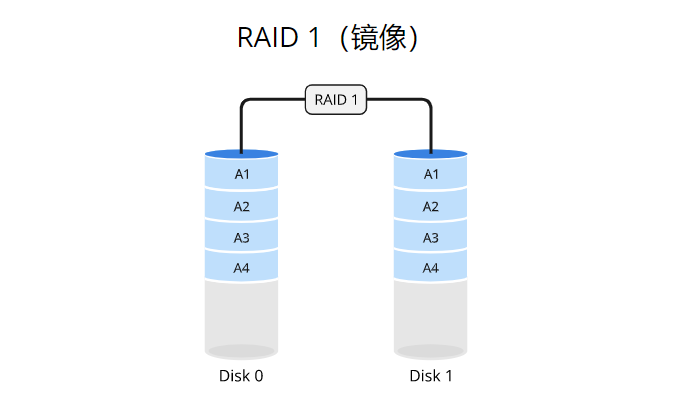
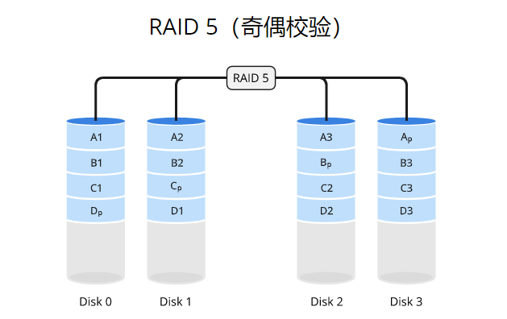
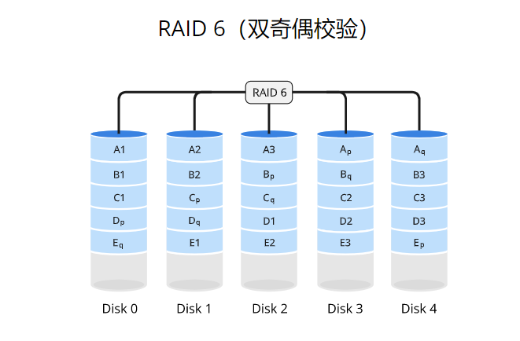
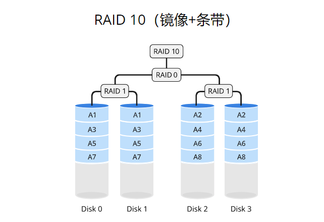
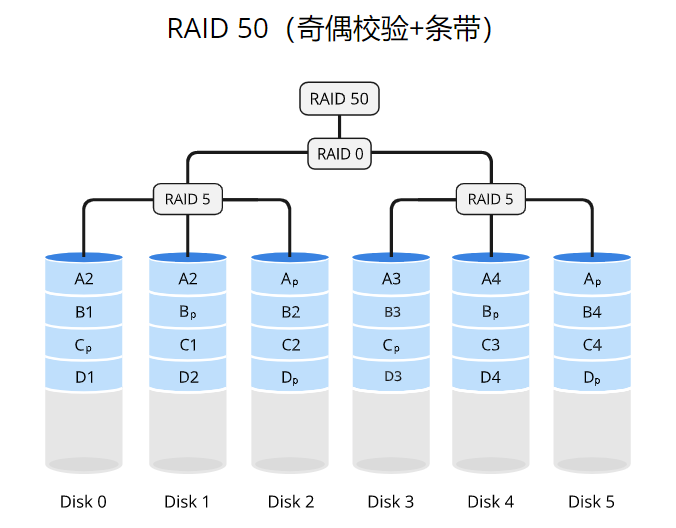
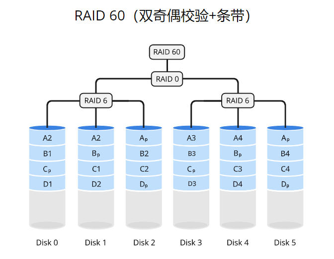

## RAID 级别

### RAID 0

### RAID 1

### RAID 5

### RAID 6

### RAID 10

### RAID 50

### RAID 60

## RAID 对比

| RAID 等级   | 冗余能力 | 读性能 | 写性能 | 存储效率 | 适用场景           |
| ----------- | -------- | ------ | ------ | -------- | ------------------ |
| **RAID 0**  | 无       | 最高   | 最高   | 100%     | 高性能、非关键数据 |
| **RAID 1**  | 单盘冗余 | 高     | 低     | 50%      | 高读性能需求       |
| **RAID 5**  | 单盘冗余 | 高     | 中     | N-1      | 平衡性能与容错     |
| **RAID 6**  | 双盘冗余 | 高     | 低     | N-2      | 高可靠性需求       |
| **RAID 10** | 单盘冗余 | 非常高 | 中     | 50%      | 高读写性能和容错   |
| **RAID 50** | 单盘冗余 | 高     | 中     | (N×K)-K  | 大规模存储         |
| **RAID 60** | 双盘冗余 | 高     | 低     | (N×K)-2K | 超大规模存储       |

以上几个磁盘阵列：

- 从读的能力来说：`RAID 5 ≈ RAID 6 ≈ RAID 60 > RAID 0 ≈ RAID 10 > RAID 3 ≈ RAID 1`
- 从写的能力来说：`RAID 10 > RAID 50 > RAID 1 > RAID 3 > RAID 5 ≈ RAID 6 ≈ RAID 60`

比较 8 块硬盘的 RAID 10 & 8 块硬盘的 RAID 60

- 重建时间：RAID 10

- 可靠性（假设冗余）：RAID 60

- 数据完整性：取决于文件系统，而不是 RAID

- 镜像 RAID 的重建速度往往比 RAID 6 快，但快不了多少。

RAID 60 具有更好的冗余，因为有两组四块硬盘，并且可以丢失每组中的任意两块硬盘，总共四个故障，数据仍然存在。如果在任何镜像对中丢失了两块硬盘，数据就没了。对于生产和备份，更倾向于选择 RAID 60。