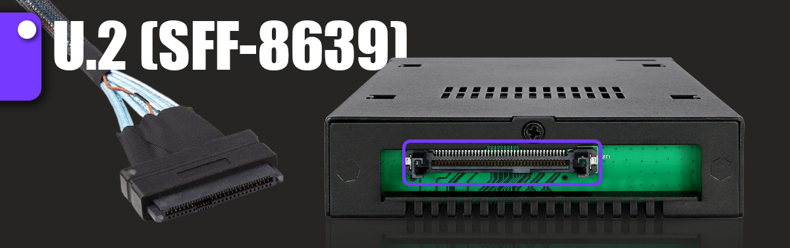
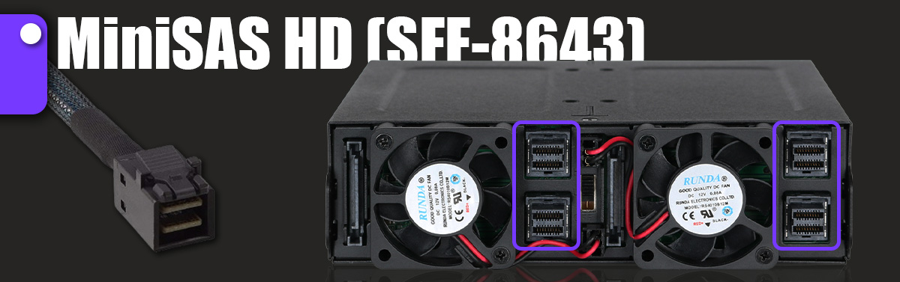
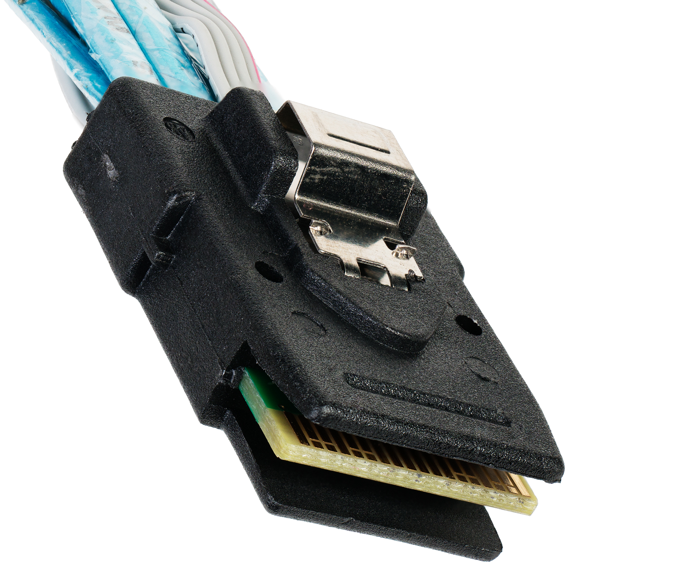
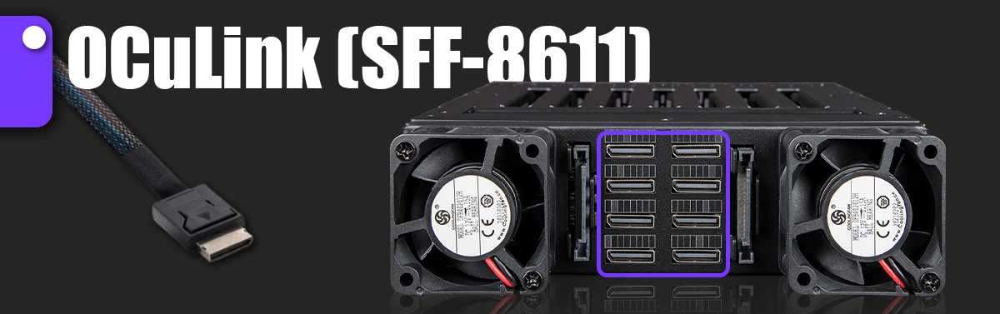
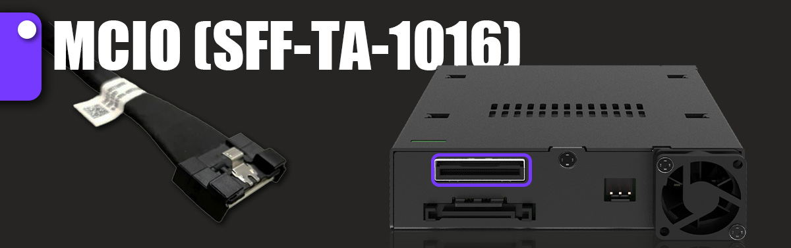

- U.2 （SFF-8639）

U.2 提供了 68 pin 组成的企业级存储解决方案的通用接口，可同时支持 NVMe、SATA 和 SAS 接口

- MiniSAS HD （SFF-8087、SFF-8643）

MiniSAS HD （SFF-8643）: MiniSAS HD 是 SAS 标准的演变，可为包括 NVMe SSD 在内的存储解决方案提供增强的性能

SFF-8087

- SlimSAS（SFF-8654）

SlimSAS 接口有 4i (36 pin)和 8i (74 pin)两种型

- OCuLink （SFF-8611）

Optical Copper Link, 是一种强大的 32 pin 接口技术，旨在促进数据通信应用中的高速数据传输，特别是在 PCIe 环境中

- MCIO （SFF-TA-1016）

Mini Cool Edige IO, 由 SFF-TA-1016 规范定义，MCIO 为未来的 PCIe 标准，如 Gen5, Gen6 和 Gen7 奠定了基础。 它的配置范围从 38pi 到 148 pin 不等

