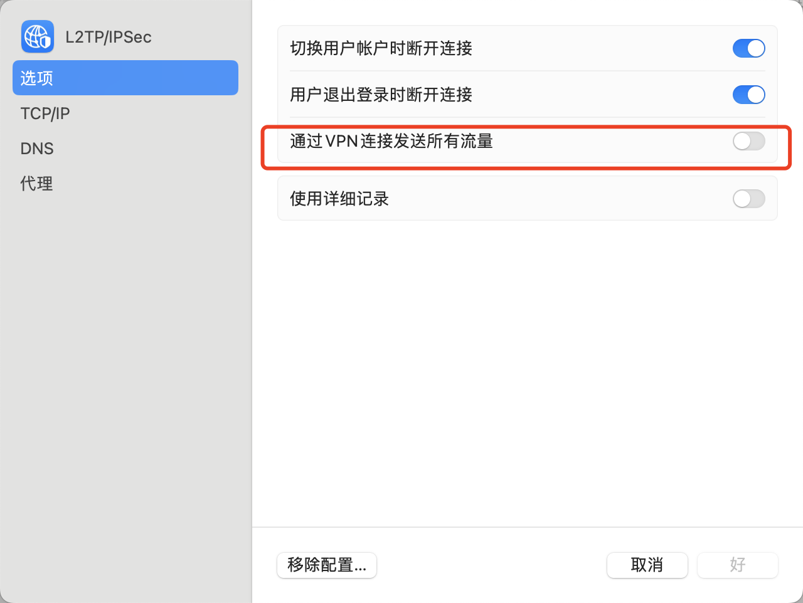

所有的流量都将通过公司的 VPN 访问，速度慢。于是通过设置路由表的方式给网络连接分流。内网 ip 走 VPN，外网流量走默认网关。

假设需要访问以下内网 ip：

```bash
10.24.0.0/16
10.244.244.0/24
39.104.143.66/32
```

首先，点开 VPN 高级选项，像上图一样把通过 VPN 连接发送所有流量去掉



设定服务顺序，将 VPN 的顺序调低

查看原始的路由表

```bash
> netstat -nr
Routing tables

Internet:
Destination        Gateway            Flags           Netif Expire
default            192.168.31.1       UGScg             en0
default            link#17            UCSIg            ppp0
default            link#20            UCSIg       bridge100      !
default            link#22            UCSIg       bridge101      !
10                 ppp0               USc              ppp0
10.10.10.1         10.10.10.3         UH               ppp0
127                127.0.0.1          UCS               lo0
127.0.0.1          127.0.0.1          UH                lo0
169.254            link#6             UCS               en0      !
...
239.255.255.250    1:0:5e:7f:ff:fa    UHmLWIg     bridge101
255.255.255.255/32 link#6             UCS               en0      !
255.255.255.255/32 link#17            UCSI             ppp0
```

接着`sudo vi /etc/ppp/ip-up`，添加如下内容：

```bash
#!/bin/sh
/sbin/route add -net 10.24.0.0/16 -interface ppp0
/sbin/route add -net 10.244.244.0/24 -interface ppp0
/sbin/route add -net 39.104.143.66/32 -interface ppp0
```

保存退出。赋权：

```bash
sudo chmod 0755 /etc/ppp/ip-up
```

这个文件以后就会在每次连接VPN的时候执行，把新的路由写入路由表，实现内外网的分流。

重新连接公司 VPN，即可实现内外网分流。

添加后的路由表

```bash
Routing tables

Internet:
Destination        Gateway            Flags           Netif Expire
default            192.168.31.1       UGScg             en0
default            link#17            UCSIg            ppp0
default            link#20            UCSIg       bridge100      !
default            link#22            UCSIg       bridge101      !
10                 ppp0               USc              ppp0
10.10.10.1         10.10.10.2         UH               ppp0
10.24/16           ppp0               USc              ppp0
10.244.244/24      ppp0               USc              ppp0
39.104.143.66/32   ppp0               USc              ppp0
...
224.0.0.251        1:0:5e:0:0:fb      UHmLWI            en0
224.0.0.251        1:0:5e:0:0:fb      UHmLWIg     bridge101
239.255.255.250    1:0:5e:7f:ff:fa    UHmLWI            en0
239.255.255.250    1:0:5e:7f:ff:fa    UHmLWIg     bridge100
239.255.255.250    1:0:5e:7f:ff:fa    UHmLWIg     bridge101
255.255.255.255/32 link#6             UCS               en0      !
255.255.255.255/32 link#17            UCSI             ppp0
```

路由测试

```bash
> traceroute 10.244.244.101
traceroute to 10.244.244.101 (10.244.244.101), 64 hops max, 52 byte packets
 1  10.10.10.1 (10.10.10.1)  46.512 ms  34.526 ms  37.952 ms
 2  10.24.9.99 (10.24.9.99)  38.300 ms  44.044 ms  43.841 ms
 3  blog.liaosirui.com (10.244.244.101)  48.519 ms  44.451 ms  56.824 ms

```

测试外网路由

```bash
> traceroute baidu.com

traceroute: Warning: baidu.com has multiple addresses; using 39.156.66.10
traceroute to baidu.com (39.156.66.10), 64 hops max, 52 byte packets
 1  192.168.31.1 (192.168.31.1)  7.026 ms  2.297 ms  1.878 ms
 2  192.168.1.1 (192.168.1.1)  2.598 ms  2.570 ms  3.334 ms
 3  100.78.192.1 (100.78.192.1)  13.331 ms  9.860 ms  7.330 ms
 4  111.9.58.1 (111.9.58.1)  13.229 ms
    111.9.58.5 (111.9.58.5)  18.707 ms
 ...
```

