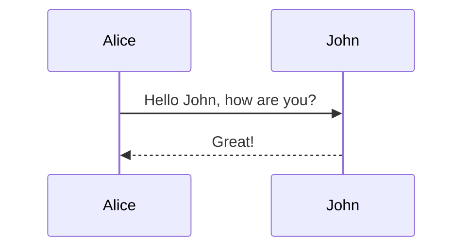
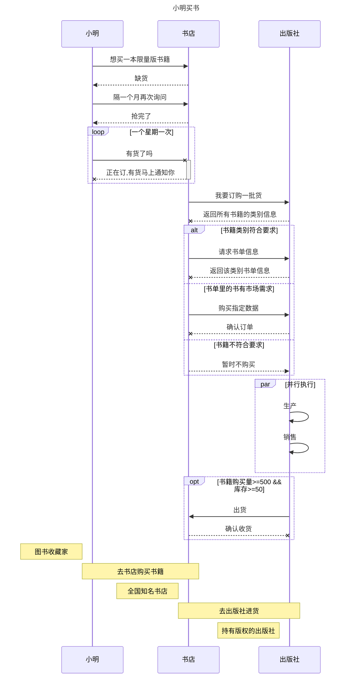

语法解释：`->>` 代表实线箭头，`-->>` 则代表虚线

```plain
sequenceDiagram
    Alice->>John: Hello John, how are you?
    John-->>Alice: Great!
```



| 类型   | 描述                             |
| ------ | -------------------------------- |
| `->`   | 无箭头的实线                     |
| `-->`  | 无箭头的虚线                     |
| `->>`  | 有箭头的实线(主动发出消息)       |
| `-->>` | 有箭头的虚线(响应)               |
| `-x`   | 末端为X的实线(主动发出异步消息)  |
| `--x`  | 有箭头的实线(以异步形式响应消息) |




