## 参与者

语法：`Actor` 角色，`Object` 对象，统称为 `Participants` 参与者

```plain
participant [ActorName]/[ObjectName] as [AliasName]
```

- `participant`：显示申明参与者
- `as`：指定参与者的别名，别名是实际显示在时序图上的名称

示例：

```plain
%% 按照 Actor 出现的顺序, 从左到右, 展示 Actor 名称
sequenceDiagram
Alice->>John: Hello John, how are you?
John->>Alice: Great!
```

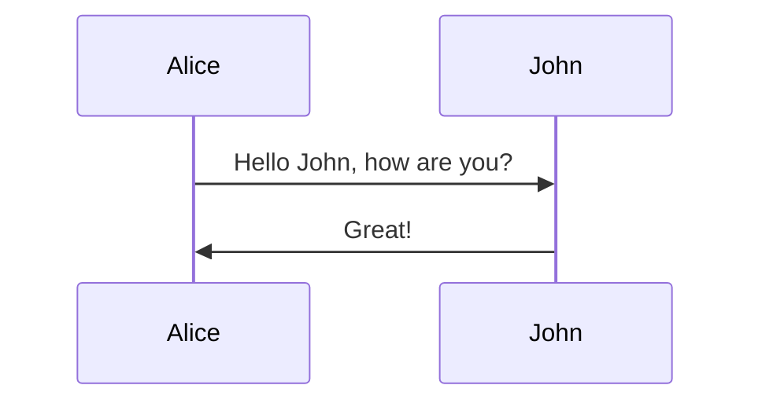


通过 `participant` 明确指出参与者，参与者展示的顺序按照 `participant` 什么的顺序

```plain
participant J as John
participant A as Alice
A->>J: Hello John, how are you?
J->>A: Great!
```

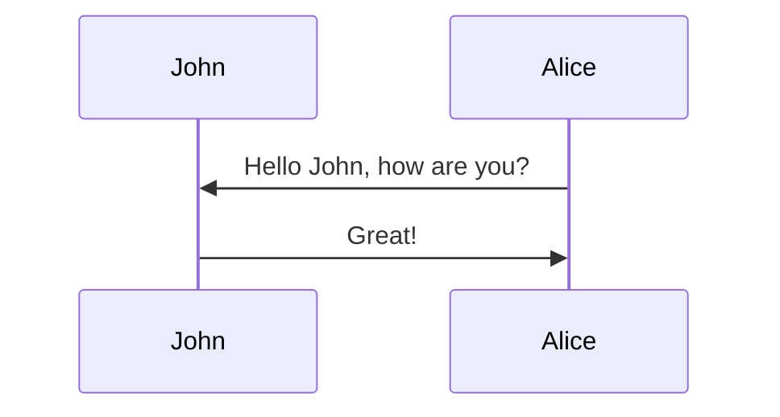


## 消息

语法：

```plain
[Actor][arrow][Actor]:Message text
```

可能的箭头类型

| 类型     | 描述                                |
| -------- | ----------------------------------- |
| `A->B`   | 无箭头的实线                        |
| `A-->B`  | 无箭头的虚线                        |
| `A->>B`  | 有箭头的实线（主动发出消息）        |
| `A-->>A` | 有箭头的虚线（响应）                |
| `A-xB`   | 末端为 X 的实线（主动发出异步消息） |
| `A--xB`  | 有箭头的虚线（以异步形式响应消息）  |

例如：

```plain
participant A
participant B
A->B: 实线
B-->A: 虚线
A->>B: 同步箭头实线
B-->>A: 同步箭头虚线
A-xB: 异步带 x 实线
B--xA: 异步带 x 虚线

```

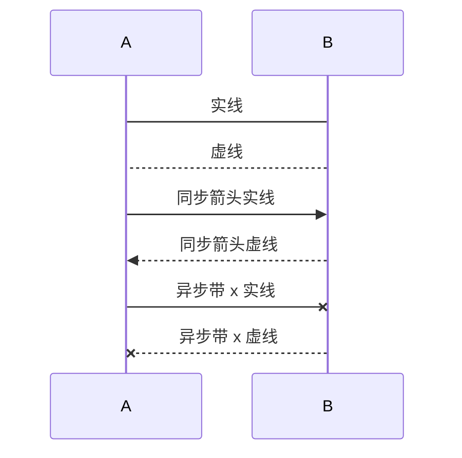


## 控制焦点

语法：

```plain
[Actor][arrow][Actor]:Message text
activate/deactivate [Actor]

或

[Actor][arrow] +/- [actor]:Message text
```

示例：

```plain
Alice->>John: Hello John, how are you?
activate John
John->>Alice: Great!
deactivate John
```

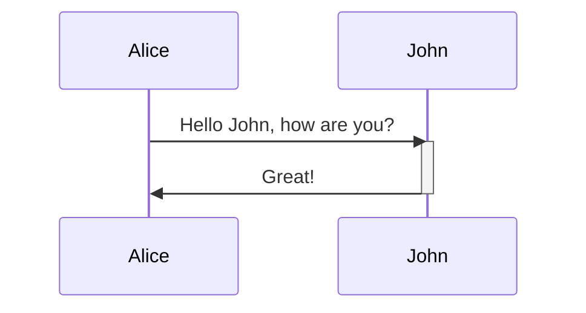


可以使用 `+`/`-` 简化表示，对同一个参与者的控制焦点会叠放

```plain
Alice->>+John: Hello John, how are you?
Dan->>+John: John, can you hear me?
John->>-Alice: Hi Alice, I can hear you!
John->>-Dan: I feel great!
```

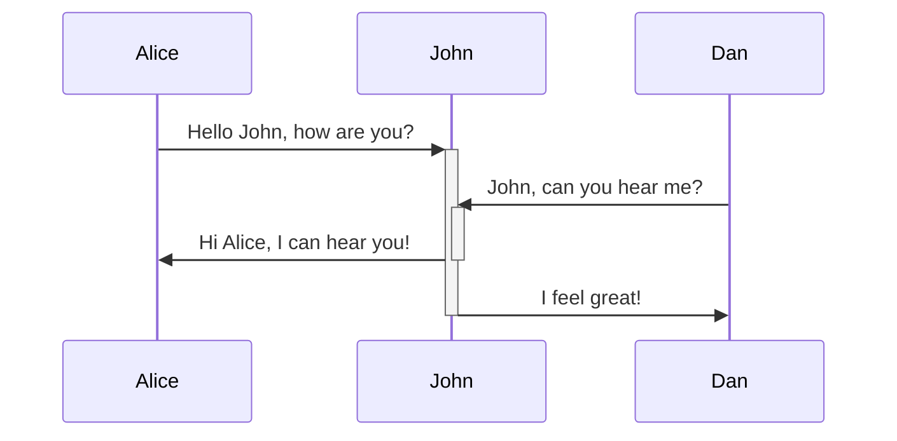

## 笔记

语法：

```plain
Note [right of | left of | over] [Actor]: Text in note content
```

示例：

`right of` 和 `left of` 只能对一个参与者使用

```plain
Note [right of | left of] John: Text in note 正确
Note right of John,Alice: Text in note 语法错误
```

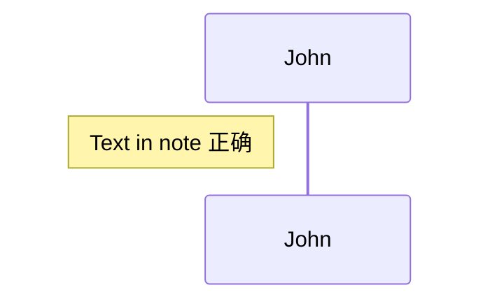

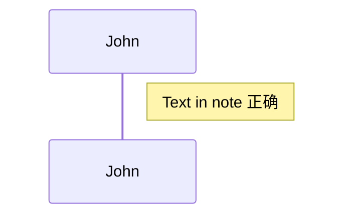


`over `可以对多个参与者使用

```plain
Note over Alice,John:A typical interaction
Note over Alice:A typical interaction
Note over John:A typical interaction
```

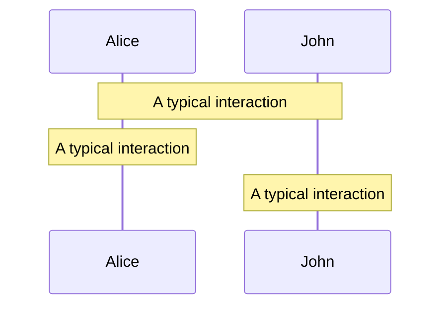

## 循环

语法：

```plain
loop [循环间隔]

end
```

示例：

```plain
Alice->John: Hello John, how are you?
loop Every minute
John->Alice: Great!
end
```

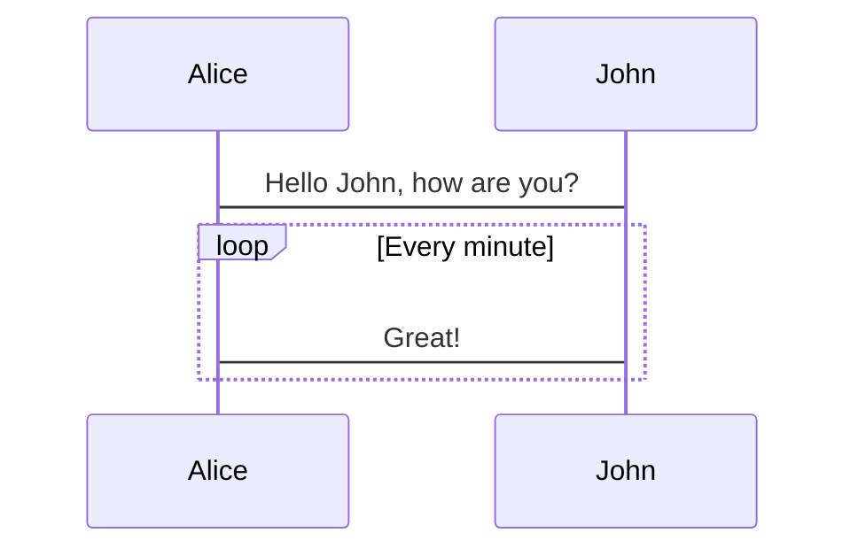

## 分支和可选操作

语法：

- 分支：

```plain
alt [判断条件]

else [判断条件]

end
```

- 可选：

```plain
opt [描述]

end
```

示例：

```plain
Alice->>Bob: Hello Bob, how are you?
alt is sick
Bob->>Alice: Not so good 😦
else is well
Bob->>Alice: Feeling fresh like a daisy
end
opt Extra response
Bob->>Alice: Thanks for asking
end
```

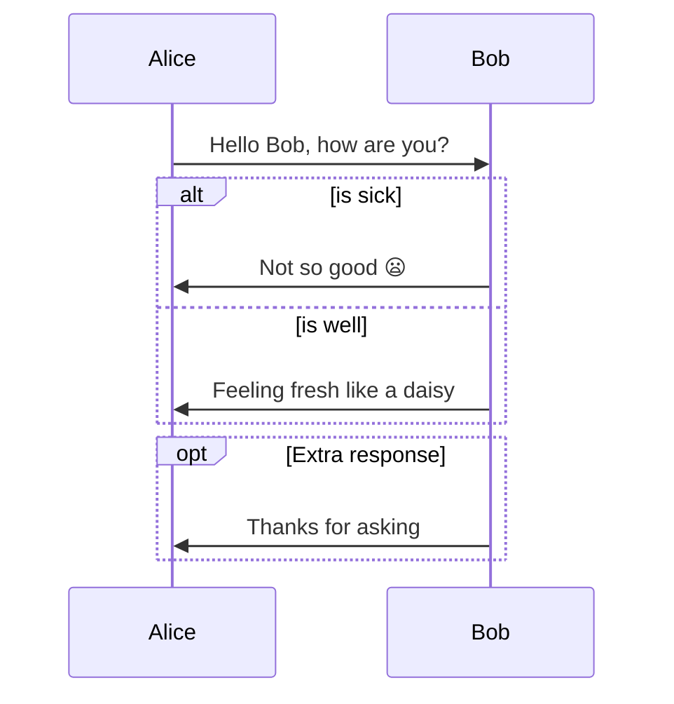

## 并行

语法：

```plain
par [Action 1]

and [Action 2]

and [Action N]

end
```

示例：

并行流程可嵌套（分支，循环也可）

```plain
par Alice to Bob
Alice->>Bob: Hello guys!
Bob->>Alice: Hello guys!
and is well
Alice->>John: Hello guys!
John->>Alice: Hello guys!
and John to Dan
par John to Dan
John->>Dan: Hello guys!
Dan->>John: Hello guys!
end
end
```

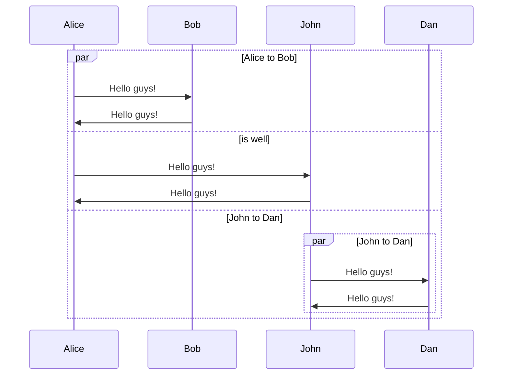


## 背景高亮

语法：

```plain
rect rgb(0, 255, 0)
end

或

rect rgba(0, 0, 255, .1)
end
```

示例：

```plain
rect rgba(60, 125, 255, .5)
par Alice to Bob
Alice->>Bob: Hello guys!
Bob->>Alice: Hello guys!
end
end
```

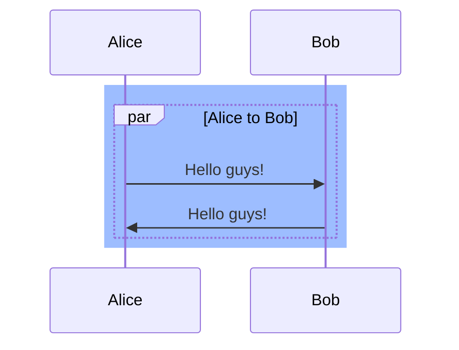


## 注释

语法：

```plain
%% 注释文本
```

示例：

```plain
Alice->>John: Hello John, how are you?
%% this is a comment
John->>Alice: Great!
```


## 时序序号

语法：

```plain
autonumber
```

示例：

```plain
autonumber
Alice->>John: Hello John, how are you?
loop Healthcheck
John->>John: Fight against hypochondria
end
Note right of John: Rational thoughts!
John->>Alice: Great!
John->>Bob: How about you?
Bob->>John: Jolly good!
```

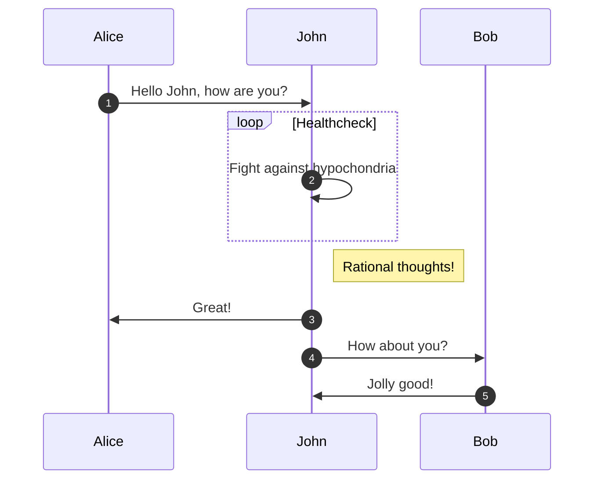

## 完整例子

```plain
sequenceDiagram
Title: 小明买书

participant consumer as 小明
participant store as 书店
participant publisher as 出版社

consumer ->> store: 想买一本限量版书籍
store -->> consumer: 缺货
consumer ->> store: 隔一个月再次询问
store -->> consumer: 抢完了
loop 一个星期一次
consumer -x +store: 有货了吗
store --x -consumer: 正在订,有货马上通知你
end

store ->> publisher: 我要订购一批货
publisher --x store: 返回所有书籍的类别信息

alt 书籍类别符合要求
store ->> publisher: 请求书单信息
publisher --x store: 返回该类别书单信息
else 书单里的书有市场需求
store ->> publisher: 购买指定数据
publisher --x store: 确认订单
else 书籍不符合要求
store -->> publisher: 暂时不购买
end

par 并行执行
publisher ->> publisher : 生产
publisher ->> publisher : 销售
end

opt 书籍购买量>=500 && 库存>=50
publisher ->> store : 出货
store --x publisher : 确认收货
end

Note left of consumer : 图书收藏家
Note over consumer,store : 去书店购买书籍
Note left of store : 全国知名书店
Note over store,publisher : 去出版社进货
Note left of publisher : 持有版权的出版社
```


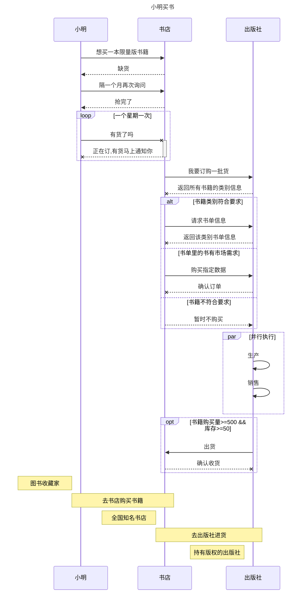

