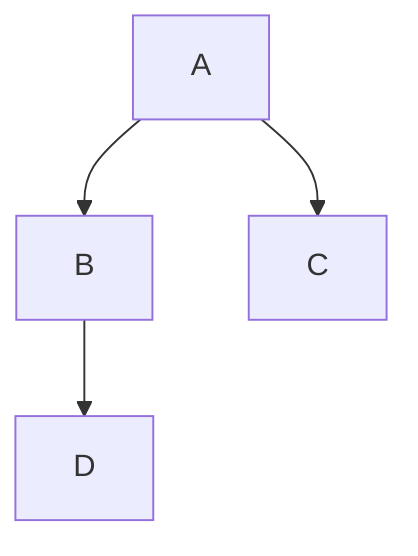
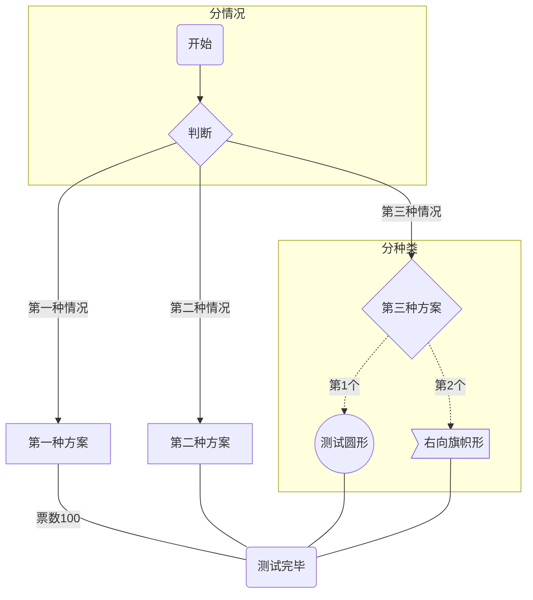
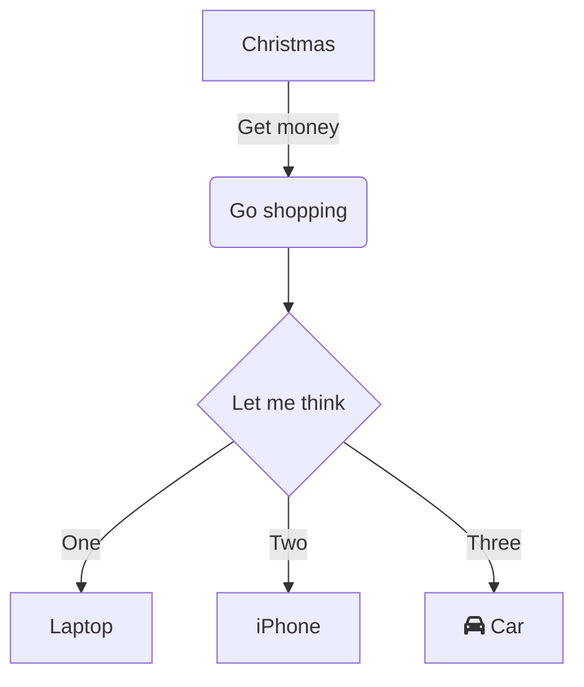

## 语法

语法解释：`graph` 关键字就是声明一张流程图，`TD` 表示的是方向，这里的含义是 Top-Down 由上至下

流程图布局方向，由四种基本方向组成，分别是英文单词

- `top` 上
- `bottom` 下
- `left` 左 
- `right`右

| 字母表示 | 含义     |
| -------- | -------- |
| TB       | 从上到下 |
| BT       | 从下到上 |
| LR       | 从左到右 |
| RL       | 从右到左 |

> 仅支持上下左右四个垂直方向，是英文单词首字母大写缩写

| 表述         | 说明         | 含义                                               |
| ------------ | ------------ | -------------------------------------------------- |
| `id[文字]`   | 矩形节点     | 表示过程                                           |
| `id(文字)`   | 圆角矩形节点 | 表示开始与结束                                     |
| `id((文字))` | 圆形节点     | 表示连接。为避免流程过长或有交叉，可将流程切开成对 |
| `id{文字}`   | 菱形节点     | 表示判断、决策                                     |
| `id>文字 ]`  | 右向旗帜节点 |                                                    |

支持虚线与实线，有箭头与无箭头、有文字与无文字。

分别是 `---`、`-.-`、 `-->`、`-.->`、`--文字-->`、`-.文字.->`、`--文字---`、`-.文字.-`

支持子图

## 示例

示例 1

示例 2

示例 3

