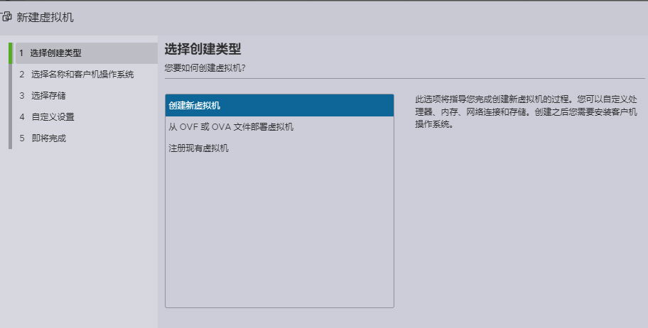
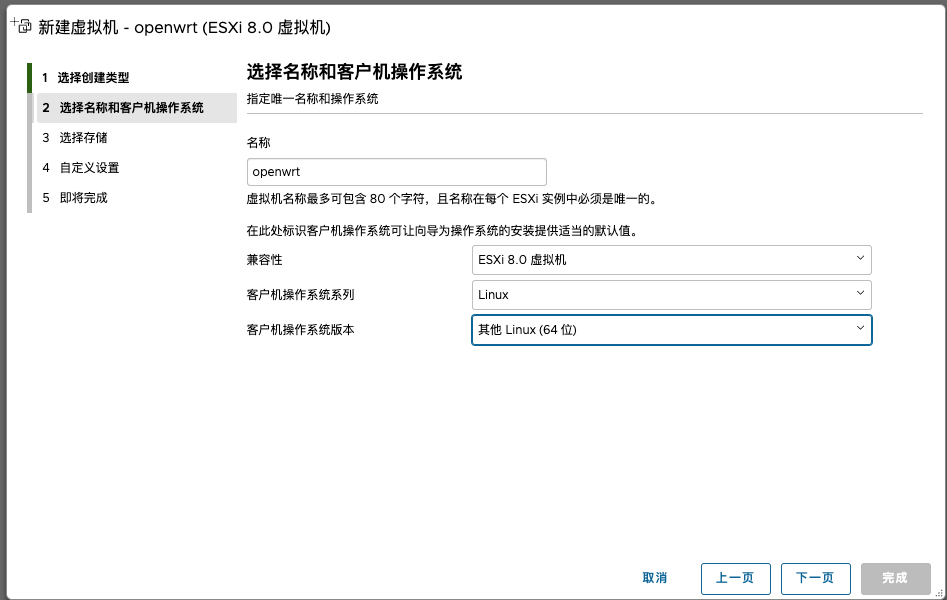
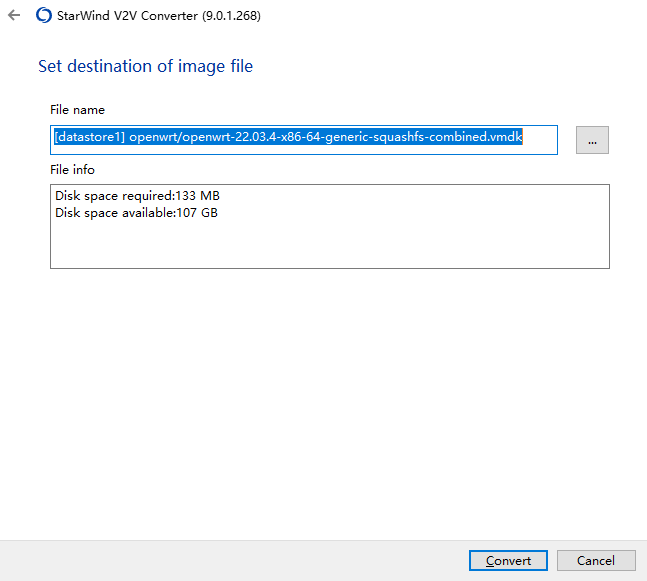
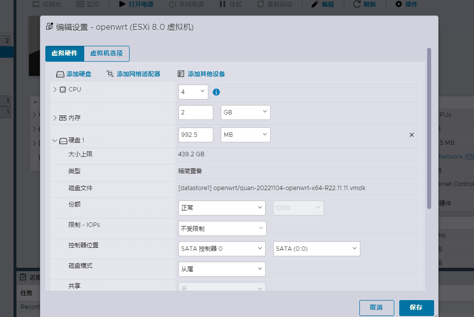
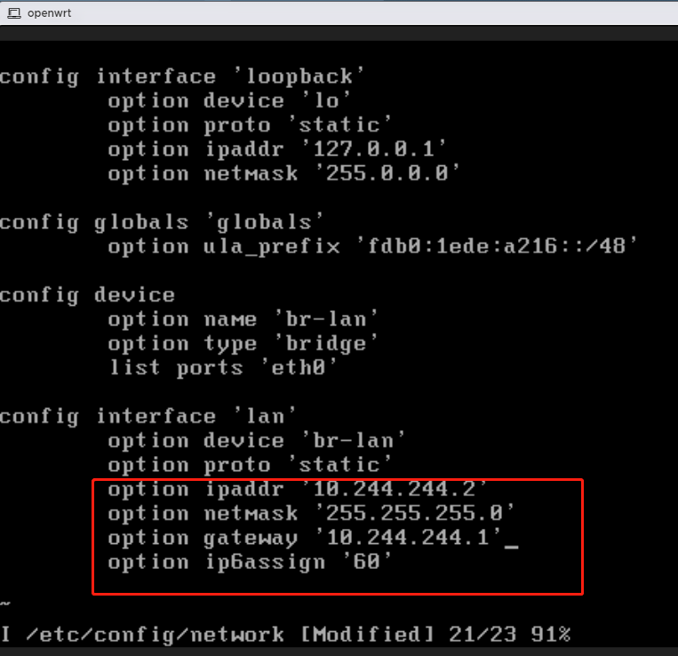

## 主路由与旁路由

旁路由是一个接入主路由的设备，只是比较特殊，具备网关还有其他一些特定的功能

旁路由应该叫旁路网关更合适，主路由从设备上收到数据包，首先发送到 OpenWrt 旁路由进行处理，包括去广告、留学等等，处理好之后再发回主路由，转发到外网

同样主路由接受到外网的数据包，首先也会将数据发送到旁路由进行处理，然后将处理过的数据，再根据数据包的目的地址发送到设备

数据走向：

- 第 1 步：设备通过网线第一个接入的路由器叫做主路由，主要实现拨号上网功能，ikuai 就是主路由，设备的数据首先会来到 ikuai 主路由
- 第 2 步：我们已经将 ikuai 网关指向了 openwrt，ikuai 会将数据传输到 openwrt 进行处理
- 第 3 步：openwrt 的网关指向了 ikuai 主路由，openwrt 处理后的数据回再传回 likuai 主路由
- 第 4、5 步：openwrt 的网关指向了 ikuai 主路由，会再传回 likuai 主路由。收到 openwrt 处理后的数据后，ikuai 会将数据通过光猫转换发送出去


## 安装虚拟机

首先进入 ESXi 后台，新建虚拟机，点击创建新虚拟机：




输入虚拟机名称，名称填写 openwrt，客户操作系统选择 Linux，openwrt 系统也是基于 Linux 开发的，客户机操作版本选择选择【其他 5X Linux (64 位)】、【其他 Linux (64 位)】版本也可以：



存储部分，无需更改，点击下一步：


虚拟硬件设置：

- 【CPU 设置】4 核，默认每个插槽一核，其他默认。

- 【内存】：内存分配 2GB，1GB 也够用。如果说内存足够的话，分配个 4G、8G 也是可以的，后面要折腾不少东西，可以多预留一些，这个不用纠结，后面可以根据内存的使用情况随时调整，在虚拟机关机的状态下，可以通过编辑更改内存大小

内存一定勾选【预留所有客户机内存 (全部锁定)】选项，如果刚开始设置没有看到【预留所有客户机内存 (全部锁定)】的话，等下面都设置好了，再返回来检查一下，一定要保证选上，因为我们需要直通一个网卡作为 openwrt 的物理 lan 口，需要锁定内存

- 【硬盘设置】：将硬盘配置删掉即可，后面创建虚拟机时，系统会自动生成分区。剩下的像 SCSI 控制器、USB 控制器、CD/DVD 控制器不需要的删掉，保留一个 SATA 控制器

- 【网络适配器】：这里着重说一下，如果我们添加了这个适配器，安装 openwrt 后，esxi 会自动虚拟产生一个 eth0 虚拟网卡，作为默认 lan 口，桥接到 esxi 虚拟机。虚拟的网口是万兆网口，但是还是会一定程度上损失网速，所以我们这里不使用虚拟网口。而是直接直通一个物理网卡给 openwrt 作为 lan 口。我们前面已经用网线将整个 lan 口物理交换机连接了，ikuai 和物理交换机也连接了，所以 ikuai 主路由和 openwrt 也进行了物理连接，而不是采用虚拟网口连接。这样的好处就是，不使用 ESXi 的虚拟网口，虽然 ESXi 虚拟的网口是万兆的，但是虚拟网口在一定程度上还是会损失网速和占用 CPU


选择 EFI 启动，记得一定要把下面的是否为此虚拟机启用 UEFI 安全引导去掉，否则会安装后无法启动。也可以采用，引导方式选择 BIOS，其他不用管。如果安装后有问题可以检查一下自己下载的镜像格式，或者两种引导方式来回替换看下

## 镜像转换

StarWind Converter 这个软件的优点：

- 免费
- 既支持 p2v（物理机转虚拟机）又支持 v2v（虚机格式 A → 虚机格式 B）
- 效率高
- 兼容性高

官网介绍：https://www.starwindsoftware.com/starwind-v2v-converter

下载地址：<https://www.starwindsoftware.com/tmplink/starwindconverter.exe>

安装完成后打开 StarWind V2V Converter，选第二项加载文件：


找到下载好的 openwrt 镜像，点下一步：


选择第二项，远程加载：


输入 ESXI 的 ip 地址和登录账号及密码，点下一步：


登录后，选择 OpenWrt 文件夹，这一步是确定 OpenWrt 的安装位置，点下一步：


选择第一项，点下一步


点【Convert】转换写入：



等待转换完成：


回到 ESXI 界面可以看到，已经安装完成，并且自动生成了硬盘。取消，退出：



打开电源自动安装：


点击 ESXi 的管理 —— 自动启动，设置一个自动启动参数，然后把自动启动参数，配置给 OpenWrt 即可，设置之后每次重启两个软路由会自动重启

## OpenWRT 系统空间扩容

### 配置网络

OpenWrt 安装好之后，默认的 IP 地址是 192.168.1.1，很多时候是不符合实际需求的，所以需要修改

以下操作是在命令行下输入的：

1、以 root 的身份登录；

2、修改 `/etc/config/network` 文件：



3、修改 `/etc/resolv.conf` 文件：


### Package 镜像修改为国内源

参考：<https://mirrors.tuna.tsinghua.edu.cn/help/openwrt/>

```
sed -i 's_downloads.openwrt.org_mirrors.tuna.tsinghua.edu.cn/openwrt_' /etc/opkg/distfeeds.conf
```

### 扩展根分区

安装需要的工具

```bash
opkg update

opkg install lsblk fdisk resize2fs blkid losetup
```

通过 `lsblk` 命令查看目前磁盘划分情况


sda1 是引导分区，sda2 是 OpenWRT 的系统分区，这里只要将磁盘剩余没有使用上的空间追加到 sda2 分区上就可以了

使用 fdisk 重新分配 sda2 分区大小

打印分区


重新分区

```bash
root@0:~# fdisk /dev/sda

Welcome to fdisk (util-linux 2.36.1).
Changes will remain in memory only, until you decide to write them.
Be careful before using the write command.

Command (m for help): p
Disk /dev/sda: 14.91 GiB, 16013852672 bytes, 31277056 sectors
Disk model: IM016-S220
Units: sectors of 1 \* 512 = 512 bytes
Sector size (logical/physical): 512 bytes / 512 bytes
I/O size (minimum/optimal): 512 bytes / 512 bytes
Disklabel type: dos
Disk identifier: 0xeb3ae1bb

Device Boot Start End Sectors Size Id Type
/dev/sda1 \* 512 33279 32768 16M 83 Linux
/dev/sda2 33792 558079 524288 256M 83 Linux

Command (m for help): d
Partition number (1,2, default 2): 2

Partition 2 has been deleted.

Command (m for help): n
Partition type
p primary (1 primary, 0 extended, 3 free)
e extended (container for logical partitions)
Select (default p):

Using default response p.
Partition number (2-4, default 2):
First sector (33280-31277055, default 34816): 33792
Last sector, +/-sectors or +/-size{K,M,G,T,P} (33792-31277055, default 31277055):

Created a new partition 2 of type 'Linux' and of size 14.9 GiB.
Partition #2 contains a ext4 signature.

Do you want to remove the signature? [Y]es/[N]o: N

Command (m for help): w

The partition table has been altered.
Calling ioctl() to re-read partition table.
Syncing disks.
```

这里注意删除分区 2 后，新建分区的 First sector 不能用 默认值 (34816)，得输入删除前的 First sector 值 (33792)

增大 loop0 文件系统大小

```
# resize2fs /dev/sda2
resize2fs /dev/loop0
```

最后重启，OpenWRT 就安装完成了

```down
reboot
```

