## Mermaid 简介

Mermaid 是一种简单的类似 Markdown 的脚本语言，通过 JavaScript 编程语言，将文本转换为图片

Mermaid 支持绘制非常多种类的图：

- 时序图
- 流程图
- 类图
- 甘特图
- ...等等

官方：

- 项目地址: https://github.com/mermaid-js/mermaid
- 在线编辑: https://mermaidjs.github.io/mermaid-live-editor/
- 官方文档: https://mermaid-js.github.io/mermaid/#/flowchart

Mermaid 官方有一个在线的工具，可以导出 SVG 和 PNG：<https://mermaid-js.github.io/mermaid-live-editor/edit>

## 饼图

饼图使用 `pie` 表示，标题下面分别是区域名称及其百分比

```plain
pie
    title Key elements in Product X
    "Calcium" : 42.96
    "Potassium" : 50.05
    "Magnesium" : 10.01
    "Iron" :  5
```


## 甘特图

甘特图一般用来表示项目的计划排期，目前在工作中经常会用到

语法也非常简单，从上到下依次是图片标题、日期格式、项目、项目细分的任务

```plain
gantt
    title 工作计划
    dateFormat  YYYY-MM-DD
    section Section
    A task           :a1, 2020-01-01, 30d
    Another task     :after a1  , 20d
    section Another
    Task in sec      :2020-01-12  , 12d
    another task      : 24d
```




```mermaid
gantt
 dateFormat  YYYY-MM-DD
 title     软件开发任务进度安排 
 excludes   weekends

 section 软硬件选型 
 硬件选择      :done,desc1, 2020-01-01,6w 
 软件设计      :active,desc2, after desc1,3w

 section 编码准备
 软件选择       :crit,done,desc3,2020-01-01,2020-01-29
 编码和测试软件   :1w
 安装测试系统    :2020-02-12,1w

 section 完成论文
 编写手册      :desc5,2020-01-01,10w
 论文修改      :crit,after desc3,3w
 论文定稿      :after desc5,3w
```

## 类图

类图 (class diagram) 由许多（静态）说明性的模型元素（例如类、包和它们之间的关系，这些元素和它们的内容互相连接）组成。 类图可以组织在（并且属于）包中，仅显示特定包中的相关内容。类图 (Class diagram) 是最常用的 UML 图， 显示出类、接口以及它们之间的静态结构和关系；它用于描述系统的结构化设计。类图 (Class diagram) 最基本的元素是类或者接口

### 访问修饰符

| 符号 | 作用域                                      | 含义               |
| :--- | :------------------------------------------ | :----------------- |
| `+`  | 方法、字段                                  | `public`           |
| `-`  | 方法、字段                                  | `private`          |
| `#`  | 方法、字段                                  | `protected`        |
| `~`  | 方法、字段                                  | `package/friendly` |
| `$`  | 方法、字段                                  | `static`           |
| `*`  | 方法                                        | `abstract`         |
| `~~` | 类型(字段类型、返回类型、class/interface等) | `泛型`             |

```plain
classDiagram
    %% 按类型批量添加
    class Animal {
        +String publicField
        #Integer protectedField
        ~Boolean packageField
        -Long privateField
        Double staticField$

        +publicMethod() String
        #protectedMethod() Integer
        ~packageMethod() Boolean
        -privateMethod() Long
        +abstractMethod()* void
        #staticMethod()$ char
    }
    %% 单条添加
    Animal: List~String~ list
    Animal: +getList() List~String~
```


### 类注释

用于标记一个类的元素据，以`<<`开始，以`>>`结束，如`<<interface>>`， 在 html 中，需要开关前后有一个空格即`<< interface >>`。一个类型只会对第一个类注释生效

常用标记有，`<<interface>>`、`<<abstract>>`、`<<enum>>`，分表代码接口、抽象类、枚举。 元素据可以是自定义的任意内容。

类注释语法如下:

```plain
classDiagram
%% 结构体声明
class Season {
    << enum >>
    +Season SPRING
    +Season SUMMER
    +Season AUTUMN
    +Season WINTER
}

%% 单行声明
class Fly
<< interface >> Fly
%% 第二个注释无效
<< enum>> Fly
Fly: +fly() void
```


### 方向

语法`direction TB/BT/RL/LR`，默认`TB`

### 关系基数

关系基数主要用于`聚合`与`组合`，表名类与类之间的关联关系。
语法如下 `[classA] "cardinality1" [Arrow] "cardinality2" [ClassB]:LabelText`

| 基数   | 含义           |
| :----- | :------------- |
| `1`    | 有且只有1个    |
| `0..1` | 0个或1个       |
| `1..*` | 1个或多个      |
| `*`    | 多个           |
| `n`    | n个，n大于1    |
| `0..n` | 0至n个，n大于1 |
| `1..n` | 1至n个，n大于1 |

### 类关系

| 关系 | 左值   | 右值   | 描述                                                         |
| :--- | :----- | :----- | :----------------------------------------------------------- |
| 继承 | `<|--` | `--|>` | 类继承另一个类或接口继承另一个接口                           |
| 实现 | `<|..` | `..|>` | 类实现接口                                                   |
| 关联 | `<--`  | `-->`  | 表示一种`拥有`关系，A类作为了B类的成员变量，若B类也使用了A类作为成员变量则为双向关联 |
| 依赖 | `<..`  | `..>`  | 表示一种`使用`关系，参数依赖、局部变量、静态方法/变量依赖    |
| 聚合 | `o--`  | `--o`  | 聚合是一种强关联关系，在代码语法上与关联无法区分             |
| 组合 | `*--`  | `--*`  | 组合也是一种强关联关系，比聚合关系还要强                     |

- 继承

```plain
classDiagram
direction LR
Parent <|-- Child
```

- 实现

```plain
classDiagram
direction LR
class Parent {
    << interface >>
}
Child ..|> Parent
```

- 关联

```plain
classDiagram
direction LR
class Car {
    +run() void
}
class Driver {
    +Car car
    +drive() void
}
Driver --> Car
```

- 依赖

```plain
classDiagram
direction LR
class Car {
    +run() void
}
class Driver {
    +drive(car:Car) void
}
Driver ..> Car
```

- 聚合

```plain
classDiagram
direction LR
class Car {
    +run() void
}
class Driver {
    +Car car
    +drive() void
}
Driver "1" o-- "1" Car
```

- 组合

```plain
classDiagram
direction LR
Company "1" *-- "N" Dept
```

### 链接

点击类跳转链接

```plain
classDiagram
class Baidu
link Baidu "https://www.baidu.com" "This is a tooltip for a link"
```

### 示例

语法解释：`<|--` 表示继承，`+` 表示 `public`，`-` 表示 `private`

```plain
classDiagram
direction BT
%% 代谢基础水和氧气
class Water
class Oxygen
%% 生命接口
class Life {
    <<interface>>
    +metabolize(water:Water, oxygen:Oxygen)* void
}
Life ..> Water
Life ..> Oxygen
%% 动物
class Animal {
    <<abstract>>
    +String name
    +int age
    +String sex
    
    +breed()* void
}
%% 实现生命接口
Animal ..|> Life

%% 哺乳动物继承动物
class Mammal {
    +breed()* List~Mammal~
}
Mammal --|> Animal

class Dog {
    +Dog mate
    +breed()* List~Dog~
}
Dog --|> Mammal
Dog --> Dog

%% 鸟类继承动物，并且鸟有一双翅膀
class Wing
class Bird {
    +Wing left
    +Wing right
    +fly()* void
}
Bird "1" o-- "2" Wing
Bird --|> Animal

%% 鸟群
class BirdCluster {
    +List~Bird~ birds
    
    +lineup() void
}

BirdCluster "1" *-- "n" Bird
```


## 流程图

### 语法

语法解释：`graph` 关键字就是声明一张流程图，`TD` 表示的是方向，这里的含义是 Top-Down 由上至下

流程图布局方向，由四种基本方向组成，分别是英文单词

- `top` 上
- `bottom` 下
- `left` 左 
- `right`右

| 字母表示 | 含义     |
| -------- | -------- |
| TB       | 从上到下 |
| BT       | 从下到上 |
| LR       | 从左到右 |
| RL       | 从右到左 |


> 仅支持上下左右四个垂直方向，是英文单词首字母大写缩写

| 表述         | 说明         | 含义                                               |
| ------------ | ------------ | -------------------------------------------------- |
| `id[文字]`   | 矩形节点     | 表示过程                                           |
| `id(文字)`   | 圆角矩形节点 | 表示开始与结束                                     |
| `id((文字))` | 圆形节点     | 表示连接。为避免流程过长或有交叉，可将流程切开成对 |
| `id{文字}`   | 菱形节点     | 表示判断、决策                                     |
| `id>文字 ]`  | 右向旗帜节点 |                                                    |

支持虚线与实线，有箭头与无箭头、有文字与无文字。

分别是 `---`、`-.-`、 `-->`、`-.->`、`--文字-->`、`-.文字.->`、`--文字---`、`-.文字.-`

支持子图

### 示例

示例 1


示例 2

```mermaid
graph TB;
subgraph 分情况
A(开始)-->B{判断}
end
B--第一种情况-->C[第一种方案]
B--第二种情况-->D[第二种方案]
B--第三种情况-->F{第三种方案}
subgraph 分种类
F-.第1个.->J((测试圆形))
F-.第2个.->H>右向旗帜形]
end
H---I(测试完毕)
C--票数100---I(测试完毕)
D---I(测试完毕)
J---I(测试完毕)
```

示例 3


## 时序图

### 参与者

语法：`Actor` 角色，`Object` 对象，统称为 `Participants` 参与者

```plain
participant [ActorName]/[ObjectName] as [AliasName]
```

- `participant`：显示申明参与者
- `as`：指定参与者的别名，别名是实际显示在时序图上的名称

示例：

```plain
%% 按照 Actor 出现的顺序, 从左到右, 展示 Actor 名称
sequenceDiagram
Alice->>John: Hello John, how are you?
John->>Alice: Great!
```


通过 `participant` 明确指出参与者，参与者展示的顺序按照 `participant` 什么的顺序

```plain
participant J as John
participant A as Alice
A->>J: Hello John, how are you?
J->>A: Great!
```


### 消息

语法：

```plain
[Actor][arrow][Actor]:Message text
```

可能的箭头类型

| 类型     | 描述                                |
| -------- | ----------------------------------- |
| `A->B`   | 无箭头的实线                        |
| `A-->B`  | 无箭头的虚线                        |
| `A->>B`  | 有箭头的实线（主动发出消息）        |
| `A-->>A` | 有箭头的虚线（响应）                |
| `A-xB`   | 末端为 X 的实线（主动发出异步消息） |
| `A--xB`  | 有箭头的虚线（以异步形式响应消息）  |

例如：

```plain
participant A
participant B
A->B: 实线
B-->A: 虚线
A->>B: 同步箭头实线
B-->>A: 同步箭头虚线
A-xB: 异步带 x 实线
B--xA: 异步带 x 虚线

```




```mermaid
sequenceDiagram
participant A
participant B
A->B: 实线
B-->A: 虚线
A->>B: 同步箭头实线
B-->>A: 同步箭头虚线
A-xB: 异步带 x 实线
B--xA: 异步带 x 虚线

```

### 控制焦点

语法：

```plain
[Actor][arrow][Actor]:Message text
activate/deactivate [Actor]

或

[Actor][arrow] +/- [actor]:Message text
```

示例：

```plain
Alice->>John: Hello John, how are you?
activate John
John->>Alice: Great!
deactivate John
```


可以使用 `+`/`-` 简化表示，对同一个参与者的控制焦点会叠放

```plain
Alice->>+John: Hello John, how are you?
Dan->>+John: John, can you hear me?
John->>-Alice: Hi Alice, I can hear you!
John->>-Dan: I feel great!
```


### 笔记

语法：

```plain
Note [right of | left of | over] [Actor]: Text in note content
```

示例：

`right of` 和 `left of` 只能对一个参与者使用

```plain
Note [right of | left of] John: Text in note 正确
Note right of John,Alice: Text in note 语法错误
```






```mermaid
sequenceDiagram
participant John
Note left of John: Text in note 正确
```

```mermaid
sequenceDiagram
participant John
Note right of John: Text in note 正确
```

`over `可以对多个参与者使用

```plain
Note over Alice,John:A typical interaction
Note over Alice:A typical interaction
Note over John:A typical interaction
```


### 循环

语法：

```plain
loop [循环间隔]

end
```

示例：

```plain
Alice->John: Hello John, how are you?
loop Every minute
John->Alice: Great!
end
```


### 分支和可选操作

语法：

- 分支：

```plain
alt [判断条件]

else [判断条件]

end
```

- 可选：

```plain
opt [描述]

end
```

示例：

```plain
Alice->>Bob: Hello Bob, how are you?
alt is sick
Bob->>Alice: Not so good 😦
else is well
Bob->>Alice: Feeling fresh like a daisy
end
opt Extra response
Bob->>Alice: Thanks for asking
end
```



```mermaid
sequenceDiagram
Alice->>Bob: Hello Bob, how are you?
alt is sick
Bob->>Alice: Not so good 😦
else is well
Bob->>Alice: Feeling fresh like a daisy
end
opt Extra response
Bob->>Alice: Thanks for asking
end
```

### 并行

语法：

```plain
par [Action 1]

and [Action 2]

and [Action N]

end
```

示例：

并行流程可嵌套（分支，循环也可）

```plain
par Alice to Bob
Alice->>Bob: Hello guys!
Bob->>Alice: Hello guys!
and is well
Alice->>John: Hello guys!
John->>Alice: Hello guys!
and John to Dan
par John to Dan
John->>Dan: Hello guys!
Dan->>John: Hello guys!
end
end
```


### 背景高亮

语法：

```plain
rect rgb(0, 255, 0)
end

或

rect rgba(0, 0, 255, .1)
end
```

示例：

```plain
rect rgba(60, 125, 255, .5)
par Alice to Bob
Alice->>Bob: Hello guys!
Bob->>Alice: Hello guys!
end
end
```

```mermaid
sequenceDiagram
rect rgba(60, 125, 255, .5)
par Alice to Bob
Alice->>Bob: Hello guys!
Bob->>Alice: Hello guys!
end
end
```


### 注释

语法：

```plain
%% 注释文本
```

示例：

```plain
Alice->>John: Hello John, how are you?
%% this is a comment
John->>Alice: Great!
```

```mermaid
sequenceDiagram
Alice->>John: Hello John, how are you?
%% this is a comment
John->>Alice: Great!
```

### 时序序号

语法：

```plain
autonumber
```

示例：

```plain
autonumber
Alice->>John: Hello John, how are you?
loop Healthcheck
John->>John: Fight against hypochondria
end
Note right of John: Rational thoughts!
John->>Alice: Great!
John->>Bob: How about you?
Bob->>John: Jolly good!
```

```mermaid
sequenceDiagram
autonumber
Alice->>John: Hello John, how are you?
loop Healthcheck
John->>John: Fight against hypochondria
end
Note right of John: Rational thoughts!
John->>Alice: Great!
John->>Bob: How about you?
Bob->>John: Jolly good!
```

### 完整例子

```plain
sequenceDiagram
Title: 小明买书

participant consumer as 小明
participant store as 书店
participant publisher as 出版社

consumer ->> store: 想买一本限量版书籍
store -->> consumer: 缺货
consumer ->> store: 隔一个月再次询问
store -->> consumer: 抢完了
loop 一个星期一次
consumer -x +store: 有货了吗
store --x -consumer: 正在订,有货马上通知你
end

store ->> publisher: 我要订购一批货
publisher --x store: 返回所有书籍的类别信息

alt 书籍类别符合要求
store ->> publisher: 请求书单信息
publisher --x store: 返回该类别书单信息
else 书单里的书有市场需求
store ->> publisher: 购买指定数据
publisher --x store: 确认订单
else 书籍不符合要求
store -->> publisher: 暂时不购买
end

par 并行执行
publisher ->> publisher : 生产
publisher ->> publisher : 销售
end

opt 书籍购买量>=500 && 库存>=50
publisher ->> store : 出货
store --x publisher : 确认收货
end

Note left of consumer : 图书收藏家
Note over consumer,store : 去书店购买书籍
Note left of store : 全国知名书店
Note over store,publisher : 去出版社进货
Note left of publisher : 持有版权的出版社
```


```mermaid
sequenceDiagram
Title: 小明买书

participant consumer as 小明
participant store as 书店
participant publisher as 出版社

consumer ->> store: 想买一本限量版书籍
store -->> consumer: 缺货
consumer ->> store: 隔一个月再次询问
store -->> consumer: 抢完了
loop 一个星期一次
consumer -x +store: 有货了吗
store --x -consumer: 正在订,有货马上通知你
end

store ->> publisher: 我要订购一批货
publisher --x store: 返回所有书籍的类别信息

alt 书籍类别符合要求
store ->> publisher: 请求书单信息
publisher --x store: 返回该类别书单信息
else 书单里的书有市场需求
store ->> publisher: 购买指定数据
publisher --x store: 确认订单
else 书籍不符合要求
store -->> publisher: 暂时不购买
end

par 并行执行
publisher ->> publisher : 生产
publisher ->> publisher : 销售
end

opt 书籍购买量>=500 && 库存>=50
publisher ->> store : 出货
store --x publisher : 确认收货
end

Note left of consumer : 图书收藏家
Note over consumer,store : 去书店购买书籍
Note left of store : 全国知名书店
Note over store,publisher : 去出版社进货
Note left of publisher : 持有版权的出版社
```

## 状态图

语法解释：`[*]` 表示开始或者结束，如果在箭头右边则表示结束

```plain
stateDiagram
    [*] --> s1
    s1 --> [*]
```

```mermaid
stateDiagram
    [*] --> s1
    s1 --> [*]
```

## 思维导图

```mermaid
%% graph定义了这是流程图，方向从左到右
graph LR

%% 然后别急着画图，我们把每个节点定义成变量。（写代码是一门艺术，一定要写的逻辑清楚，我用o表示根节点，后面按层级的规律给它编码）
o(群里提问的艺术)
o1(提问之前)
o11(尝试自己解决)
o111(搜索也是一门艺术)
o1111(Baidu)
o1112(Google)
o112(查阅手册或者文档)
o113(查阅论坛或者社区)
o1131(github)
o1132(stackoverflow)
o114(查阅源代码)
o115(询问朋友)
o116(自检并且不断尝试)
o12(不能自己解决)
o121(明白自己想问什么)
o122(梳理准备你的问题)
o123(言简意赅)
o2(怎样提问)
o21(用词准确, 问题明确)
o22(描述准确, 信息充足)
o221(准确有效的信息)
o222(问题内容)
o223(做过什么尝试)
o224(想要问什么)
o23(别问毫无意义的问题)
o231(有没有人在)
o232(有没有人会)
o3(注意事项)
o31(提问前做好冷场的心理准备)
o311(也许这个问题网上搜一下就知道答案)
o312(也许别人在忙)
o313(也许这个问题太简单了)
o314(也许没人做过这个)
o32(谦虚, 别人没有义务为你解决问题)
o33(没有一定的学习能力, 遇到问题只会伸手的不适合玩这个)
o34(群唯一的作用: 扯淡, 交流, 分享, 以上几条为前提)

%% 定义变量后再开始连接节点。
o --- o1
o --- o2
o --- o3
o1 --- o11
o1 --- o12
o2 --- o21
o2 --- o22
o2 --- o23
o3 --- o31
o3 --- o32
o3 --- o33
o3 --- o34
o11 --- o111
o111 -.- o1111
o111 -.- o1112
o11 --- o112
o11 --- o113
o113 -.- o1131
o113 -.- o1132
o11 --- o114
o11 --- o115
o11 --- o116
o12 --- o121
o12 --- o122
o12 --- o123
o22 --- o221
o22 --- o222
o22 --- o223
o22 --- o224
o23 --- o231
o23 --- o232
o31 --- o311
o31 --- o312
o31 --- o313
o31 --- o314

%% 到这里连接就写完了，其实这里就足够了，下面是美化样式的方法，精益求精，也可以不求。
%% -------------------------------------------------------------------------
%% 下面开始绘制节点的样式，fill管背景色，stroke管边框，color是字体颜色，有点类似css的语法。
style o fill:black,stroke:black,stroke-width:1px,color:white
style o1 fill:#f22816,stroke:#f22816,stroke-width:1px,color:white
style o2 fill:#f2b807,stroke:#f2b807,stroke-width:1px,color:white
style o3 fill:#233ed9,stroke:#233ed9,stroke-width:1px,color:white
style o11 fill:#fcd4d0,stroke:#fcd4d0,stroke-width:1px
style o12 fill:#fcd4d0,stroke:#fcd4d0,stroke-width:1px
style o111 fill:#fcd4d0,stroke:#fcd4d0,stroke-width:1px
style o112 fill:#fcd4d0,stroke:#fcd4d0,stroke-width:1px
style o113 fill:#fcd4d0,stroke:#fcd4d0,stroke-width:1px
style o114 fill:#fcd4d0,stroke:#fcd4d0,stroke-width:1px
style o115 fill:#fcd4d0,stroke:#fcd4d0,stroke-width:1px
style o116 fill:#fcd4d0,stroke:#fcd4d0,stroke-width:1px
style o121 fill:#fcd4d0,stroke:#fcd4d0,stroke-width:1px
style o122 fill:#fcd4d0,stroke:#fcd4d0,stroke-width:1px
style o123 fill:#fcd4d0,stroke:#fcd4d0,stroke-width:1px
style o1111 fill:#fcd4d0,stroke:#fcd4d0,stroke-width:1px
style o1112 fill:#fcd4d0,stroke:#fcd4d0,stroke-width:1px
style o1131 fill:#fcd4d0,stroke:#fcd4d0,stroke-width:1px
style o1132 fill:#fcd4d0,stroke:#fcd4d0,stroke-width:1px
style o21 fill:#fcf1cd,stroke:#fcf1cd,stroke-width:1px
style o22 fill:#fcf1cd,stroke:#fcf1cd,stroke-width:1px
style o221 fill:#fcf1cd,stroke:#fcf1cd,stroke-width:1px
style o222 fill:#fcf1cd,stroke:#fcf1cd,stroke-width:1px
style o223 fill:#fcf1cd,stroke:#fcf1cd,stroke-width:1px
style o224 fill:#fcf1cd,stroke:#fcf1cd,stroke-width:1px
style o23 fill:#fcf1cd,stroke:#fcf1cd,stroke-width:1px
style o231 fill:#fcf1cd,stroke:#fcf1cd,stroke-width:1px
style o232 fill:#fcf1cd,stroke:#fcf1cd,stroke-width:1px

%% 下面开始绘制线条的样式，以第一个为例子，0代表第一根线，顺序以代码的线出现的位置为准
linkStyle 0 stroke:#f22816,stroke-width:5px;
linkStyle 1 stroke:#f2b807,stroke-width:5px;
linkStyle 2 stroke:#233ed9,stroke-width:5px;
linkStyle 3 stroke:#f22816,stroke-width:3px;
linkStyle 4 stroke:#f22816,stroke-width:3px;
linkStyle 5 stroke:#f2b807,stroke-width:3px;
linkStyle 6 stroke:#f2b807,stroke-width:3px;
linkStyle 7 stroke:#f2b807,stroke-width:3px;
linkStyle 8 stroke:#233ed9,stroke-width:3px;
linkStyle 9 stroke:#233ed9,stroke-width:3px;
linkStyle 10 stroke:#233ed9,stroke-width:3px;
linkStyle 11 stroke:#233ed9,stroke-width:3px;

```

参考资料：<https://blog.csdn.net/weixin_43982359/article/details/136002742>

## 参考文档

- <https://snowdreams1006.github.io/write/mermaid-flow-chart.html>

- <https://www.xiehai.zone/tags.html?tag=mermaid>

- <https://madmaxchow.github.io/VLOOK/chart.html>
