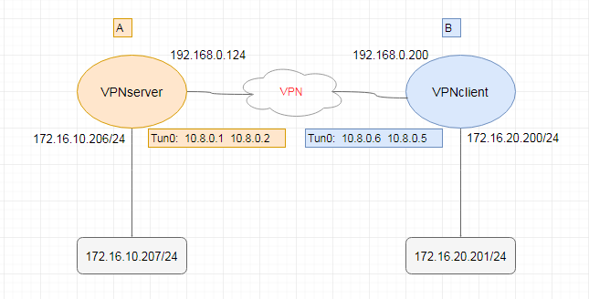

使用 OpenVPN 搭建 vpn 服务器打通 A 和 B 两个异地网络

让 A 局域网中的 172.16.10.0/24 段可以和 B 局域网中的 172.16.20.0/24 段可以网络互通



编辑 `/etc/openvpn/server.conf` 文件，内容如下

```ini
route 172.16.20.0 255.255.255.0
# 启动时给 openvpn 服务器添加路由，告诉服务器去 172.16.20.0/24 网段的都走虚拟机网卡(tun0)，相当于静态路由
```

查看路由

```bash
# route -n | grep tun0 
10.8.0.2        0.0.0.0         255.255.255.255 UH    0      0        0 tun0   # 主机路由
172.16.20.0     10.8.0.2        255.255.255.0   UG    0      0        0 tun0   # 静态路由，去172.16.20.0 段下一跳是 10.8.0.2
10.8.0.0        10.8.0.2        255.255.255.0   UG    0      0        0 tun0   # 静态路由，去10.8.0.0 段下一跳是 10.8.0.2
```

指定 vpnclient 这个客户端的配置，编辑 `/etc/openvpn/ccd/vpnclient` ，内容如下

```bash
ifconfig-push 10.8.0.6 10.8.0.5      # 配置客户端的 IP
iroute 172.16.20.0 255.255.255.0     # 告诉服务端，我的网段是 172.16.20.0/24
```

对于另一个访问的客户端

```bash
route-nopull
route 172.16.20.0 255.255.255.0 vpn_gateway
dhcp-option DNS 172.16.20.0.2
```

