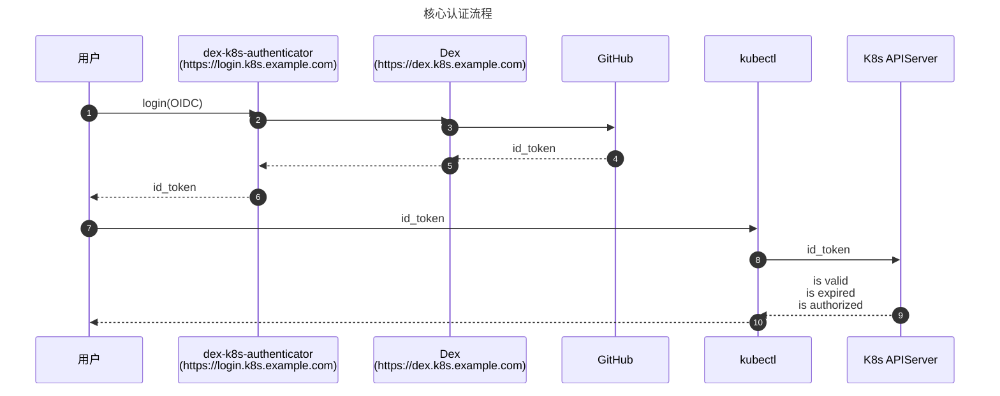

组件说明

1. Dex 是一种身份认证服务，它使用 OpenID Connect 来驱动其他应用程序的身份验证。Dex 通过“connectors”充当其他身份提供商的门户。 这让 dex 将身份验证推到 LDAP 服务器、SAML 提供商或已建立的身份提供商（如 GitHub、Gitlab、Google 和 Active Directory等）。 客户端编写身份验证逻辑以与 dex 交互认证，然后 dex 通过 connector 转发到后端用户认证方认证，并返回给客户端Oauth2 Token。与其相似的还有 Keycloak，auth0 等
2. dex-k8s-authenticator 是一个web-app，它可以与 Dex 进行交互并获取 Dex 生成的 token 创建和修改 kubeconfig 文件的命令。用户执行这些生成的命令后可以完成 kubeconfig 文件配置

dex-k8s-authenticator 简介：

- GitHub 仓库：<https://github.com/mintel/dex-k8s-authenticator>

- 部署文档：<https://github.com/mintel/dex-k8s-authenticator/blob/master/docs/helm.md>

