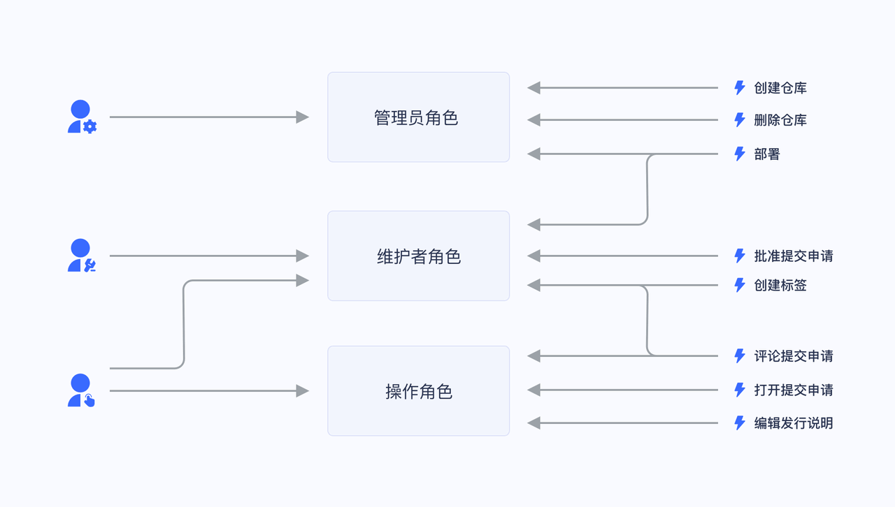

## 基于角色的访问控制（RBAC）

基于角色的访问控制（Role-based access control，简称 RBAC），指的是通过用户的角色（Role）授权其相关权限，这实现了更灵活的访问控制，相比直接授予用户权限，要更加简单、高效、可扩展。

当使用 RBAC 时，通过分析系统用户的实际情况，基于共同的职责和需求，授予他们不同角色。你可以授予给用户一个或多个角色，每个角色具有一个或多个权限，这种 用户-角色、角色-权限 间的关系，让我们可以不用再单独管理单个用户，用户从授予的角色里面继承所需的权限。

以一个简单的场景（Gitlab 的权限系统）为例，用户系统中有 Admin、Maintainer、Operator 三种角色，这三种角色分别具备不同的权限，比如只有 Admin 具备创建代码仓库、删除代码仓库的权限，其他的角色都不具备。

授予某个用户「Admin」这个角色，他就具备了「创建代码仓库」和「删除代码仓库」这两个权限。

不直接给用户授权策略，是为了之后的扩展性考虑。比如存在多个用户拥有相同的权限，在分配的时候就要分别为这几个用户指定相同的权限，修改时也要为这几个用户的权限进行一一修改。有了角色后，我们只需要为该角色制定好权限后，给不同的用户分配不同的角色，后续只需要修改角色的权限，就能自动修改角色内所有用户的权限。

## 