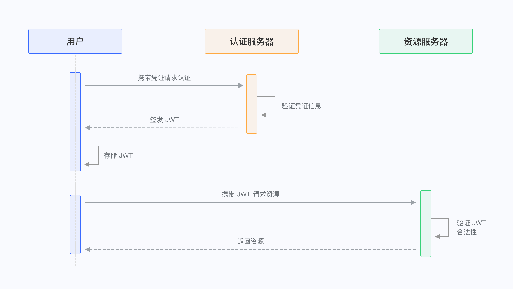

##  JWT 简介

JSON Web Token (JWT，RFC 7519)，是为了在网络应用环境间传递声明而执行的一种基于 JSON 的开放标准（(RFC 7519)。

- <https://tools.ietf.org/html/rfc7519>

该 token 被设计为紧凑且安全的，特别适用于分布式站点的单点登录（SSO）场景。JWT 的声明一般被用来在身份提供者和服务提供者间传递被认证的用户身份信息，以便于从资源服务器获取资源，也可以增加一些额外的其它业务逻辑所必须的声明信息，该 token 也可直接被用于认证，也可被加密。

## 认证流程



- 用户使用账号（手机/邮箱/用户名）密码请求服务器
- 服务器验证用户账号是否和数据库匹配
- 服务器通过验证后发送给客户端一个 JWT Token
- 客户端存储 Token，并在每次请求时携带该 Token
- 服务端验证 Token 值，并根据 Token 合法性返回对应资源

### 客户端附带 JWT Token 的方式

用户在完成认证后会返回开发者一个 JWT Token，开发者需将此 Token 存储于客户端，然后将此 Token 发送给开发者受限的后端服务器进行验证。

建议使用 **HTTP Header Authorization** 的形式携带 Token，以下以 JavaScript 的 axios 库为例示范如何携带：

```javascript
const axios = require("axios");
axios
  .get({
    url: "https://yourdomain.com/api/v1/your/resources",
    headers: {
      Authorization: "Bearer ID_TOKEN",
    },
  })
  .then((res) => {
    // custom codes
  });

```

Bearer Token  RFC 6750) 用于授权访问资源，任何 Bearer 持有者都可以无差别地用它来访问相关的资源，而无需证明持有加密 key。一个 Bearer 代表授权范围、有效期，以及其他授权事项；一个 Bearer 在存储和传输过程中应当防止泄露，需实现 Transport Layer Security (TLS)；一个 Bearer 有效期不能过长，过期后可用 Refresh Token 申请更新。

- <http://www.rfcreader.com/#rfc6750>

建议开发者遵循规范，在每次请求的 Token 前附带 Bearer。

## 参考文档

- https://www.jianshu.com/p/576dbf44b2ae