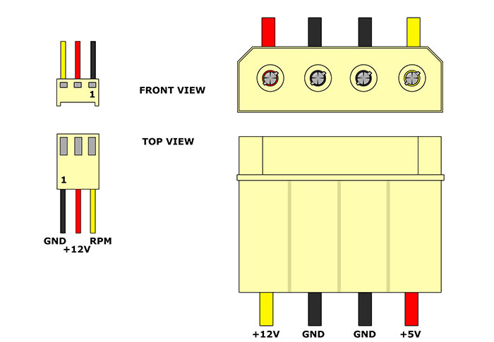

散热风扇的种类——2针、3针、4针

- 2 针风扇

2 针的散热风扇意味着它只有红黑两种电源线，一个接地，一个供电，结构简单，但是功能也很少，不能测速，想要调速需要使用其他方案

还有一种 D 型电源接口的风扇，也就是大 4pin 接口的风扇；这种风扇也没有变速功能，而且供电是 12V 的，用大 4pin 接口就是为了获得更好的性能（功率更大）

- 3 针风扇

3 针风扇接口在原先的红黑基础上增加了一条黄色的线（也部分是黑黄绿），它主要负责测速，通过它主板可以侦测到风扇是否在转、转速多少，不过 3 针风扇的调速是通过调整风扇电压来实现的，首先这样做调节转速依然不够灵活，温度探测来自主板，不能实时反映 CPU 状态信息，而且需要主板 BIOS 设置各种参数，所以能不能调速还要看主板支持与否

- 4 针风扇

从 2 针到 3 针，风扇调速的问题始终没有彻底解决，所以在 LGA775 时代英特尔联合厂商推出了新的 PWM 调速规范，散热风扇变成了 4 个针脚，在 3 针基础上又多了一个 PWM 线（ 脉宽调变）。4 针风扇的接口颜色也不固定，常见的有下面两种：

