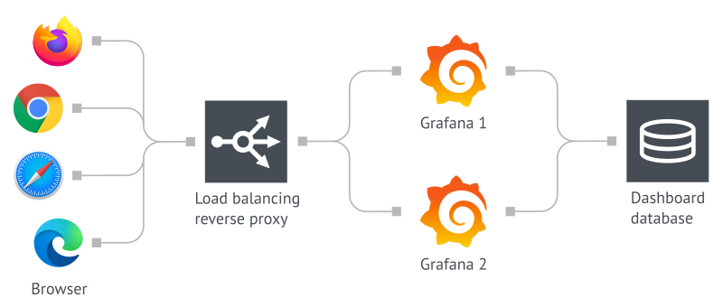

## 简介

Grafana 是一个监控仪表系统，它是由 Grafana Labs 公司开源的的一个系统监测工具，它可以大大帮助我们简化监控的复杂度，我们只需要提供需要监控的数据，它就可以帮助生成各种可视化仪表，同时它还有报警功能，可以在系统出现问题时发出通知。

## 数据源

Grafana 支持许多不同的数据源，每个数据源都有一个特定的查询编辑器，每个数据源的查询语言和能力都是不同的。

我们可以把来自多个数据源的数据组合到一个仪表板，但每一个面板被绑定到一个特定的数据源。

官方文档：<https://grafana.com/docs/grafana/latest/datasources/>

目前官方支持以下数据源：

- Alertmanager
- AWS CloudWatch
- Azure Monitor
- Elasticsearch
- Google Cloud Monitoring
- Graphite
- InfluxDB
- Loki
- Microsoft SQL Server (MSSQL)
- MySQL
- OpenTSDB
- PostgreSQL
- Prometheus
- Jaeger
- Zipkin
- Tempo
- Testdata

## 部署和安装

### 组件

Grafana 需要一个数据库来存储其配置数据，比如用户、数据源和仪表盘等，目前 Grafana 支持 SQLite、MySQL、PostgreSQL 3 种数据库，默认使用的是 SQLite，该数据库文件会存储在 Grafana 的安装位置，所以需要对 Grafana 的安装目录进行持久化。

可以在 Grafana 配置的 `[database]` 部分找到数据库的相关配置，Grafana 会将所有长期数据保存在数据库中，然后部署多个 Grafana 实例使用同一个数据库即可实现高可用。



### uid 和 gid

需要注意的是 Changelog 中 v5.1.0 版本的更新介绍：

```text
Major restructuring of the container
Usage of chown removed
File permissions incompatibility with previous versions
user id changed from 104 to 472
group id changed from 107 to 472
Runs as the grafana user by default (instead of root)
All default volumes removed
```

## 参考资料

- <https://cloud.tencent.com/developer/article/2192174?from_column=20421&from=20421>
