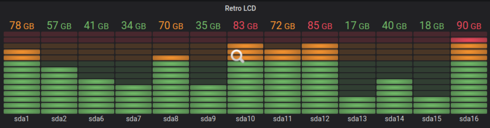

## Dashboard 看板

在 Grafana 中有「Dashboard」和「Panel」的概念，Dashboard 可以理解成看板，而 Panel 可以理解成图表，一个看板中包含了无数个图表。例如下图就是一个看板（Dashboard）

[Grafana官网 - Dashboards 模块](https://grafana.com/grafana/dashboards) 提供了下载 Dashboard 模板的功能

Dashboards 里有许多各种类型的 Dashboard 面板，例如 JVM 监控、MySQL 数据库监控等。只需找到合适自己的监控面板，之后根据 ID 添加即可

## Panel 面板

面板（Panel）是 Grafana 中基本可视化构建块，每个面板都有一个特定于面板中选择数据源的查询编辑器，每个面板都有各种各样的样式和格式选项，面板可以在仪表板上拖放和重新排列，它们也可以调整大小，所以要在 Grafana 上创建可视化的图表，面板是必须要掌握的知识点。

Panel 是 Grafana 中最基本的可视化单元，每一种类型的面板都提供了相应的查询编辑器(Query Editor)，让用户可以从不同的数据源（如 Prometheus）中查询出相应的监控数据，并且以可视化的方式展现，Grafana 中所有的面板均以插件的形式进行使用。

Grafana 提供了各种可视化来支持不同的用例，目前内置支持的面板包括：

- Time series（时间序列）是默认的也是主要的图形可视化面板
- State timeline（状态时间表）状态随时间变化
- Status history（状态历史记录）
- Bar chart（条形图）
- Histogram（直方图）
- Heatmap（热力图）
- Pie chart（饼状图）
- Stat（统计数据）
- Gauge
- Bar gauge
- Table（表格）
- Logs（日志）
- Node Graph（节点图）
- Dashboard list（仪表板列表）
- Alert list（报警列表）
- Text panel（文本面板，支持 markdown 和 html）
- News Panel（新闻面板，可以显示 RSS 摘要）等

除此之外，我们还可以通过官网的面板插件页面 <https://grafana.com/grafana/plugins/?type=panel> 获取安装其他面板进行使用

### 图表

对于基于时间的折线图、面积图和条形图，我们建议使用默认的 Time series 时间序列进行可视化

而对于分类数据，则使用 Bar Chart 条形图可视化

### 数据统计

用于数据统计相关的可视化可以使用 Stat 面板进行可视化，可以使用阈值或色标来控制背景或值颜色

### 仪表盘

如果想显示与最小值和最大值相关的值，则有两个选择，首先是如下所示的标准径 Gauge 面板

其次 Grafana 还具有水平或垂直 Bar gauge（条形仪表面板），具有三种不同的不同显示模式

### 表格

要在表格布局中显示数据，需要使用 Table 表格面板进行可视化

### 饼状图

Grafana 现在支持 Pie Chart 饼状图面板可视化

### 热力图

要显示值分布，可以使用 Heatmap 热力图面板可视化

## Row Panel 行面板

- 可以支一些面板进行分类，有一个title，然后展开或者折叠。如果面板比较多，这样还是挺有好处，可以把当前不关心的监控面板先折叠。

- 另外这种是懒加载的，只有展示的时候，才会加载数据，如果指标太多，只展开自己关注的面板，在性能上也能降低一些影响。

添加时选择行

## 参数变量

变量支持更具交互性和动态性的仪表板，我们可以在它们的位置使用变量，而不是在指标查询中硬编码，变量显示为 Dashboard 顶部的下拉列表，这些下拉列表可以轻松更改仪表板中显示的数据

为了能够选择节点数据，这里我们定义了一个名为 `instance` 的变量名，在添加变量的页面中主要包括如下一些属性：

- `Name`：变量名，在仪表盘中调用使用 `$变量名` 的方式
- `Type`：变量类型，变量类型有多种，其中 `query` 表示这个变量是一个查询语句
- `Hide`：为空是表现为下拉框，选择 label 表示不显示下拉框的名字，选择 variable 表示隐藏该变量，该变量不会在 Dashboard 上方显示出来，默认选择为空
- `Data source`：查询语句的数据源
- `Refresh`：何时去更新变量的值，变量的值是通过查询数据源获取到的，但是数据源本身也会发生变化，所以要时不时的去更新变量的值，这样数据源的改变才会在变量对应的下拉框中显示出来。Refresh 有两个值可以选择：`On Dashboard Load`（在 Dashboard 加载时更新）、`On Time Range Change`（在时间范围变更的时候更新）
- `Query`：查询表达式，不同的数据源查询表达式都不同
- `Regex`：正则表达式，用来对抓取到的数据进行过滤，默认不过滤
- `Sort`：排序，对下拉框中的变量值做排序，默认是 disable，表示查询结果是怎样下拉框就怎样显示
- `Multi-value`：启用这个功能，变量的值就可以选择多个，具体表现在变量对应的下拉框中可以选多个值的组合
- `Include All option`：启用这个功能，变量下拉框中就多了一个全选 all 的选项

## 参考文档

- <https://blog.csdn.net/x763795151/article/details/123109775>
