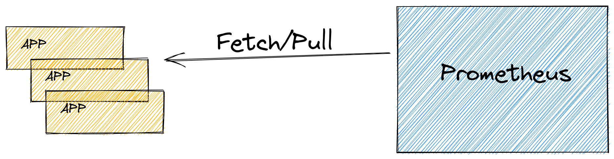
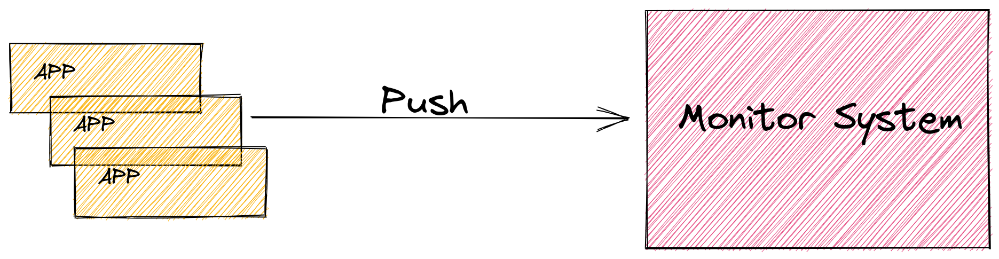
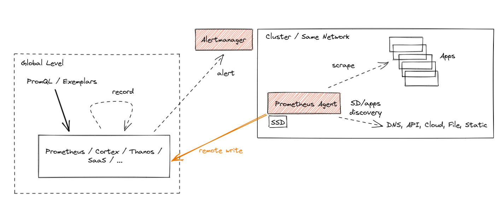

## 拉模式（Pull）和 推模式（Push）

众所周知，Prometheus 是一种拉模式（Pull）的监控系统，这不同于传统的基于推模式（Push）的监控系统。

什么是拉模式（Pull）呢？



待监控的服务自身或者通过一些 exporter 暴露出来一些 metrics 指标的接口，由 Prometheus 去主动的定时进行抓取 / 采集，这就是拉模式（Pull）。即由监控系统主动的去拉（Pull）目标的 metrics。

与之相对应的就是推模式（Push）。



由应用程序主动将自身的一些 metrics 指标进行上报，监控系统再进行相对应的处理。如果对于某些应用程序的监控想要使用推模式（Push），比如：不易实现 metrics 接口等原因，可以考虑使用 Pushgateway 来完成。

## Prometheus Agent 模式

Prometheus Remote Write 的方式，将启用了 Agent 模式的 Prometheus 实例的数据写入到远程存储中。并借助远程存储来提供一个全局视图。

Agent 模式禁用了 Prometheus 的一些特性，优化了指标抓取和远程写入的能力。如果已开启 Agent 模式的 Prometheus 将会默认关闭其 UI 查询能力，报警以及本地存储等能力。



Prometheus Agent 并没有本质上改变 Prometheus 指标采集的方式，仍然还是继续使用拉模式（Pull）。

它的使用场景主要是进行 Prometheus 的 HA / 数据持久化或集群。与现有的一些方案在架构上会略有重合， 但是有一些优势：

- Agent 模式是 Prometheus 内置的功能；
- 开启 Agent 模式的 Prometheus 实例，资源消耗更少，功能也会更单一，对于扩展一些边缘场景更有利；
- 启用 Agent 模式后，Prometheus 实例几乎可以当作是一个无状态的应用，比较方便进行扩展使用；

Agent 模式是轻量级的 Prometheus 服务，负责采集并远程写入到远端存储； Pushgateway 是中转站，用于接收临时任务（Job）推送的指标并持久化，供 Prometheus 拉取

```bash
global:
  scrape_interval: 15s
  external_labels:
    cluster: testing

scrape_configs:
  - job_name: "prometheus"
    static_configs:
      - targets: ["localhost:9090"]

remote_write:
  - url: "http://127.0.0.1:10908/api/v1/receive"

```

Prometheus Agent 模式现在是内置在 Prometheus 二进制文件中的，增加 `--enable-feature=agent` 选项即可启用。

## 参考资料

- <https://moelove.info/2021/11/28/%E6%96%B0%E5%8A%9F%E8%83%BDPrometheus-Agent-%E6%A8%A1%E5%BC%8F%E4%B8%8A%E6%89%8B%E4%BD%93%E9%AA%8C/>

- <https://github.com/prometheus-operator/prometheus-operator/blob/main/Documentation/platform/prometheus-agent.md>

- <https://www.trae.cn/article/706584834>

- kubelet 指标 <https://www.lijiaocn.com/%E6%8A%80%E5%B7%A7/2018/09/14/prometheus-compute-kubernetes-container-cpu-usage.html>