| 层级         | 组件               | 副本数 | 高可用机制          |
| :----------- | :----------------- | :----- | :------------------ |
| 数据采集层   | Exporter           | N      | 多实例部署          |
| 监控采集层   | Prometheus         | 2      | 双副本独立抓取      |
| 告警管理层   | Alertmanager       | 3      | Gossip 协议集群     |
| 告警通知接入 | KeepAlived + Nginx | 2      | VIP 漂移 + 负载均衡 |
| 告警通知处理 | PrometheusAlert    | 2      | 双副本热备          |
| 数据存储层   | VictoriaMetrics    | 3      | 数据复制因子 = 3    |
| 查询展示层   | Grafana            | N      | 无状态可水平扩展    |

```mermaid
flowchart TB
    subgraph Exporter_Layer["📊 数据采集层"]
        subgraph K8S_Exporter["🐳 Kubernetes 业务"]
            E1[Node Exporter]
            E2[Kube State Metrics]
            E3[Cadvisor]
        end
        subgraph Trade_Exporter["💼 交易业务"]
            E4[Trade App Exporter]
            E5[DB Exporter]
            E6[MQ Exporter]
        end
        subgraph Other_Exporter["📦 其他业务"]
            E7[Other Exporter N]
        end
    end

    subgraph Prometheus_Layer["🔍 监控采集层 - 多套隔离部署"]
        subgraph K8S_Prom["Prometheus 集群 - K8S"]
            P1[Prometheus K8S 副本 1]
            P2[Prometheus K8S 副本 2]
            P1_Label["label: prometheus=k8s"]
        end
        subgraph Trade_Prom["Prometheus 集群 - Trade"]
            P3[Prometheus Trade 副本 1]
            P4[Prometheus Trade 副本 2]
            P3_Label["label: prometheus=trade"]
        end
    end

    subgraph Alertmanager_Layer["🚨 告警管理层 - 三副本集群"]
        AM1[Alertmanager 节点 1]
        AM2[Alertmanager 节点 2]
        AM3[Alertmanager 节点 3]
        AM_Gossip{{Gossip 协议}}
    end

    subgraph PrometheusAlert_Layer["📢 告警通知层 - 双副本高可用"]
        subgraph HA_Proxy["🔄 高可用接入"]
            KA[KeepAlived VIP]
            NG[Nginx 负载均衡]
        end
        PA1[PrometheusAlert 节点 1]
        PA2[PrometheusAlert 节点 2]
    end

    subgraph Notify_Channel["📱 通知渠道"]
        DD[钉钉]
        WX[企业微信]
        TEL[阿里云电话]
    end

    subgraph Storage_Layer["💾 数据存储层 - 三副本集群"]
        VM1[VictoriaMetrics 节点 1]
        VM2[VictoriaMetrics 节点 2]
        VM3[VictoriaMetrics 节点 3]
        VM_Gossip{{数据复制}}
    end

    subgraph Query_Layer["📈 查询展示层"]
        GF[Grafana]
        GF_DS1["数据源: k8s"]
        GF_DS2["数据源: trade"]
        GF_DS3["数据源: 全局"]
    end

    %% 数据采集流向 - K8S
    E1 & E2 & E3 -->|Scrape| P1
    E1 & E2 & E3 -->|Scrape| P2

    %% 数据采集流向 - Trade
    E4 & E5 & E6 -->|Scrape| P3
    E4 & E5 & E6 -->|Scrape| P4

    %% 数据采集流向 - Other
    E7 -->|Scrape| P1
    E7 -->|Scrape| P2

    %% 告警流向 - 所有 Prometheus 到 Alertmanager 集群
    P1 & P2 & P3 & P4 -->|Alert Rules| AM1
    P1 & P2 & P3 & P4 -->|Alert Rules| AM2
    P1 & P2 & P3 & P4 -->|Alert Rules| AM3

    %% Alertmanager 集群内部同步
    AM1 <-->|Gossip| AM_Gossip
    AM2 <-->|Gossip| AM_Gossip
    AM3 <-->|Gossip| AM_Gossip

    %% Alertmanager 到 PrometheusAlert
    AM1 & AM2 & AM3 -->|Webhook| KA
    KA --> NG
    NG --> PA1
    NG --> PA2

    %% PrometheusAlert 到通知渠道
    PA1 & PA2 --> DD
    PA1 & PA2 --> WX
    PA1 & PA2 --> TEL

    %% 数据存储流向 - 所有 Prometheus Remote Write 到 VM
    P1 & P2 & P3 & P4 -->|Remote Write| VM1
    P1 & P2 & P3 & P4 -->|Remote Write| VM2
    P1 & P2 & P3 & P4 -->|Remote Write| VM3

    %% VictoriaMetrics 集群内部复制
    VM1 <-->|Replication| VM_Gossip
    VM2 <-->|Replication| VM_Gossip
    VM3 <-->|Replication| VM_Gossip

    %% 查询流向
    VM1 & VM2 & VM3 -->|Query| GF

    %% 样式定义
    classDef exporter fill:#e1f5fe,stroke:#01579b,stroke-width:2px
    classDef prometheus fill:#fff3e0,stroke:#e65100,stroke-width:2px
    classDef alertmanager fill:#ffebee,stroke:#b71c1c,stroke-width:2px
    classDef pa fill:#fce4ec,stroke:#880e4f,stroke-width:2px
    classDef notify fill:#e8f5e9,stroke:#1b5e20,stroke-width:2px
    classDef storage fill:#e8f5e9,stroke:#1b5e20,stroke-width:2px
    classDef query fill:#f3e5f5,stroke:#4a148c,stroke-width:2px
    classDef ha fill:#fff8e1,stroke:#f57f17,stroke-width:2px,stroke-dasharray: 5 5
    classDef label fill:#ffffff,stroke:#666,stroke-width:1px,stroke-dasharray: 3 3

    class E1,E2,E3,E4,E5,E6,E7 exporter
    class P1,P2,P3,P4 prometheus
    class P1_Label,P3_Label label
    class AM1,AM2,AM3,AM_Gossip alertmanager
    class KA,NG,PA1,PA2 pa
    class HA_Proxy ha
    class DD,WX,TEL notify
    class VM1,VM2,VM3,VM_Gossip storage
    class GF,GF_DS1,GF_DS2,GF_DS3 query



```




Prometheus 外部标签配置

```yaml
# prometheus-k8s.yml
global:
  external_labels:
    prometheus: k8s
    cluster: production-k8s

# prometheus-trade.yml
global:
  external_labels:
    prometheus: trade
    cluster: production-trade
```

VictoriaMetrics 多租户查询

```yaml
# Grafana 数据源配置
# K8S 数据源
URL: http://vm-select:8481/select/0/prometheus
PromQL: {prometheus="k8s"}

# Trade 数据源
URL: http://vm-select:8481/select/1/prometheus
PromQL: {prometheus="trade"}

# 全局数据源
URL: http://vm-select:8481/select/0/prometheus
PromQL: 无过滤
```

Alertmanager 路由配置（按标签分发）

```yaml
# alertmanager.yml
route:
  receiver: default
  routes:
    - match:
        prometheus: k8s
      receiver: k8s-team
    - match:
        prometheus: trade
      receiver: trade-team

receivers:
  - name: k8s-team
    webhook_configs:
      - url: http://prometheus-alert/v1/k8s
  - name: trade-team
    webhook_configs:
      - url: http://prometheus-alert/v1/trade
```

| 建议项   | 说明                                                         |
| :------- | :----------------------------------------------------------- |
| 命名规范 | Prometheus 实例名称与业务线一致，如 `prom-k8s`, `prom-trade` |
| 标签统一 | 所有指标添加 `prometheus`、`cluster`、`env` 等标准标签       |
| 告警去重 | Alertmanager 使用 `group_by: ['alertname', 'prometheus']` 避免重复 |
| 存储隔离 | VictoriaMetrics 可使用不同 `accountID` 实现逻辑隔离          |
| 权限控制 | Grafana 按团队分配数据源访问权限                             |
| 容量规划 | 每套 Prometheus 根据目标数量独立规划资源                     |
