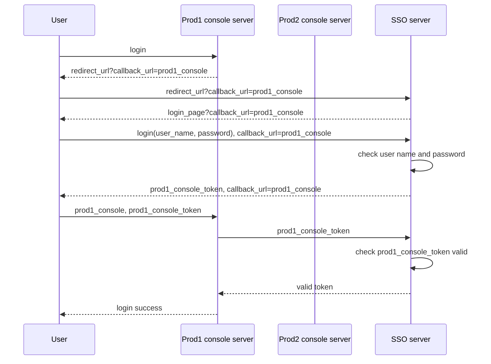

```go

```


```mermaid
sequenceDiagram
    participant User
    participant Prod1 console server
    participant Prod2 console server
    participant SSO server
		User ->> Prod1 console server: login
		Prod1 console server -->> User: redirect_url?callback_url=prod1_console
		User ->> SSO server: redirect_url?callback_url=prod1_console
		SSO server -->> User: login_page?callback_url=prod1_console
		User ->> SSO server: login(user_name, password), callback_url=prod1_console
		SSO server ->> SSO server: check user name and password
		SSO server -->> User: prod1_console_token, callback_url=prod1_console
		User ->> Prod1 console server: prod1_console, prod1_console_token
        Prod1 console server ->> SSO server: prod1_console_token
        SSO server ->> SSO server: check prod1_console_token valid
        SSO server -->> Prod1 console server: valid token
        Prod1 console server -->> User: login success
```

