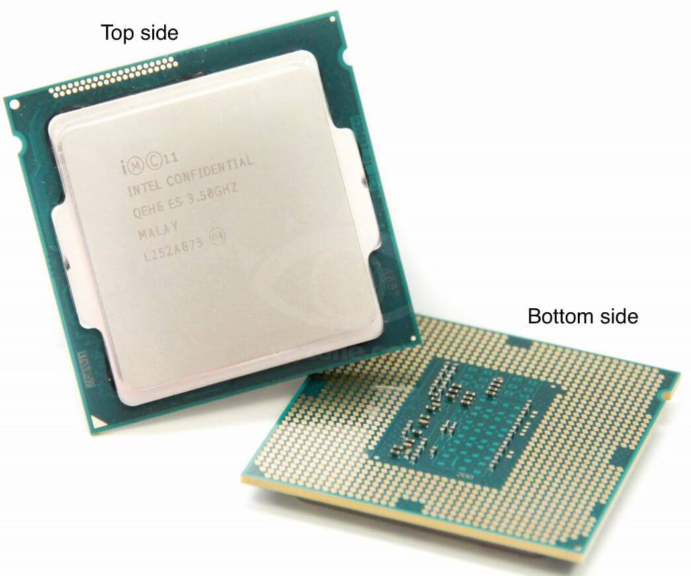
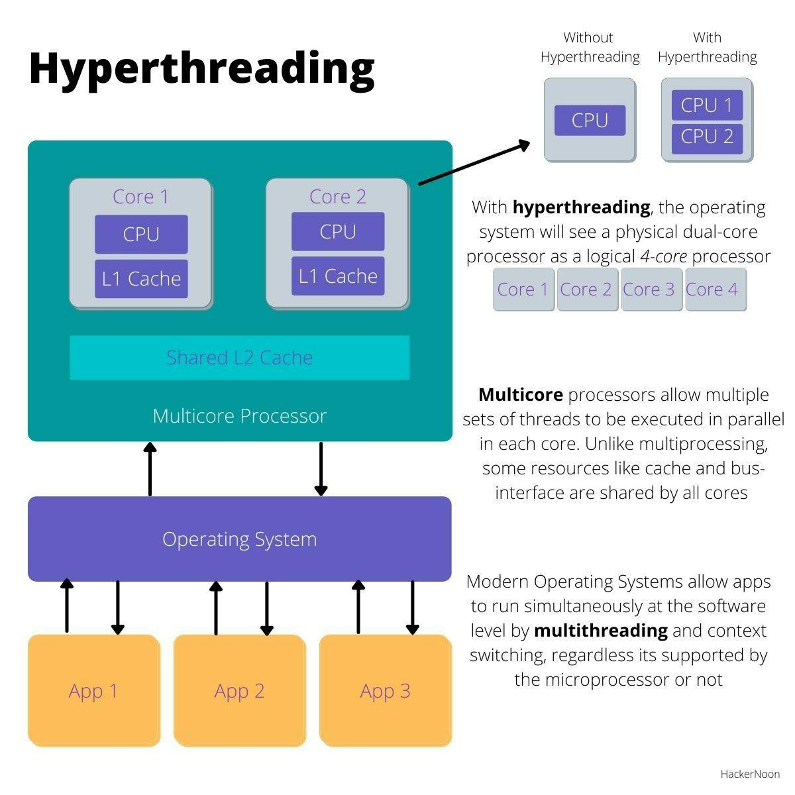

对于 Linux 机器，可以用 `lscpu`、`cat /proc/info` 等命令查看它的 CPU 信息

```
lscpu
```

展示的信息如下

```bash
Architecture:            x86_64
  CPU op-mode(s):        32-bit, 64-bit
  Address sizes:         43 bits physical, 48 bits virtual
  Byte Order:            Little Endian
CPU(s):                  256
  On-line CPU(s) list:   0-255
Vendor ID:               AuthenticAMD
  BIOS Vendor ID:        Advanced Micro Devices, Inc.
  Model name:            AMD EPYC 7742 64-Core Processor
    BIOS Model name:     AMD EPYC 7742 64-Core Processor
    CPU family:          23
    Model:               49
    Thread(s) per core:  2
    Core(s) per socket:  64
    Socket(s):           2
    Stepping:            0
    Frequency boost:     enabled
    CPU(s) scaling MHz:  92%
    CPU max MHz:         2250.0000
    CPU min MHz:         1500.0000
    BogoMIPS:            4499.65
    Flags:               fpu ...
Virtualization features:
  Virtualization:        AMD-V
Caches (sum of all):
  L1d:                   4 MiB (128 instances)
  L1i:                   4 MiB (128 instances)
  L2:                    64 MiB (128 instances)
  L3:                    512 MiB (32 instances)
NUMA:
  NUMA node(s):          2
  NUMA node0 CPU(s):     0-63,128-191
  NUMA node1 CPU(s):     64-127,192-255
Vulnerabilities:
  Gather data sampling:  Not affected
  Itlb multihit:         Not affected
  L1tf:                  Not affected
  Mds:                   Not affected
  Meltdown:              Not affected
  Mmio stale data:       Not affected
  Retbleed:              Mitigation; untrained return thunk; SMT enabled with STIBP protection
  Spec rstack overflow:  Mitigation; Safe RET
  Spec store bypass:     Mitigation; Speculative Store Bypass disabled via prctl
  Spectre v1:            Mitigation; usercopy/swapgs barriers and __user pointer sanitization
  Spectre v2:            Mitigation; Retpolines, IBPB conditional, STIBP always-on, RSB filling, PBRSB-eIBRS Not affected
  Srbds:                 Not affected
  Tsx async abort:       Not affected
```

可以看到有 255 个 CPU，但无法看到 CPU 在物理上是怎么分布的（layout）

（1）Package

如下图，package（直译为“封装”）是我们能直接在主板上看到的一个东西，里面封装一个或多个处理器核心（称为 core 或 processor）



（2）Core (processor)

指硬件核心/硬件处理器。一个 package 里面可能会包含多个处理器，如下图所示


或者从芯片视图看：


（3）超线程（Hyper-threading）/硬件线程（hardware thread）

大部分 X86 处理器都支持超线程，也叫硬件线程。 如果一个 CORE 支持 2 个硬件线程， 那么启用超线程后， 这个 CORE 上面就有 2 个在大部分情况下都能独立执行的指令流（这 2 个硬件线程共享 L1 cache 等）， 操作系统能看到的 CPU 数量会翻倍（相比 CORE 的数量）， 每个 CPU 对应的不是一个 CORE，而是一个硬件线程 / 超线程（hyper-thread）



（4）Logical CPU

以上提到的 package、core/processor、hyper-threading/hardware-thread，都是硬件概念。

在任务调度的语境中，所说的 “CPU” 其实是一个逻辑概念。 例如，内核的任务调度是基于逻辑 CPU 来的

- 每个逻辑 CPU 分配一个任务队列（run queue），独立调度
- 每个逻辑 CPU 能独立加载指令并执行

逻辑 CPU 的数量和分布跟 package/core/hyper-threading 有直接关系， 一个逻辑 CPU 不一定对应一个独立的硬件处理器

前面提到的 `lscpu` 输出中有 `Thread(s) per core:  2` 说明它启用了超线程/硬件线程

通过工具 `cpupower` 来看下它的 CPU 分布，执行：

```bash
cpupower monitor
```

可以得到输出

```bash
intel-rapl/intel-rapl:0
0
intel-rapl/intel-rapl:0/intel-rapl:0:0
0
              | Mperf              || RAPL        || Idle_Stats
 PKG|CORE| CPU| C0   | Cx   | Freq  || pack | core  || POLL | C1   | C2
   0|   0|   0| 20.42| 79.58|  3192||178743488|544543||  0.00|  3.21| 76.33
   0|   0| 128|  0.11| 99.89|  3172||178743488|544543||  0.00|  5.18| 94.46
   0|   1|   1| 24.27| 75.73|  3195||178743488|544543||  0.00|  2.17| 74.12
   0|   1| 129|  0.12| 99.88|  3172||178743488|544543||  0.00|  5.29| 94.36
   0|   2|   2| 59.94| 40.06|  3195||178743488|544543||  0.05| 26.05| 13.10
   0|   2| 130|  0.10| 99.90|  3150||178743488|544543||  0.00|  3.51| 96.13
...
   0|  63|  63|  0.06| 99.94|  2520||178743488|544543||  0.00|  1.11| 98.79
   0|  63| 191|  0.13| 99.87|  2667||178743488|544543||  0.00|  3.03| 96.50
   1|   0|  64|  2.85| 97.15|  3220||178743488|544543||  0.00|  3.47| 93.60
   1|   0| 192| 77.95| 22.05|  3190||178743488|544543||  0.00|  4.28| 18.62
   1|   1|  65|  2.94| 97.06|  3075||178743488|544543||  0.00|  6.40| 90.53
   1|   1| 193|  0.59| 99.41|  2215||178743488|544543||  0.00|  8.23| 90.87
...
   1|  63| 255|  1.35| 98.65|  3143||178743488|544543||  0.00|  3.58| 95.07
```

前三列：

1. PKG：package，2 个独立的 CPU package（0~1），对应上面的 NUMA；
2. CORE：物理核心/物理处理器。每个 package 里 64 个 CORE（0~63）；
3. CPU：用户看到的 CPU，即上面所说的逻辑 CPU；这台机器启用了超线程（hyperthreading），每个 CORE 对应两个 hardware thread， 每个 hardware thread 最终呈现为一个用户看到的 CPU，因此最终是 256 个 CPU（0~255）

也可以通过 hw-loc 查看硬件拓扑，里面能详细到不同 CPU 的 L1/L2 cache 关系，执行：

```bash
hwloc-ls
```

可以得到输出

```bash
Machine (2003GB total)
  Package L#0
    NUMANode L#0 (P#0 995GB)
    L3 L#0 (16MB)
      L2 L#0 (512KB) + L1d L#0 (32KB) + L1i L#0 (32KB) + Core L#0
        PU L#0 (P#0)
        PU L#1 (P#128)
      L2 L#1 (512KB) + L1d L#1 (32KB) + L1i L#1 (32KB) + Core L#1
        PU L#2 (P#1)
        PU L#3 (P#129)
      L2 L#2 (512KB) + L1d L#2 (32KB) + L1i L#2 (32KB) + Core L#2
        PU L#4 (P#2)
        PU L#5 (P#130)
      L2 L#3 (512KB) + L1d L#3 (32KB) + L1i L#3 (32KB) + Core L#3
        PU L#6 (P#3)
        PU L#7 (P#131)
...
```

对应关系为

```bash
Machine (2003GB total)
  # PKG 0
  Package L#0
    NUMANode L#0 (P#0 995GB)
    L3 L#0 (16MB)
      # Core 0
      L2 L#0 (512KB) + L1d L#0 (32KB) + L1i L#0 (32KB) + Core L#0
        # Logical CPU 0
        PU L#0 (P#0)
        # Logical CPU 128
        PU L#1 (P#128)
      # Core 1
      L2 L#1 (512KB) + L1d L#1 (32KB) + L1i L#1 (32KB) + Core L#1
         # Logical CPU 1
        PU L#2 (P#1)
         # Logical CPU 129
        PU L#3 (P#129)
...
```

