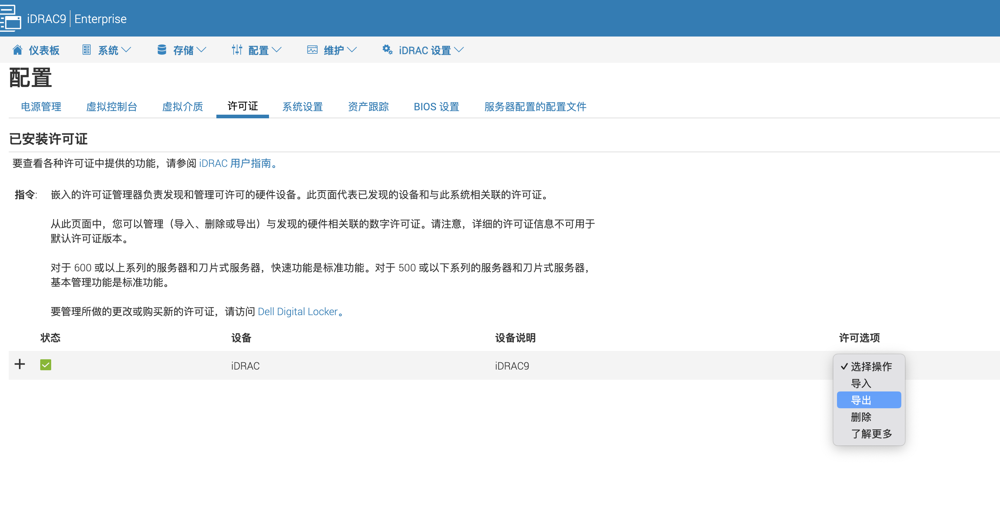
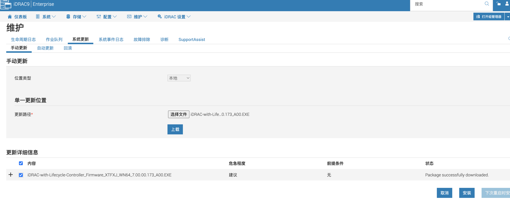
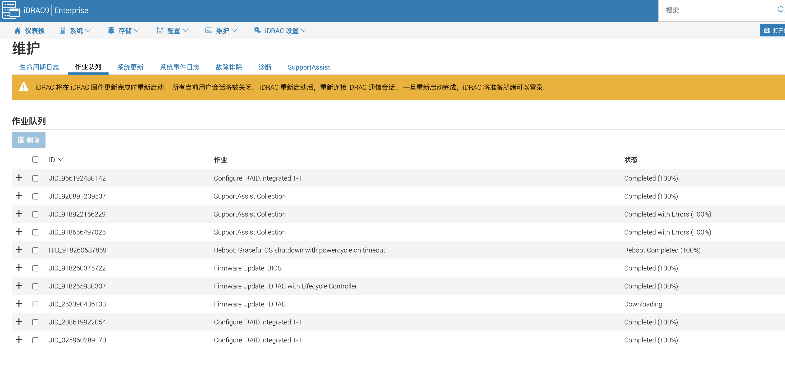

如果同时升级其他固件时，建议优先升级 iDRAC，完成后再升级BIOS等固件，避免签名验证错误等问题的发生

- <https://www.dell.com/support/home/zh-cn/product-support/product/poweredge-r640/drivers>
- <https://www.dell.com/support/kbdoc/zh-cn/000196546/idrac9%E6%9B%B4%E6%96%B0%E5%9B%BA%E4%BB%B6%E6%AD%A5%E9%AA%A4>

## 更新 iDRAC

更新 iDRAC，先下载

默认 BIN 格式，可以从其它格式中选择 EXE 格式

先备份授权

上传手动更新

**Process:**

1. 登录 iDRAC9 Web 界面。
2. 转至 维护，然后单击系统更新。此时会显示手动更新(Manual Update)页面。
3. 从“Manual Update”选项卡中，选择“Local”作为“Location Type”
4. 单击 Choose File， 选择 所需组件的固件映像文件，然后单击 Upload。
5. 上传完成后更新详细信息(Update Details)部分会显示上传到 iDRAC 的每个固件文件及其状态。如果固件映像文件有效且已成功上传， 则“内容 ”列将显示 （+） 图标。展开该名称可查看Device Name（设备名称）、Current（当前）和Available firmware version（可用固件版本）信息。
6. 选择所需的固件文件，然后执行以下操作之一：
   - 对于不需要主机系统重新启动的固件映像，请单击Install（安装）。例如，这可能是 iDRAC 固件文件。
   - 对于需要主机系统重新启动的固件映像，请单击Install and Reboot（安装并重启）或Install Next Reboot（下次重新启动时安装）。
   - 要取消固件更新，请单击Cancel（取消）。
   - 单击 Install、Install and Reboot 或 Install Next Reboot 时，将显示消息 Updating Job Queue 。
7. 要显示Job Queue页面，请单击 Job Queue。使用此页面查看和管理待处理的固件更新进度。可以通过单击 OK 刷新当前页面，以查看固件更新的状态。

需要说明的是，IDRAC升级期间并不会重启系统，升级期间会有一个短时间无法管理甚至连接IDRAC接口的现象存在，不必惊慌。但仍然不建议线上操作升级。

稍后，重新登录IDRAC，查看版本即可

个别机器刷的时候不会报告升级失败，但仍提示还是老版本，这个时候只能冷重启加载解决。升级后，如发现冲突或兼容问题，可以执行回滚操作，请自行测试

## 升级 BIOS

方式相同，上传等待即可

安装并重启即可

更新网卡/阵列卡/硬盘固件步骤与更新BIOS方法一致，选择对应的固件文件上载后根据提示进行升级即可