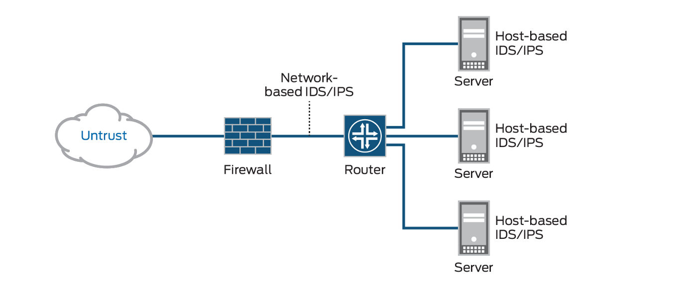

## IDS/IPS

入侵检测系统 (IDS) 是一种网络安全工具，用于监控网络流量和设备，以发现已知的恶意活动、可疑活动或违反安全策略的行为

## 参考资料

- <https://www.ibm.com/cn-zh/topics/intrusion-detection-system>

- <https://www.juniper.net/gb/en/research-topics/what-is-ids-ips.html>