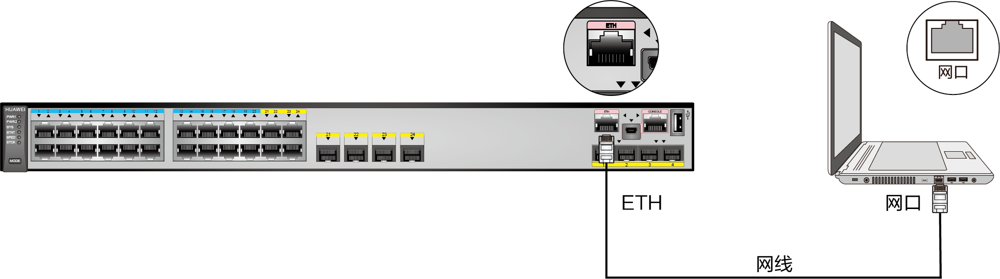
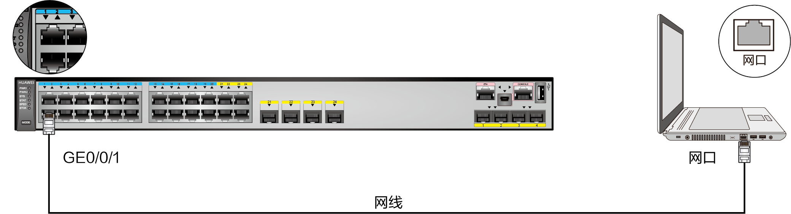

## 管理接口与管理 IP 地址

参考文档：<https://support.huawei.com/enterprise/zh/doc/EDOC1100098004>

### 管理接口

管理接口包括 Console 口、MiniUSB 口、管理网口和业务口

- Console 口

该方式是登录交换机最基本的方式，属于带外管理，也是其他登录方式（如Telnet、STelnet）的基础


- MiniUSB 口

通过 MiniUSB 口登录与通过 Console 口登录仅设备的连接方式不同，登录时的通讯参数和登录配置是一致的，也属于带外管理。当 MiniUSB 口和 Console 口同时使用时，只有 MiniUSB 口生效


- 管理网口

管理网口是一种特殊的以太网接口，可以配置 IP 地址，但不承担业务传输。该方式属于带外管理。交换机设备面板上的 ETH 口为管理网口，但盒式交换机的管理网口的软件接口名称是 MEth 接口，框式交换机的管理网口的软件接口名称是 ETH 接口



- 业务口

业务口指的是承担业务传输的以太网接口。当通过业务口对设备进行配置管理时，网络中的管理数据和业务数据在相同的链路中传输，即采用带内管理



### 初始化

重置现有配置

```bash
<HUAWEI> reset saved-configuration
```

管理 IP 可在管理网口上配置

```bash
<HUAWEI> system-view
[HUAWEI] interface MEth 0/0/1
[HUAWEI-MEth0/0/1] ip address 10.253.253.1 24
[HUAWEI-MEth0/0/1] display ip interface MEth 0/0/1
```

交换机开启 Telnet 服务

```bash
<HUAWEI>sys
[HUAWEI]telnet server enable
```

交换机开启 Web 服务

```bash
[HUAWEI]http server enable
[HUAWEI]http secure-server enable
```

交换机开启 SSH 服务

```bash
[HUAWEI]rsa local-key-pair create
[HUAWEI]stelnet server enable
```

配置 VTY 用户界面的最大个数（同时可以登录的最大数；默认是 5，这个可以不设置）

```bash
[HUAWEI]user-interface maximum-vty 15
```

配置 VTY 用户界面的终端属性

```bash
[HUAWEI]user-interface vty 0 14
[HUAWEI-ui-vty0-14]protocol inbound all
[HUAWEI-ui-vty0-14]protocol inbound telnet
[HUAWEI-ui-vty0-14]protocol inbound ssh
```

配置 VTY 用户界面的用户验证方式

```bash
[HUAWEI-ui-vty0-14]authentication-mode aaa
[HUAWEI-ui-vty0-14]q
```

配置登录验证方式

```bash
[HUAWEI]aaa

# 密码选项 irreversible-cipher 账号 huawei 密码
[HUAWEI-aaa]local-user huawei password irreversible-cipher Huawei12#$

# 配置接入服务类型
[HUAWEI-aaa]local-user huawei service-type ssh telnet terminal ftp http

# 配置账号的级别，默认 3 级是超级管理员的权限
[HUAWEI-aaa]local-user huawei privilege level 3

# 保存配置
[HUAWEI-aaa]q
[HUAWEI]q
<HUAWEI>save
```

### 配置管理 IP 地址

，也可在业务口上配置。对于管理网口，可直接在该接口上配置 IP 地址。对于业务口，若设备支持二三层模式切换，在接口切换到三层模式后，可直接在三层接口上配置 IP 地址；否则，设备可借助 VLANIF 接口配置 IP 地址

