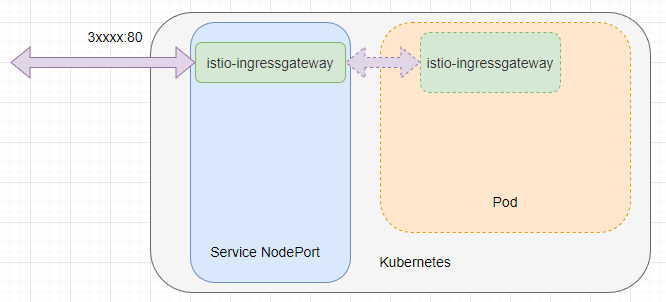

官方文档：

- Istio 版本与 k8s 兼容性列表：<https://istio.io/latest/zh/docs/releases/supported-releases/>

## 使用 helm 进行部署

确定内核

```bash
cat <<EOT >> /etc/modules-load.d/k8s.conf
overlay
br_netfilter
nf_nat
xt_REDIRECT
xt_owner
iptable_nat
iptable_mangle
iptable_filter
EOT
```

- 部署 istio-base

- 部署 istiod
- 部署 istio-ingressgateway

添加仓库

```bash
helm repo add istio https://istio-release.storage.googleapis.com/charts

helm repo update

helm search repo istio/
```

有如下的组件

```bash
NAME            CHART VERSION   APP VERSION     DESCRIPTION                                       
istio/base      1.18.2          1.18.2          Helm chart for deploying Istio cluster resource...
istio/cni       1.18.2          1.18.2          Helm chart for istio-cni components               
istio/gateway   1.18.2          1.18.2          Helm chart for deploying Istio gateways           
istio/istiod    1.18.2          1.18.2          Helm chart for istio control plane                
istio/ztunnel   1.18.2          1.18.2          Helm chart for istio ztunnel components  
```

提前创建命名空间

```yaml
apiVersion: v1
kind: Namespace
metadata:
  name: istio-system
  labels:
    # istio-injection: disabled
    istio-operator-managed: Reconcile
    kubernetes.io/metadata.name: istio-system
```

### 安装 istio-base

先安装 istio-base，才能接着安装其它 Istio 组件

```bash
helm install istio-base istio/base -n istio-system --set defaultRevision=default
```

| 名称                  | 组                  | 最新版本 |
| --------------------- | ------------------- | -------- |
| IstioOperator         | install.istio.io    | v1alpha1 |
| DestinationRule       | networking.istio.io | v1beta1  |
| EnvoyFilter           | networking.istio.io | v1alpha3 |
| Gateway               | networking.istio.io | v1beta1  |
| ProxyConfig           | networking.istio.io | v1beta1  |
| ServiceEntry          | networking.istio.io | v1beta1  |
| Sidecar               | networking.istio.io | v1beta1  |
| VirtualService        | networking.istio.io | v1beta1  |
| WorkloadEntry         | networking.istio.io | v1beta1  |
| WorkloadGroup         | networking.istio.io | v1beta1  |
| AuthorizationPolicy   | security.istio.io   | v1beta1  |
| PeerAuthentication    | security.istio.io   | v1beta1  |
| RequestAuthentication | security.istio.io   | v1beta1  |
| Telemetry             | telemetry.istio.io  | v1alpha1 |

### 安装 istiod

Istiod（ Istio Discovery） 是 Istio 服务网格的核心组件，负责控制平面功能

istiod 具备了五大功能：

- 配置管理：负责分发和同步 Istio 配置到数据平面（Envoy 代理）
- 服务发现：基于 Kubernetes 的 Service 和 Endpoint 信息生成服务发现数据，这些数据用于 Envoy Proxy 的负载均衡
- 证书管理：为 Envoy Proxy 提供证书签发，以支持双向 TLS 身份验证
- 验证和转换：验证 Istio 配置资源的正确性，并将它们转换为 Envoy Proxy 可以理解的格式
- Envoy 代理注入：负责将 Envoy Proxy 注入到服务 Pod 中，以便进行流量拦截和路由

>  新版本的 Istiod 将旧版本中零散的组件如 Mixer、Pilot、Citadel、Galley 等合并

安装 istiod

```bash
helm install istiod istio/istiod -n istio-system --wait
```

### 安装 istio-ingressgateway

istio-ingressgateway （Istio Ingress Gateway ）类似 Kubernetes 的 Ingress ，是 Istio 控制外部流量进入 Kubernetes 的入口组件，istio-ingressgateway 作为一个入口点，允许从服务网格外部访问服务网格内部的服务，起到了类似 nginx、apisix 等入口网关的作用

Istio Ingress Gateway 的主要包括以下作用：

- 接收集群外部的流量，并根据 Istio 的配置将请求路由到适当的内部服务（起到网关的作用）
- 提供负载均衡和流量控制功能，包括请求路由、重试、超时、熔断等（流量治理）
- 支持 TLS 配置，以便在流量进入服务网格之前进行加密（给域名配置证书）
- 支持双向 TLS 身份验证，以提高服务网格的安全性（服务间通讯）
- 提供 Metrics、Tracing 和 Logging 收集，以便更好地观察和监控流量（需要自己安装对应的组件）

安装 istio ingress

```bash
helm install istio-ingressgateway istio/gateway -n istio-system --wait
```

istio-ingressgateway 本身包含 Kubernetes Service 、Pod，通过暴露节点端口，外部可以通过节点端口将流量打入 istio-ingressgateway 的 Pod



流量经过 Istio 分析后，流量通过负载均衡转发到其中一个 Pod


流量进入 Istio 之后，不需要将流量转发到 Service，但是依然需要依赖 Service。 Istio 会从 Service 中获取到所有的 Pod，然后 Istio 直接将流量转发到 Pod，实现熔断、故障处理等一系列任务。
