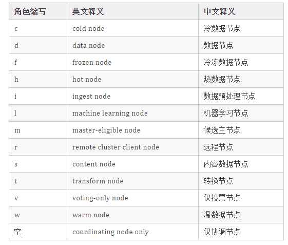

## 集群

节点通过设置集群名称，在同一网络中发现具有相同集群名称的节点，组成集群；每个集群都有一个 cluster name 作为标识，默认的集群名称为 elasticsearch

如果在同一网络中只有一个节点，则这个节点成为一个单节点集群

### 集群状态

- Green

所有主分片和从分片都准备就绪（分配成功），即使有一台机器挂了（假设一台机器一个实例），数据都不会丢失，但会变成 Yellow 状态

- Yellow

所有主分片准备就绪，但存在至少一个主分片（假设是 A）对应的从分片没有就绪，此时集群属于警告状态，意味着集群高可用和容灾能力下降，如果刚好 A 所在的机器挂了，而从分片还处于未就绪状态，那么 A 的数据就会丢失（查询结果不完整），此时集群进入 Red 状态

- Red

至少有一个主分片没有就绪（直接原因是找不到对应的从分片成为新的主分片），此时查询的结果会出现数据丢失（不完整）

## 节点

### 节点类型和节点角色

Elasticsearch 7.9 之前的版本中的节点类型：数据节点、协调节点、候选主节点、ingest 节点，在 Elasticsearch 7.9 以及之后节点类型升级为节点角色（Node roles）。节点角色分的很细：数据节点角色、主节点角色、ingest 节点角色、热节点角色等



当集群中有多个节点角色的时候，就需要手动设定、配置节点的角色。

节点角色划分的目的在于：不同角色的节点各司其职，共同确保集群的功能的稳定和性能的高可用

Node roles <https://www.elastic.co/guide/en/elasticsearch/reference/8.16/modules-node.html>

- `master`
- `data`
- `data_content`
- `data_hot`
- `data_warm`
- `data_cold`
- `data_frozen`
- `ingest`
- `ml`
- `remote_cluster_client`
- `transform`

### 不同角色节点的功能详解

#### （1）主节点（Master-eligible node）

- 主节点的核心用途：集群层面的管理，例如创建或删除索引、跟踪哪些节点是集群的一部分，以及决定将哪些分片分配给哪些节点。主节点的 path.data 用于存储集群元数据信息，不可缺少。
- 主节点的重要性：拥有稳定的主节点对于集群健康非常重要。和早期版本不同，节点角色划分后，主节点又被细分为：候选主节点和仅投票主节点。

- 主节点存储数据：集群中每个索引的索引元数据，集群层面的元数据。

专用候选主节点（Dedicated master-eligible node）

如果集群规模大、节点多之后，有必要独立设置专用候选主节点。

专用候选主节点配置：

```less
node.roles: [ master ]
```

仅投票主节点（Voting-only master-eligible node）

用途：仅投票，不会被选为主节点。

硬件配置可以较专用候选主节点低一些。

仅投票主节点配置：

```less
node.roles: [ master, voting_only ]
```

注意：master 必不可少。

关于集群主节点配置，要强调说明如下：

- 高可用性 (HA) 集群需要至少三个符合主节点资格的节点；其中至少两个不是仅投票节点。
- 即使其中一个节点发生故障，这样的集群也将能够选举一个主节点。

#### （2）数据节点（Data node）

数据节点用途：数据落地存储、数据增、删、改、查、搜索、聚合操作等处理操作。

数据节点硬件配置：CPU 要求高、内存要求高、磁盘要求高。

专属数据节点好处：主节点和数据节点分离，各司其职。

数据节点存储内容

- 分片数据。
- 每个分片对应的元数据。
- 集群层面的元数据，如：setting 和 索引模板。

拥有专用数据节点的主要好处是主角色和数据角色的分离。

数据节点的配置：

```haskell
node.roles: [ data ]
```

在 Elastic 多层（tires）冷热集群架构体系下，数据节点又可以细分为：

- 内容数据节点（Content data node）
- 热数据节点（Hot data node）
- 温数据节点（Warm data node）
- 冷数据节点（Cold data node）
- 冷冻数据节点（Frozen data node）


内容数据节点

用途：处理写入和查询负载，具有较长的数据保留要求。

建议至少设置一个副本，以保证数据的高可用。

不属于数据流的系统索引或其他索引会自动分配到内容数据节点。

```less
node.roles: [ data_content ]
```

热数据节点

用途：保存最近、最常访问的时序数据。

推荐使用：SSD 磁盘，至少设置一个副本。

```less
node.roles: [ data_hot ]
```

温数据节点

用途：保存访问频次低且很少更新的时序数据。

```less
node.roles: [ data_warm ]
```

冷数据节点

用途：保存不经常访问且通常不更新的时序数据。可存储可搜索快照。

```less
node.roles: [ data_cold ]
```

冷冻数据节点

用途：保存很少访问且从不更新的时序数据。

```less
node.roles: [ data_frozen ]
```

需要注意：在配置节点角色时，data_hot、data_warm、data_cold 要和 data_content 要一起配置。且 data_hot、data_warm、data_cold 不要和原有的data 节点一起配置了。如果仅 data_hot 不设置 data_content 会导致集群数据写入后无法落地。

我的理解：data_hot, data_warm, data_cold 是标识性的节点，实际落地存储还得靠 data_content 角色。

#### （3）数据预处理节点（ingest node）

用途：执行由预处理管道组成的预处理任务。

```less
node.roles: [ ingest ]
```

#### （4）仅协调节点（Coordinating only node）

用途：类似智能负载均衡器，负责：路由分发请求、聚集搜索或聚合结果。

注意事项：在一个集群中添加太多的仅协调节点会增加整个集群的负担，因为当选的主节点必须等待来自每个节点的集群状态更新的确认。

```less
node.roles: [ ]
```

#### （5）远程节点（Remote-eligible node）

用途：跨集群检索或跨集群复制。

```less
node.roles: [ remote_cluster_client ]
```

#### （6）机器学习节点（Machine learning node）

用途：机器学习，系收费功能。

```less
node.roles: [ ml, remote_cluster_client]
```

#### 转换节点（Transform node）

用途：运行转换并处理转换 API 请求。

```less
node.roles: [ transform, remote_cluster_client ]
```