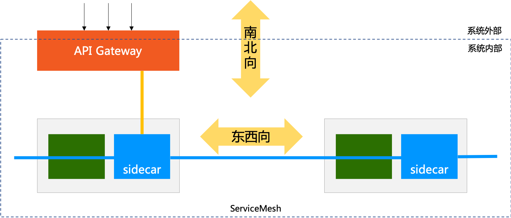

- Service Mesh 部署在系统内部：因为原子微服务和组合服务通常不会直接暴露给外部系统

- API Gateway 部署在系统的边缘：一方面暴露在系统之外，对外提供 API 供外部系统访问；一方面部署在系统内部，以访问内部的各种服务

- 东西向通讯：指服务间的相互访问，其通讯流量在服务间流转，流量都位于系统内部

- 南北向通讯：指服务对外部提供访问，通常是通过 API Gateway 提供的 API 对外部保罗，其通讯流量是从系统外部进入系统内部。

如上图所示，通常在地图上习惯性的遵循 “上北下南，左西右东” 的原则。

## 参考资料

- <https://www.qikqiak.com/envoy-book/file-based-dynamic-config/>

- istio入门到精通【400节大课】<https://edu.csdn.net/learn/35483/572944>