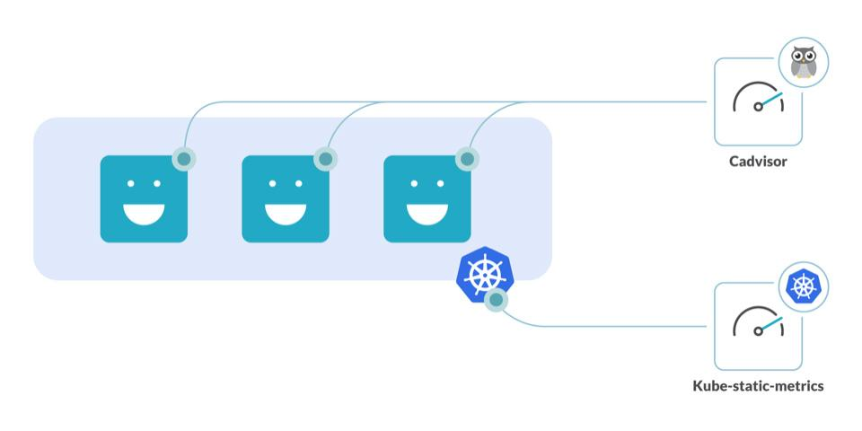

## 分析工具

kube-state-metrics：用于收集和报告 Kubernetes 集群中对象的状态信息的监控工具

cAdvisor：展示和分析容器运行状态的工具



## 检测未充分利用的资源

### CPU

检测空闲 CPU 资源，利用 container_cpu_usage_seconds_total 和 kube_pod_container_resource_requests 参数，可以检测到 CPU 利用情况

```
sum((rate(container_cpu_usage_seconds_total{container!="POD",container!=""}[30m]) - on (namespace,pod,container) group_left avg by (namespace,pod,container)(kube_pod_container_resource_requests{resource="cpu"})) * -1 >0)
```

如何识别哪些命名空间浪费了 CPU：将上面的 PromQL 语句按命名空间过滤，可以得到更细粒度的数据

```
sum by (namespace)((rate(container_cpu_usage_seconds_total{container!="POD",container!=""}[30m]) - on (namespace,pod,container) group_left avg by (namespace,pod,container)(kube_pod_container_resource_requests{resource="cpu"})) * -1 >0)
```

查找 CPU 占用前 10 的容器，可以使用该 topk 函数获取 上述 PromQL 查询的 Top n 结果

```
topk(10,sum by (namespace,pod,container)((rate(container_cpu_usage_seconds_total{container!="POD",container!=""}[30m]) - on (namespace,pod,container) group_left avg by (namespace,pod,container)(kube_pod_container_resource_requests{resource="cpu"})) * -1 >0))
```

### 内存

## 参考资料

- <https://segmentfault.com/a/1190000044863330>