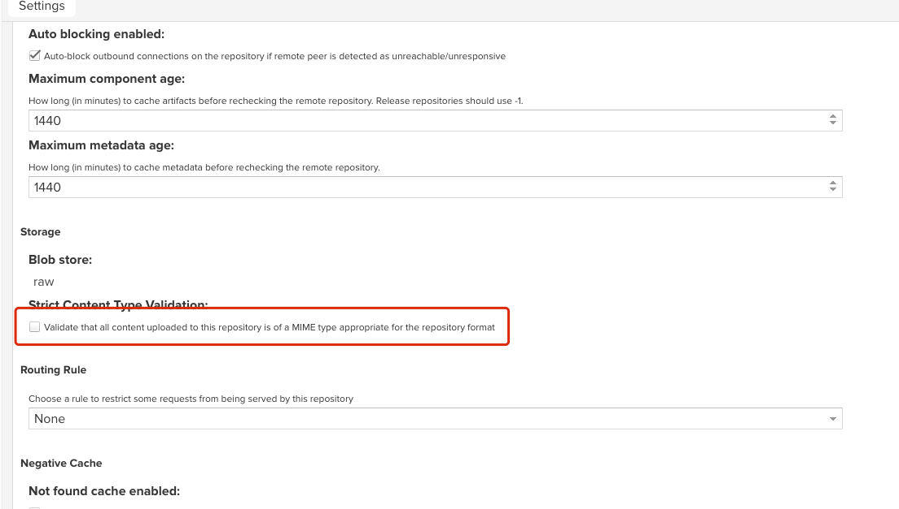
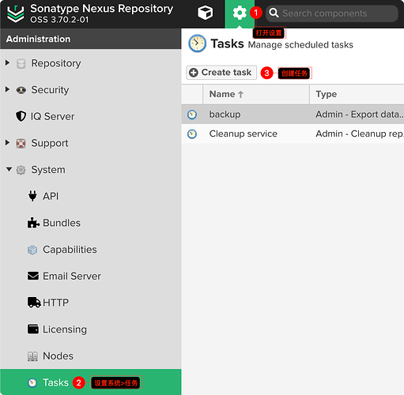
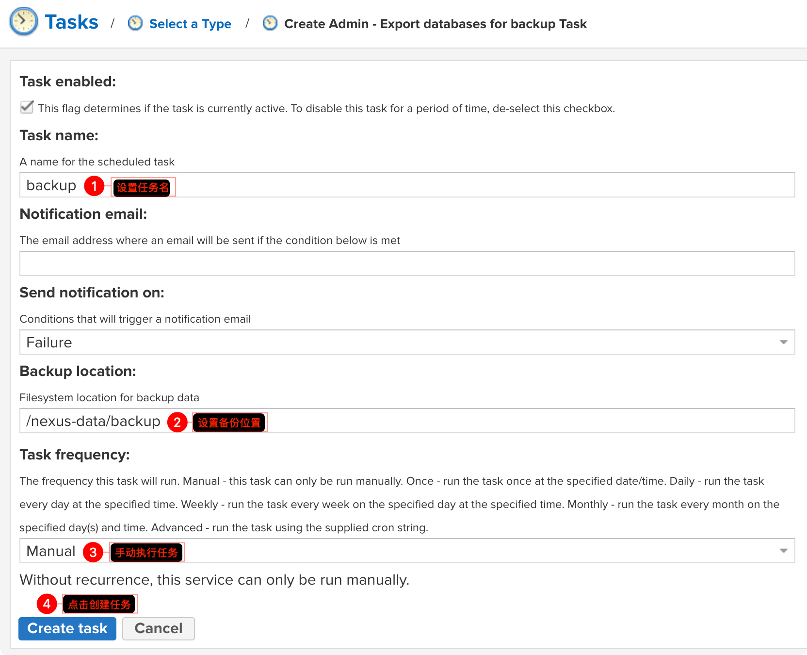
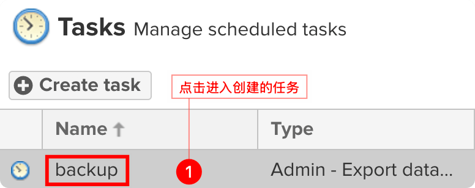
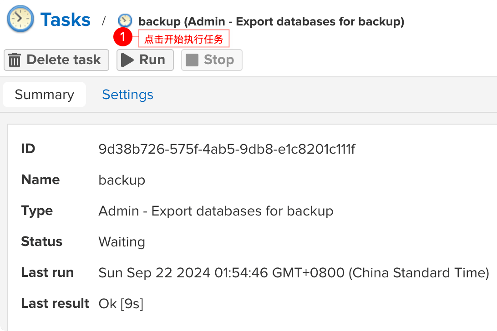

## 部署 Nexus

初始化密码

目前的 Nexus3 用户名 admin 的初始化密码不再是 admin123，需要在文件中去查看密码。

```
docker compose exec -it nexus cat /opt/sonatype/sonatype-work/nexus3/admin.password
```

输出后的密码是一个 uuid，这个就是密码，不要考虑太多，直接全部复制去登陆。登录成功后会有个提示修改密码的操作，修改密码就可以了。

修改密码后一定要记住，在修改密码完成之后 admin.password ⽂件会⾃动删除。

## Nexus 报 Detected content type 错误问题处理

这是由于 Nexus 会去校验仓库内容是否是适用于存储库格式的 MIME 类型，这里在仓库设置中取消校验设置即可：如下图



## Nexus 升级路线

- <https://help.sonatype.com/en/supported-nexus-repository-manager-upgrade-paths.html>

- <https://help.sonatype.com/en/upgrading-to-nexus-repository-3-71-0-and-beyond.html>

从 3.70 升级到 3.71+ 有很多 breaking changes

先下载数据库升级工具 

- <https://help.sonatype.com/en/orientdb-downloads.html>

- <https://download.sonatype.com/nexus/nxrm3-migrator/nexus-db-migrator-3.70.3-01.jar>

先升级到 3.70.3（最后一个版本）

```bash
services:
  nexus:
    # https://hub.docker.com/r/sonatype/nexus3/tags
    image: sonatype/nexus3:3.70.3
    restart: always
    container_name: nexus
    hostname: nexus
    user: nexus
    environment:
      - NEXUS_CONTEXT=/
    ports:
      - '8081:8081'
    volumes:
      - /etc/localtime:/etc/localtime:ro
      - ./mnt/nexus-data:/nexus-data
```

创建 `nexus` 备份文件










`https://download.sonatype.com/nexus/nxrm3-migrator/nexus-db-migrator-<version版本号>.jar` 要符合自己镜像的版本。jar 的下载页面为 [3.70.x Downloads (for OrientDB)](https://help.sonatype.com/en/orientdb-downloads.html)

```bash
# 1. 进入容器
docker compose exec -it nexus /bin/bash

# 2. 停止 nexus 服务
/opt/sonatype/nexus/bin/nexus stop

# 3. 进入备份文件夹
cd /nexus-data/backup/

# 4. 查看备份的文件
ls -ahl

# 5. 下载迁移工具，这里如果无法使用 curl 直接下载，建议在良好的网络环境下下载好文件后，把文件复制到 docker 容器中的 /nexus-data/backup 文件夹中
curl -s -L -O https://download.sonatype.com/nexus/nxrm3-migrator/nexus-db-migrator-3.70.3-01.jar

# 6. 将数据迁移到 `H2` 数据库
java -jar nexus-db-migrator-3.70.3-01.jar --migration_type=h2

# 7.  停止 nexus 服务
/opt/sonatype/nexus/bin/nexus stop

# 8. 查看迁移的数据文件
ls -ahl nexus.mv.db

# 9. 将迁移的数据文件复制到 `db` 文件夹中
cp nexus.mv.db /nexus-data/db

# 10. 退出容器
exit
```

修改 `nexus` 使用 `H2` 数据库

```bash
# 1. 删除容器
docker compose down

# 2. 修改打开 H2 数据库
vi ./mnt/nexus-data/etc/nexus.properties
# 在文件中添加一行，:wq 保存并退出
nexus.datastore.enabled=true

# 3. 重新创建容器
docker compose up -d

# 4. 查看 H2 数据库正确启动
docker compose logs nexus | grep H2
# 控制台输出
nexus  | 2024-09-21 00:00:00,000+0000 INFO  [FelixStartLevel] *SYSTEM org.sonatype.nexus.datastore.DataStoreConfigurationDefaultSource - Loaded 'nexus' data store configuration defaults (Embedded H2)
nexus  | 2024-09-21 00:00:00,000+0000 INFO  [FelixStartLevel] *SYSTEM org.sonatype.nexus.datastore.mybatis.MyBatisDataStore - nexus - MyBatis databaseId: H2
```

切换 `nexus` 到指定版本

```bash
services:
  nexus:
    # https://hub.docker.com/r/sonatype/nexus3/tags
    image: sonatype/nexus3:3.74.0
    restart: always
    container_name: nexus
    hostname: nexus
    user: nexus
    environment:
      - NEXUS_CONTEXT=/
    ports:
      - '8081:8081'
    volumes:
      - /etc/localtime:/etc/localtime:ro
      - ./mnt/nexus-data:/nexus-data
```

`docker compose up -d` 创建容器

升级完毕

后续版本继续升级即可

## 配置 Default Secret Encryption Key

使用环境变量

```bash
NEXUS_SECRETS_KEY_FILE=/nexus-secret-keys.json
```

- <https://help.sonatype.com/en/re-encryption-in-nexus-repository.html>

从 API 触发

```bash
curl -X 'PUT' \
  'https://nexus.alpha-quant.tech/service/rest/v1/secrets/encryption/re-encrypt' \
  -H 'accept: application/json' \
  -H 'Content-Type: application/json' \
  -H 'NX-ANTI-CSRF-TOKEN: <your-token>' \
  -H 'X-Nexus-UI: true' \
  -d '{
  "secretKeyId": "string",
  "notifyEmail": "string"
}'
```

