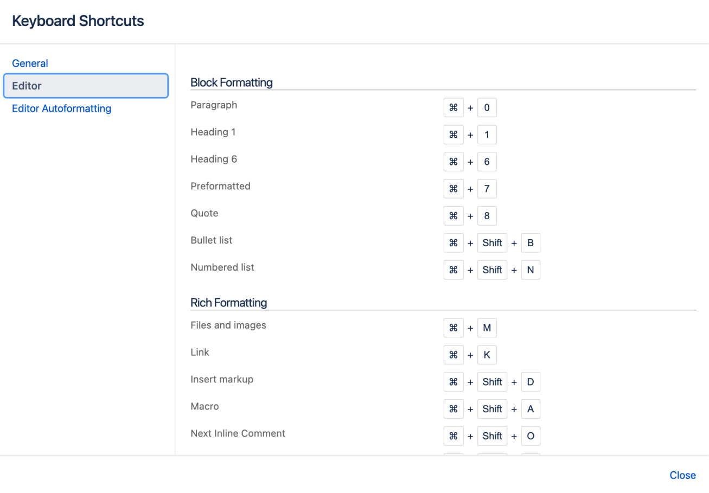
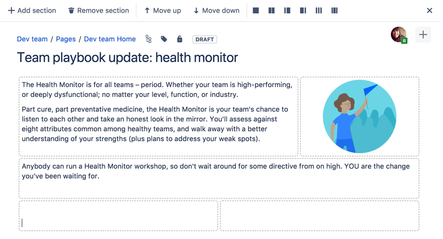

## 熟悉 Confluence

Confluence 作为一个知识管理的平台，让团队成员协作、分享信息，查找工作所需的资料，从此打破不同团队、不同部门以及个人之间信息孤岛的僵局，Confluence 真正实现了组织资源共享。同时 Confluence 让团队从无休止的邮件和会议中解脱出来，让每天的工作更有效能

### 仪表板（Confluence首页）

详见：<https://confluence.atlassian.com/conf89/the-dashboard-1387594593.html>

仪表板是 Confluence 站点的信息中心，可以访问信息和更新

可以通过点击 Confluence 左上角的站点图标从 Confluence 的任何页面跳转到仪表板


1. 发现区：查看最近发生了什么
2. 工作区：快捷找到最新和有用的页面来完成工作
3. 定制区：管理员可以添加有用的内容来帮助人们使用网站

仪表板有一个可折叠的侧边栏，可帮助快捷转到想去的地方：

- Discover（发现）通过 “所有更新” 实时查看变动的内容，或查看 “热门” 信息流中有活跃讨论或点赞的页面
- My Work（我的工作）在 “最近处理” 中快速访问您最近创建和编辑的页面，在 “最近查看” 中可以发现昨天浏览过的页面，对于频繁访问的重要页面您可以主动放进 “收藏夹” 下
- My Spaces（我的空间）在这里，可以保留某些空间的快捷链接，以便每天多次进入

### Confluence空间目录（space directory）

详见：<https://confluence.atlassian.com/conf89/the-space-directory-1387594609.html>

Confluence 中包含很多个 space（空间），空间是按某个主题汇集页面的地方，这样有助于对站点中的内容进行分类管理。您可以创建任意数量的空间，在空间目录中可以查看和找到 Confluence 站点中的所有空间


1. 访问空间目录 – 要访问空间目录，请在 Confluence 标题中选择 空间 > 所有空间
2. 设置常用的空间 – 毫无疑问，通常会经常使用一两个空间。单击空间右侧的星号，使其出现在仪表板上的“我的空间”下
3. 选择空间类别 – 进入空间目录页面，将看到 Confluence 站点中所有空间的列表。点击左侧的“我的空间”（或 收藏空间）类别以仅查看标有星号的空间。然后再次选择所有空间
4. 筛选空间 – 在右上角的筛选框中输入空间名称的一部分。如果 Confluence 中有很多空间，这将很快缩小空间列表的范围

### Confluence 空间侧边栏

详见：<https://confluence.atlassian.com/conf89/the-space-sidebar-1387594612.html>

侧边栏是每个 Confluence 空间都有的功能。侧边栏上可以设置博客链接，设置自定义快捷链接，最重要的是包含了页面树（它将空间中的页面按层级结构展示）

可以在侧边栏上找到他们的会议纪要、决议、需求，以及其它内容。通常来说，在空间中创建的页面都会默认出现在侧边栏里


1. 空间快捷链接：链接到 Confluence 页面或网络上的其他页面
2. 页面树：空间中页面的层级结构视图

可以用键盘上的左方括号( `[` )展开或收起侧边栏，也可以用鼠标操作

### 配置侧边栏

空间的管理员可以配置侧边栏

1. 从侧边栏底部点击 空间管理 > 配置侧边栏 （如果侧边栏折叠了，则点击齿轮菜单）
2. 点击 +增加链接 来创建快捷链接；快捷链接可以是 Confluence 页面或空间，也可以是任何网络地址
3. 如果空间中没有用到某些功能，还可以在侧边栏中隐藏内容（例如空间的博客）

### Confluence 的快捷键

详见：<https://confluence.atlassian.com/conf89/keyboard-shortcuts-1387594614.html>

用键盘操作的效率远远高于用鼠标，当然，要记住这么多快捷键也不容易；最好的方法是要学会如何在 Confluence 中查找快捷键列表

- 点击顶部的帮助图标，然后点击快捷键
- 查看页面时，按 `Shift+?`
- 编辑页面时，选择编辑器工具栏中的问号图标



快捷键分为 3 类：

- 通用 – 全局、页面和博客快捷键
- 编辑器 – 文本编辑和格式设置快捷键
- 编辑器自动格式化 – Wiki 和自动格式化快捷键

## Confluence 空间创建

需要拥有“创建空间”和“创建个人空间”权限才能执行空间配置

### 什么是空间（space）?

Confluence 里的空间（space）是什么？它实际上只是一个放置相关内容的地方，例如信息和文件，我们把相关的信息和文件有组织地放进同一个空间里。空间也为我们提供了一个与其他人合作的地方

- 每个空间都可以设置自己的权限规则，允许向合适的人授予访问权限和其它权限

- 空间里还有一个博客功能，因此可以向能看到该空间的任何人发布重要消息和更新

- Confluence 中可以有任意数量的空间，并且可以在不再需要时归档或删除它们

### Confluence 创建项目空间

详见：<https://confluence.atlassian.com/conf89/create-a-project-space-1387594638.html>

1. 从Confluence顶部菜单选择 空间（Spaces） > 创建空间（Create space）
2. 选择空白空间（Blank space)，然后下一步（Next）
3. 输入空间名称
4. 更改空间关键字——这一步非常重要，它可以帮助人们便捷地进入这个空间。空间关键字是构成 URL 的一部分，因此将其设为好记的单词或名称可以更轻松地与项目相关联
5. 点击创建（Create)

每个空间都有一个默认主页，可以根据自己的需要对其进行定制。只需点击“编辑”（或按键盘上的“E”）即可编辑主页

空间已准备好，团队可以在其中添加页面。如果想再次找到它，请在Confluence顶部菜单中选择空间（Spaces），然后从下拉菜单中选择它；要向空间中添加页面，请先进入到该空间并点击顶部菜单中的按钮“创建”

### Confluence 创建个人空间

详见：<https://confluence.atlassian.com/conf89/create-your-personal-space-1387594640.html>

作为团队中的新手，可能希望自己暂存一些工作内容，直到准备好向外展示为止；对于这部分文档，将创建一种特殊类型的空间：个人空间。像涂鸦墙一样使用个人空间，至少在刚开始使用 Confluence 时，可以在某个地方草拟页面、试用功能，并大致了解空间的功能

1. 在 Confluence 顶部菜单右侧点击个人头像
2. 选择添加个人空间（Add Personal Space）
3. 点击创建；现在拥有了一个属于自己的空间，但是还需要设置权限，以确保只有自己可以看见它
4. 点击侧边栏底部的空间管理（Space tools） > 权限（Permissions）
5. 点击页面中的编辑权限（Edit Permissions ）（可能会提示再次输入密码）；应该会看到在组（Groups）下列出的 confluence-users 组。权限项表格的第一个权限是查看（View）权限，它决定了该用户组中的每个人是否都可以看到您的空间
6. 取消选中查看（View）并点击页面底部的保存（Save all ）


### Confluence 创建公开的团队空间

详见：<https://confluence.atlassian.com/conf89/create-the-team-s-pr-space-1387594642.html>

为了允许匿名用户访问您的 Confluence 站点，Confluence 管理员需要授予匿名用户 “使用 Confluence” 权限

1. 点击侧边栏底部的空间管理（Space tools） > 权限（Permissions）
2. 向下滚动页面，直到看到匿名访问（Anonymous），然后点击编辑权限（Edit Permissions）
3. 选中匿名用户的查看（View）权限，点击保存（Save all）

用户无需登录就可以访问该空间

### Confluence 删除或归档空间

详见：<https://confluence.atlassian.com/conf89/delete-and-archive-spaces-1387594644.html>

如果需要清理旧空间，可以归档或删除空间。归档只是意味着它不会出现在常规搜索中，而删除显然要让它永久消失

归档空间：

1. 点击侧边栏底部的空间管理（Space tools） > 概览（Overview）
2. 点击编辑空间详情（Edit Space Details）
3. 把状态（Status）从  ”使用中“（Current）修改为 ”归档的“（Archived），然后点击保存（Save）

删除空间：

1. 点击侧边栏底部的空间管理（Space tools） > 概览（Overview）
2. 切换到删除空间（Delete Space）标签页

## 如何创建和编辑页面

详见：<https://confluence.atlassian.com/doc/create-and-edit-pages-139476.html>

### 创建页面

可以在 Confluence 中的任何位置创建页面。只需在标题中选择 Create（创建）即可。页面是捕获所有重要（且不重要）信息的地方； 从空白页开始，可添加富文本，任务，图像，Macro 和链接，或使用有用的蓝图之一捕获会议记录，决定等

如果要快速创建空白页，请点击标题中的 Create（创建）按钮； 如果要从模板创建页面，请单击从模板创建按钮


- 创建空白页
- 从模板创建


- （1）Select space（选择空间）：选择将在其中创建内容的空间。

- （2）Page templates（页面模板）：从模板创建页面或创建其他类型的内容。

- （3）Parent page（父页面）：页面将是该页面的子页面。

确定空白页或蓝图后，将直接进入 Confluence 编辑器。可以在编辑器中为页面命名或重命名，添加内容并设置其格式。 添加一些内容后，请选择 > Preview（预览）以窥视已完成页面的外观，并准备好将其显示在空间中时进行发布。

保存后，会在 view（查看）模式下看到该页面。可以随时通过选择 Edit（编辑）” 或按键盘上的 E 来重新输入编辑器。


- （1）Confluence header（汇合标题）：创建空白页，模板中的页面并访问空间或您的个人资料

- （2）Space sidebar（空间侧边栏）：访问页面，博客和管理空间

- （3）Page tools（页面工具）：编辑或共享页面，观看页面以获取更新并执行更多操作

注意：保存超大页面时可能会遇到问题。Confluence 可以接受大约 5mb 的内容（不包括附件），大约相当于 80 万个单词。如果您确实遇到错误，表明该页面太大而无法保存，则应将该页面分成几个较小的页面

### 自动完成链接，文件，Macro 和提及内容

| 操作                                         | 触发字符 | 键盘快捷键         | 描述                                                   |
| -------------------------------------------- | -------- | ------------------ | ------------------------------------------------------ |
| 在页面添加链接                               | `[`      | `Ctrl + Shift + K` | 查看建议页面或其他位置的列表以从页面链接到该页面。     |
| 在页面上显示图像，视频，音频文件或文档       | `!`      | `Ctrl + Shift + M` | 查看要嵌入到页面中的建议图像，多媒体文件和文档的列表。 |
| 在页面上添加 Macro                           | `{`      | 无                 | 开始输入宏名称时，请参阅建议列表。                     |
| 通过电子邮件通知其他用户您在页面上提到了他们 | `@`      | 无                 | 查看要提及的建议用户列表。                             |

### 如何使页面布局更舒适

详见：<https://confluence.atlassian.com/conf89/page-layouts-columns-and-sections-1387594969.html>

 页面的布局可能会对阅读方式产生重大影响，而布局得当，可以使您放置文本，图像，Macro，图表等的更多位置，从而获得最佳视觉效果

有两种方法可以修改 Confluence 页面的布局：

- 使用页面布局添加节和列
- 使用 Macro 添加节和列

（1）页面布局工具可使用水平部分和垂直列来构建页面。通过添加具有不同列配置的多个部分，可以非常轻松地构建非常复杂的布局



Confluence 预置了几种常见的分栏模式，在工具栏点击即可，如下：


要添加节：

- 选择工具栏中的Page Layout（页面布局）按钮。
- 出现页面布局工具栏。
- 选择Add Section（添加节）。

  新节显示在您当前内容的下方，该部分的边界用虚线表示（当您查看页面时，虚线不可见）。

要更改部分中的列布局：

- 将光标放在要更改的部分上。
- 从页面布局工具栏选择一种布局（例如，两列或三列）。

  更改列布局时，该部分中的所有文本，图像或Macro都不会丢失。 当您减少列数时，Confluence会将您的内容向左移动。当您增加列数时，Confluence将在现有内容的右侧添加空白列。

要将部分移至页面的另一部分：

- 将光标放在要移动的部分上。
- 选择Move up（上移）或Move down（下移）按钮。

  该部分及其所有内容将在页面上其他部分的上方或下方移动。

（2）可以使用 Section 和 Column Macro 向页面添加一组列。Section 和 Column Macro 定义一个将包含列的区域。可以根据需要选择任意多个节。在每个节中，可以根据需要拥有任意多的列。

如果要为每列定义特定的百分比或像素宽度，Section 和 Column Macro 会非常有用。

Section Macro 的参数

| 参数     | 默认  | 描述                                                         |
| -------- | ----- | ------------------------------------------------------------ |
| 显示边框 | false | 选择此选项可在部分和列周围绘制边框。注意：如果没有 Column Macro，则边框将无法正确显示 |

Column Macro 的参数

| 参数 | 默认                                      | 描述                                                         |
| ---- | ----------------------------------------- | ------------------------------------------------------------ |
| 列宽 | 页面宽度的100％，平均除以该部分中的列数。 | 指定列的宽度，以像素（例如400px）为单位，或者以可用宽度的百分比（例如50%）为单位 |

### 如何创建漂亮的动态页面

（1）增加页面吸引力

- 图片，照片和屏幕截图。Confluence 页面既可以显示来自 Confluence 网站又可以显示其他网站的图像。要将图像放入 Confluence，您可以将其上传并附加到页面或博客文章中，然后将其显示在其他任何页面，博客文章或评论中，或者，使用其网址（URL）显示远程图像

- 画廊。使用图库Macro显示一组图像。查看页面时，人们可以单击任意图片以放大并以幻灯片形式查看图像
- 多媒体。可以显示电影，动画和视频，并在 Confluence 页面上嵌入音频文件。 例如，Confluence 支持Adobe Flash，MP3，MP4 和其他各种电影格式

推荐 shell 录制工具：`asciinema`

（2）改变页面结构

使用其他Macro来突出显示和格式化页面的各个部分：

- 面板
- 信息，提示，注意和警告
- 代码块
- 格式

（3）从图片中讲故事

 Confluence 的应用程序提供了用于创建图表和模型的复杂工具

例如：

- Balsamiq Mockups for Confluence 
- Creately for Confluence 
- Gliffy Confluence Plugin 
- Graphviz Plugin for Confluence 
- Lucidchart for Confluence

（4）显示演示文稿和文件

- 将 Office 文档附加到 Confluence 页面，然后使用 View File Macro（查看文件Macro）在页面上显示它们。这适用于 Excel 电子表格，PowerPoint 演示文稿和 Word 文档
- 在 Confluence 中显示 PDF 文件，使用 View File Macro（查看文件Macro）显示

### 如何添加，删除和搜索标签

详见：<https://confluence.atlassian.com/doc/add-remove-and-search-for-labels-136419.html>

标签是可以添加到页面，博客文章和附件中的关键字或附件。您可以定义自己的标签，并使用它们来对 Confluence 中的内容进行分类，标识或添加书签。

例如，您可以为网站上所有与帐户相关的页面分配标签 accounting。然后，您可以在单个空间或整个站点中浏览带有该标签的所有页面，显示带有该标签的页面列表，或基于该标签进行搜索。由于标签是用户定义的，因此您可以添加任何可帮助您识别站点内容的单词。还可以将标签（称为类别）应用于空间，以帮助组织 Confluence 空间。

**标记页面或博客文章**

任何有权编辑页面的用户都可以在页面上添加标签。任何现有标签将显示在页面内容下方页面的右下方

**要将标签添加到页面或博客文章：**

- 在页面底部，选择编辑标签或按键盘上的 L 键
- 输入新标签（键入时建议使用现有标签）
- 选择添加


## Confluence 编辑技巧

- 输入标题

通过`Ctrl+数字`的方式来快捷输入标题，比如`Ctrl+1`表示标题 1，`Ctrl+2`表示标题 2，`Ctrl+0`表示正文

- 输入行内代码

行内代码快捷输入方式：`空格+{{行内代码}}` ，这里注意 `{{` 前面一定要有空格，否则会被当成普通文本来渲染。行内代码实际就是等宽字体，也可以选中文本后通过编辑器的菜单栏来设置

习惯 Markdown 方式，可以使用反撇号完成

- 输入链接

输入 `[` 调出链接下拉菜单，根据需要选择即可

- 代码块

除了使用宏外，按照 Markdown 的语法也能快速生成一个代码块

## 输入宏

输入 `{` 调出宏下拉菜单，后面可以继续跟上宏名称的关键字，以缩小搜索范围

除了可以用下拉菜单选择宏外，还可以直接用一对花括号直接指定宏，这种写法称为 wiki 标记，比如

```bash
{code:title=This is my title|theme=FadeToGrey|linenumbers=true|language=java|firstline=0001|collapse=true}
This is my code
{code}
```

### 格式化

主要包括代码块，信息框/提示框/警告框等，比如下面是一个信息框：


### Confluence 内容

用于聚合显示 Confluence 的内容，比如空间列表，任务报告，最近更新等，常用的有以下几个：

1. 空间列表 - 显示所有空间
2. 任务报告 - 显示所有未守成的待办事项，可指定空间或页面；
3. 最近修改过的页面 - 显示最近修改过的的页面，包括作者和修改时间；
4. 最近更新 - 效果和上面类似；
5. 热门标签 - 显示标签云或标签列表；
6. 标签列表 - 按首字母显示所有标签；

### 导航

用于快速定位或搜索指定页面，常用如下：

1. 目录 - 显示文章区目录；
2. 页面树 - 显示当前空间所有页面或某个页面的子页面树；
3. livesearch - 显示一个搜索框，用于搜索当前空间页面；
4. 锚 - 用于插入锚点，插入的描点可在插入链接时转换成链接来使用；

### Draw.io 宏

通过 Draw.io 宏可以实现在页面中插入画图，像下面这样，比起插入 Graphivz 画图，Draw.io 可以大大简化画图的工作量


## 移动和重新排序页面

官方文档：<https://confluence.atlassian.com/doc/move-and-reorder-pages-146407727.html>

在 Confluence 中设置页面位置的最简单方法是导航到您希望页面驻留的空间，并在必要时找到其父页面并选择创建。不过有时候，您可能想在创建页面时或创建页面后更改页面的位置。

您还可以在页面树（层次结构）中移动页面并对其重新排序。

### 设置页面位置或移动页面

- 请执行以下任一操作：

  - While creating a page（创建页面时）–选择页面顶部的位置图标。

  - Once a page is created（创建页面后）–选择...>Move（移动）。

- 使用设置页面位置对话框左侧的选项卡可帮助您找到页面的新空间和 / 或父页面（对话框底部的 Current location - 当前位置和 New location - 新位置面包屑指示当前父页面和新页面） 父页面）。

- 如果要将页面移动到子页面之间的其他位置，请选择 Reorder（重新排序）（当您在下一步中选择 Move（移动）时，就可以对页面进行重新排序）。

- 选择移动（如果要对子页面重新排序，请为页面选择新位置，然后选择重新排序）。

该页面 - 以及所有附件，评论和子页面 - 已移至您选择的位置。Confluence 将自动调整指向已移动页面的所有链接，以指向其新位置的页面。

注意：完成 New parent page（新建父页面）字段后，您需要选择 Confluence 自动完成建议的页面。键入或粘贴页面名称（或使用浏览器的自动完成功能）将无效。


### 重新排列空间中的页面

您可以更改页面在其空间内的位置，并在层次结构中对页面重新排序。 这使您可以：

- 将单个页面或一组页面移动到该空间中的另一父页面。
- 重新排序是同一父级的子级的页面。

页面的所有链接都将保留。移动父页面时，子页面的整个层次结构也会移动。

要移动或重新排序页面：

- 转到空间，然后从侧边栏底部选择 Space tools（空间工具）>Reorder pages from the bottom of the sidebar（对页面重新排序）
- 展开分支以找到要移动的页面。
- 将页面拖动到树中的新位置。

另外，您可以选择按字母顺序（A-Z）图标按字母顺序对一组子页面进行排序。 如果当前是手动对页面系列进行排序，则仅按字母顺序（A-Z）图标显示在父页面旁边。

如果您改变主意，则可以使用 Undo Sorting（撤消排序）图标恢复为先前的手动页面顺序。 仅在对页面进行排序后，而您仍在 Reorder Pages（重新排序页面）选项卡上，并且尚未执行任何其他操作时，此选项才可用。


- 按字母顺序：按字母顺序对所有子页面进行排序。
- 撤消：撤消排序。
