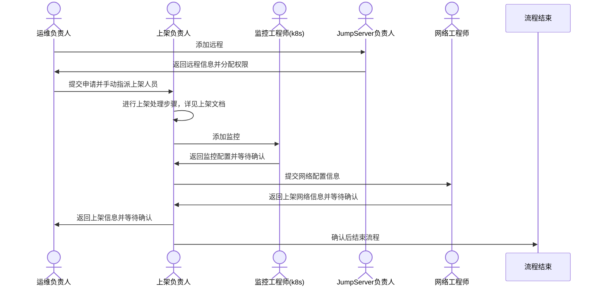
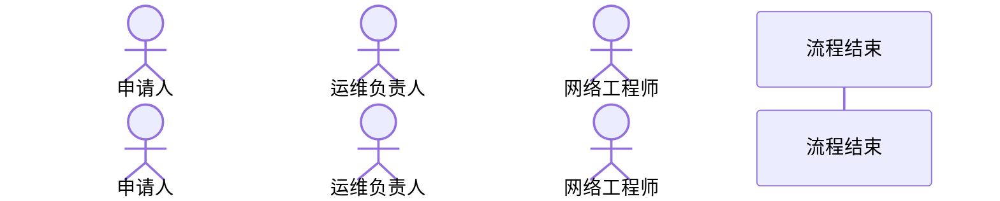

## 上架机器流程

提交工单的基础信息：

- 需要开通的网络关系
- 是否申请 sudo 权限
- 机器连接方式：jumpserver 或者 ssh
- 是否需要测试

```mermaid
sequenceDiagram
actor OPSM as 运维负责人
actor OPS as 上架负责人
actor OPSMK as 监控工程师(k8s)
actor OPSJ as JumpServer负责人
actor OPSN as 网络工程师
participant E as 流程结束
OPSM->>OPSJ: 添加远程
OPSJ->>OPSM: 返回远程信息并分配权限
OPSM->>OPS: 提交申请并手动指派上架人员
OPS->>OPS: 进行上架处理步骤，详见上架文档
OPS->>OPSMK: 添加监控
OPSMK->>OPS: 返回监控配置并等待确认
OPS->>OPSN: 提交网络配置信息
OPSN->>OPS: 返回上架网络信息并等待确认
OPS->>OPSM: 返回上架信息并等待确认
OPS->>E: 确认后结束流程
```

## 下架机器流程

```mermaid
sequenceDiagram
actor REQ as 申请人
actor OPSM as 运维负责人
actor OPSN as 网络工程师
actor OPSN as 网络工程师
participant E as 流程结束

```

