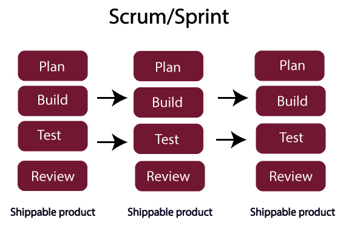

## Scrum

- Scrum

Scrum 是一个敏捷框架，可以帮助您组织，迭代和继续您正在处理的同一个项目。在 scrum 中，产品是在一系列迭代中构建的，称为 sprint 或 part

- Sprint

Sprint 是一个时间限制的时期，scrum 团队需要完成一定数量的工作。每个 sprint 都有一个指定的时间线，即 2 周到 1 个月。scrum 团队在 sprint 计划会议期间同意此时间表

- Scrum Master

Scrum Master 被定义为 Scrum 开发团队的推动者或仆人领导者。Scrum Master 必须确保遵循 Scrum 原则

- Scrum 开发团队

Scrum 开发团队是包含开发人员，QA 和 Scrum master 的个人成员的集合。它决定并提供努力估计，Scrum 团队的建议规模为 5 到 9 名成员

### Scrum 是如何工作的？

在瀑布模型中，我们已经读到完成了第一个完整的需求，然后完成整个设计，然后完成整个开发，然后完成整个测试和部署。此模型占用产品的整个生命周期，然后唯一的产品可供客户查看。虽然 Scrum 说要考虑软件的一小部分，然后对其进行规划，构建，测试并最终进行审核。已经开发的这个小模块将向客户展示

例如，我们需要开发电子商务网站，可以分为多个 sprints 或模块，如登录页面，支付页面，购物车页面等。然后，每个模块单独开发并同时向客户展示。因此，我们可以说，在每个 sprint 完成后，将产品发送到客户端，但不是完整的产品，而是功能的一部分